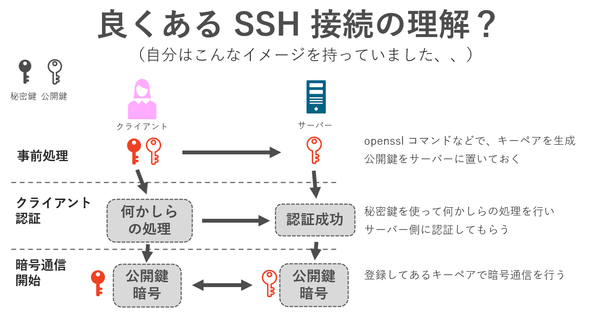
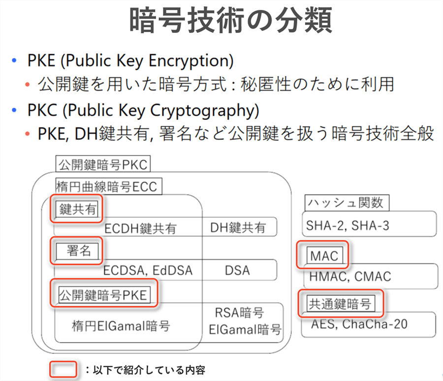
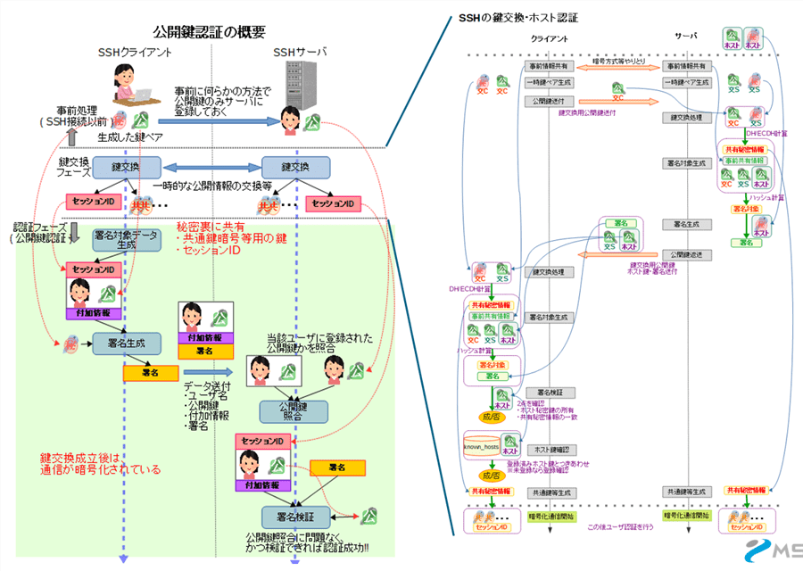
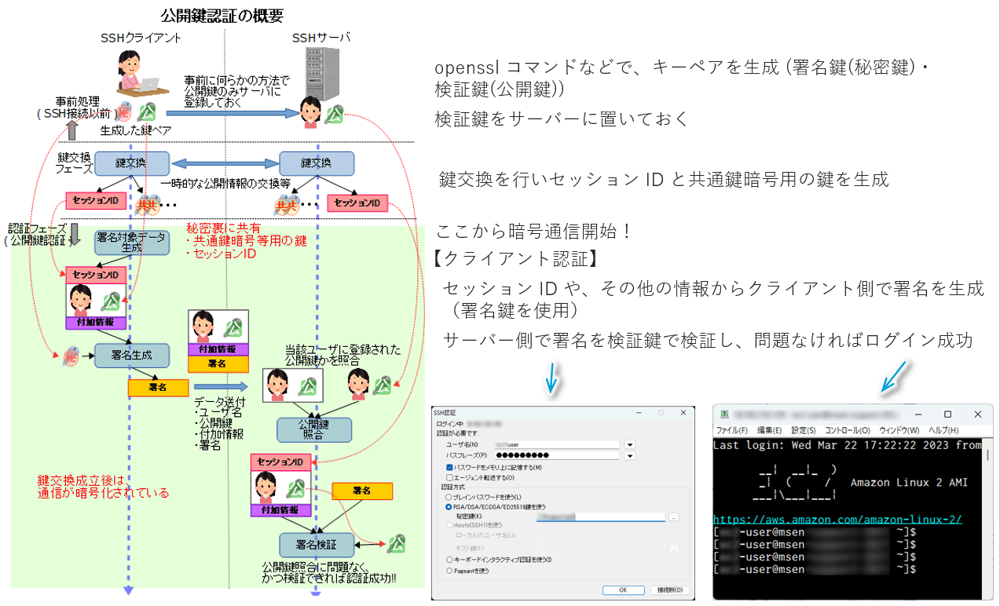
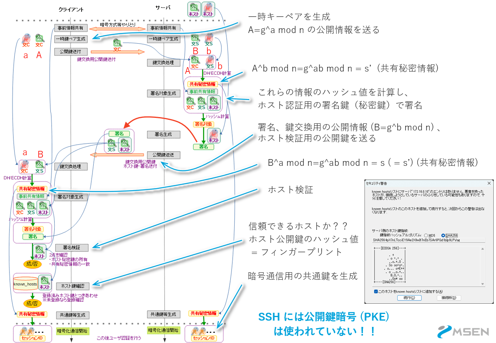

こんにちは、ひらたつです。

私はインフラ系の業務に携わっていますが、サーバー構築時などに **SSH** を使うことが多いです。

ツールは Tera Term を使って、各種サーバーにアクセスします。

業務をする中で、ゼロからサーバーを構築するには SSH の詳細を知っておく必要があると感じました。

SSH の詳細を理解するために勉強しましたので、今回はその内容をまとめようと思います。

SSH の詳細を理解するには、各暗号技術（デジタル署名、鍵交換など）の知識も必須だったので、そちらの内容も記載しています。

SSH や 暗号技術をこれから勉強しようと思っている方の参考になれば幸いです。

参考にした文献などは下部に記載していますが、特に以下の本やサイトを参考にさせていただきました。  
- [暗号と認証のしくみと理論がこれ1冊でしっかりわかる教科書](https://www.amazon.co.jp/s?k=%E6%9A%97%E5%8F%B7%E3%81%A8%E8%AA%8D%E8%A8%BC%E3%81%AE%E3%81%97%E3%81%8F%E3%81%BF%E3%81%A8%E7%90%86%E8%AB%96%E3%81%8C%E3%81%93%E3%82%8C1%E5%86%8A%E3%81%A7%E3%81%97%E3%81%A3%E3%81%8B%E3%82%8A%E3%82%8F%E3%81%8B%E3%82%8B%E6%95%99%E7%A7%91%E6%9B%B8&adgrpid=126201621494&hvadid=649598557401&hvdev=c&hvlocphy=1009540&hvnetw=g&hvqmt=e&hvrand=2225526127804717049&hvtargid=kwd-1428186856242&hydadcr=1828_13591162&jp-ad-ap=0&tag=googhydr-22&ref=pd_sl_1ko9h3si4w_e)
- [『暗認本読書会』資料集](https://herumi.github.io/anninbon/event.html)
- [SSHの公開鍵認証における良くある誤解の話 - Qiita](https://qiita.com/angel_p_57/items/2e3f3f8661de32a0d432)
- [SSHのハイブリッド暗号に関する良くある誤解の話 - Qiita](https://qiita.com/angel_p_57/items/30a12a0d45457b5f76d5)

## SSH とは

SSH (Secure Shell) とは、遠くにあるコンピューターと安全に通信するプロトコルです。

インターネット上に流れる通信は **暗号化** されています。

暗号化されており安全ですので、Secure と言われています。

似たものに、Telnet や FTP がありますが、これらは暗号化しません。

-  Telnet (Teletype network)：サーバーに接続してコマンドを実行するために使われる。ポート 23 を使用する。
- FTP (File Transfer Protocol)：データを転送するために使われる。ポート 20,21 を使用する。

## 勉強前の SSH の理解

今回の勉強前は下図のような理解をしていました。

`openssl` コマンドでキーペアを作ったことはありました。  
それらの鍵を使用してクライアントを認証し、同じ鍵で暗号通信をしているイメージでした。

今思うと非常にざっくりした理解だったなと感じています。

## SSH の概要

下図が正しい SSH 通信の流れでした。

1. 事前処理でキーペアを作成し、公開鍵をサーバーに登録します（クライアント認証鍵）。  
    （ここで登録する鍵は「クライアント認証」で使います。この公開鍵は検証鍵ともいわれます。詳細は後述します。）
1. セッション ID や暗号通信で使うために「鍵交換」を行います。交換用の鍵は接続の度に作られます。
1. サーバー側で事前に作成されている公開鍵（検証鍵）をクライアントに送り、クライアント側で「ホスト認証」を行います（ホスト認証鍵）。
1. 「ホスト認証」で問題なければ「鍵交換」で交換した鍵からセッション ID や 暗号通信用の共通鍵を生成します。
1. 上記完了後から暗号通信が始まります。暗号方式は共通鍵暗号です。
1. 事前処理で作成したキーペアの秘密鍵で署名を生成し、サーバー側で認証します。
1. 問題なく認証が通ればやりとりが開始されます。

勉強してみて、想像より複雑で良くできたしくみで処理を行っているのだなという印象でした。

以下では SSH 通信で使われている暗号技術について概要を記載していきます。

## 各暗号技術について

※ 本章で使用している図は **[暗号と認証のしくみと理論がこれ1冊でしっかりわかる教科書](https://www.amazon.co.jp/s?k=%E6%9A%97%E5%8F%B7%E3%81%A8%E8%AA%8D%E8%A8%BC%E3%81%AE%E3%81%97%E3%81%8F%E3%81%BF%E3%81%A8%E7%90%86%E8%AB%96%E3%81%8C%E3%81%93%E3%82%8C1%E5%86%8A%E3%81%A7%E3%81%97%E3%81%A3%E3%81%8B%E3%82%8A%E3%82%8F%E3%81%8B%E3%82%8B%E6%95%99%E7%A7%91%E6%9B%B8&adgrpid=126201621494&hvadid=649598557401&hvdev=c&hvlocphy=1009540&hvnetw=g&hvqmt=e&hvrand=2225526127804717049&hvtargid=kwd-1428186856242&hydadcr=1828_13591162&jp-ad-ap=0&tag=googhydr-22&ref=pd_sl_1ko9h3si4w_e)** から引用しています。

暗号技術は下図のように分類されます。

ここでややこしいのが、「公開鍵暗号」という言葉が2箇所に登場していることです。

私も最初この部分で「？」となりました。

通常認識されているであろう公開鍵暗号（共通鍵暗号と比べられるもの）は PKC (Public Key Cryptography) の方です。

では、PKE (Public Key Encryption) は何かというと、「キーペアを作成して、その一方を公開するよ」という意味の公開鍵暗号です。

「鍵共有」も「署名」も「PKE」もキーペアを作成して一方の鍵を公開するしくみになっています。

以下で詳細を述べます。

### 1. 鍵交換

鍵交換は「秘匿化されていない通信経路を用いて安全に秘密情報を共有するしくみ」です。

アリス側では、`a`、`A` がキーペアで、`a` が秘密鍵、`A` が公開鍵です。

この `a` と、ボブから送られてくる公開鍵の `B` を使って、`s` を計算します。

ボブも同様に `S'` を作ることができます。

この `s` と `S'` は数学的に同じ値になるので、`S = S'` が共有された値になります。

通信経路には `A`, `B`, `g`, `n` が流れていますが、たとえこれらの値を傍受しても `n` が 2048 ビット以上だと秘密鍵 `a`, `b` を導くことは困難だそうです。

ただ、傍受ではなくデータを改ざんされる「中間者攻撃」には弱いみたいです。

そのために、改ざん検知のために他の暗号技術が用意されています。

### 2. メッセージ認証符号 (MAC)

メッセージ認証符号 (MAC, Message Authentication Code) は「データの改ざんを検知するしくみ」です。

アリスとボブで事前に秘密鍵を共有しておきます。

アリスがデータと秘密鍵で MAC 値 `t` を生成します。

ボブでも同様に MAC 値 `t'` を生成し、`t = t'` となればデータは改ざんされていないことが分かります。

ただ、MAC にも弱点があります。

1つ目は、アリスに対して否認防止の機能がないことです。

ボブが適当にデータを作ってもアリスが作成したと言い張れます。

これを防止するために `3. 署名` を使います。

2つ目は、データの改ざんは防げるが、暗号化されていなのでデータが盗み放題だということです。

これを防止するために `4. 共通鍵暗号`、`5. 公開鍵暗号` を使います。

### 3. 署名 (デジタル署名)

デジタル署名はデータの改ざんを検知するしくみ + 否認防止の機能を持っています。

基本的な動作は MAC と同じですが、鍵の使い方が異なります。

署名をする時は、署名鍵（秘密鍵）を使い、署名を検証するときは検証鍵（公開鍵）を使います。

このことで、ボブはアリスの署名を作ることができません。

ただ、MAC に比べて処理速度が遅いというデメリットがあります。

また、MAC と同様にデータの改ざんは防げるが、暗号化されていなのでデータが盗み放題です。

### 4. 共有鍵暗号

データの暗号化で使われるものが共通鍵暗号と `5. 公開鍵暗号` です。

共通鍵暗号は暗号と復号で同じ鍵を使います。

同じ鍵を使うため、通信相手の数だけ秘密鍵が必要になります。

また、データは暗号化されますが、改ざんは検知できません。

### 5. 公開鍵暗号

公開鍵暗号は暗号化に暗号鍵（公開鍵）を使って、復号に復号鍵（秘密鍵）を使います。

通信相手には暗号鍵を渡すので、共通鍵暗号と違い通信相手が増えても必要な鍵は増えません。

### 各暗号技術の整理

各暗号方式を整理すると以下になります。

また、別の見方で整理すると、以下のように分けることもできます。

・署名・MAC は完全性（データ改ざんの検知）  
・共通鍵暗号・公開鍵暗号は機密性（データの暗号化）

また、PKC に関して秘密鍵・公開鍵を記載すると下図のようになります。

## SSH の詳細

※ 本章で使用している図は **[SSHの公開鍵認証における良くある誤解の話 - Qiita](https://qiita.com/angel_p_57/items/2e3f3f8661de32a0d432)** と **[SSHのハイブリッド暗号に関する良くある誤解の話 - Qiita](https://qiita.com/angel_p_57/items/30a12a0d45457b5f76d5)** から引用しています。

上記では大まかな SSH 通信の流れと、各暗号技術を紹介しました。

ここではより詳細な SSH 通信の内容を記載します。

全体像は下図です。

### 1. クライアント認証詳細

通信の流れは以下です。

1. 【事前処理】openssl コマンドなどで、キーペアを生成 (署名鍵(秘密鍵)・検証鍵(公開鍵))
1. 【事前処理】検証鍵をサーバーに置いておく
1. 【鍵交換】「鍵交換」を行いセッション ID と共通鍵暗号用の鍵を生成
1. 【クライアント認証】セッション ID や、その他の情報からクライアント側で署名を生成（署名鍵を使用）
1. 【クライアント認証】サーバー側で署名を検証鍵で検証し、問題なければログイン成功

### 2. 鍵交換・ホスト認証詳細

通信の流れは以下です。

1. 【鍵交換】一時キーペアを生成（クライアントもサーバーも）
1. 【鍵交換】クライアントからサーバーへ公開情報 `A`（公開鍵）を送る
1. 【鍵交換】サーバー側で `A^b mod n = g^ab mod n = s’` (共有秘密情報) を計算する
1. 【ホスト認証】共有秘密情報やホスト認証用の検証鍵（公開鍵）、鍵交換の公開情報（公開鍵）などから署名対象データを作成する
1. 【ホスト認証】上記データのハッシュ値を計算し、ホスト認証用の署名鍵（秘密鍵）で署名する
1. 【ホスト認証】その署名とホスト認証用の検証鍵（公開鍵）、鍵交換の公開情報（公開鍵）をクライアントへ送る
1. 【鍵交換】クライアント側で `B^a mod n = g^ba mod n = s` (共通秘密情報) を計算する  
    👆ここで鍵交換が完了する
1. 【ホスト認証】送られてきた署名をホスト認証用の検証鍵で検証する
1. 【ホスト認証】フィンガープリント（ホスト認証鍵のハッシュ値）を計算し、`known_host` と突き合わせて信頼できるホストか否かを判断する

ここで驚いたのが、SSH 通信の暗号化に公開鍵暗号 (PKC) は使われていないということです。

`openssl` コマンド等で生成しサーバーに登録する鍵は暗号化のためではなく、クライアント認証のためのものでした。

## 終わりに

今回は SSH 通信について学習した内容を紹介しました。

学習前より SSH に対する理解が深まったと感じています。

ただ、実際学習してみると暗号の奥の深さを感じました。

今回の内容は非常に概要的な話ですので、より数学的な暗号についても機会があれば学習してみようと思います。

では、次の記事でお会いしましょう。

## 参考文献

以下を参考にさせていただきました。  
ありがとうございました。

- [暗号と認証のしくみと理論がこれ1冊でしっかりわかる教科書](https://www.amazon.co.jp/s?k=%E6%9A%97%E5%8F%B7%E3%81%A8%E8%AA%8D%E8%A8%BC%E3%81%AE%E3%81%97%E3%81%8F%E3%81%BF%E3%81%A8%E7%90%86%E8%AB%96%E3%81%8C%E3%81%93%E3%82%8C1%E5%86%8A%E3%81%A7%E3%81%97%E3%81%A3%E3%81%8B%E3%82%8A%E3%82%8F%E3%81%8B%E3%82%8B%E6%95%99%E7%A7%91%E6%9B%B8&adgrpid=126201621494&hvadid=649598557401&hvdev=c&hvlocphy=1009540&hvnetw=g&hvqmt=e&hvrand=2225526127804717049&hvtargid=kwd-1428186856242&hydadcr=1828_13591162&jp-ad-ap=0&tag=googhydr-22&ref=pd_sl_1ko9h3si4w_e)
- [『暗認本読書会』資料集](https://herumi.github.io/anninbon/event.html)
- [SSHの公開鍵認証における良くある誤解の話 - Qiita](https://qiita.com/angel_p_57/items/2e3f3f8661de32a0d432)
- [SSHのハイブリッド暗号に関する良くある誤解の話 - Qiita](https://qiita.com/angel_p_57/items/30a12a0d45457b5f76d5)
- [SSHの公開鍵ってなに? - Qiita](https://qiita.com/angel_p_57/items/19eda15576b3dceb7608#%E5%85%AC%E9%96%8B%E9%8D%B5%E8%AA%8D%E8%A8%BC%E3%81%AE%E3%82%A4%E3%83%A1%E3%83%BC%E3%82%B8)
- [SSL/TLSの基本 - Qiita](https://qiita.com/angel_p_57/items/446130934b425d90f89d)
- [ここが違うよSSHとSSL！ - Qiita](https://qiita.com/satodayo/items/b45573b7165235a15152)
