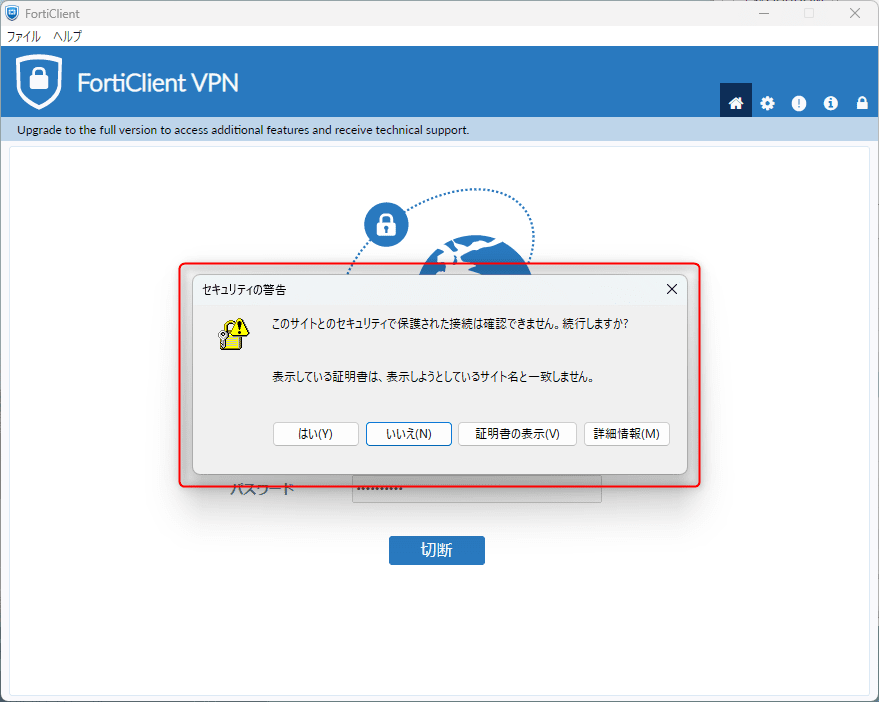
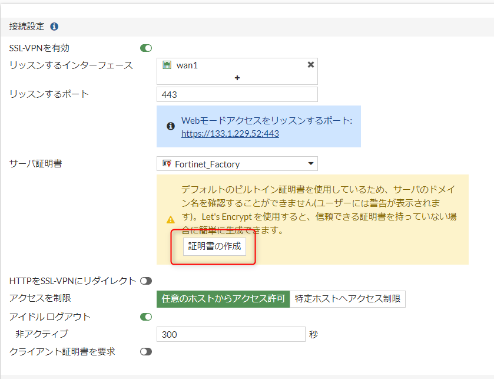
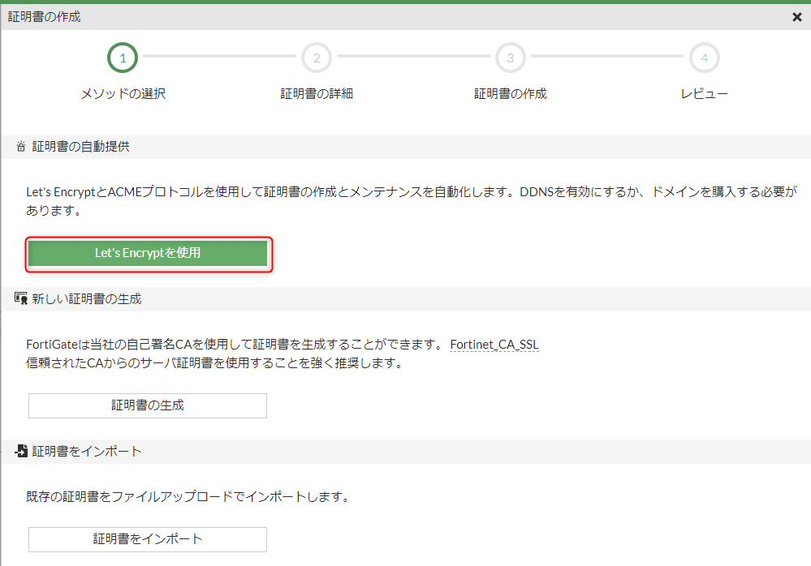
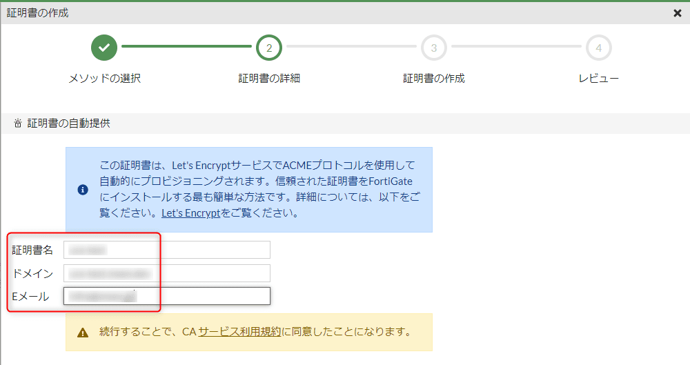
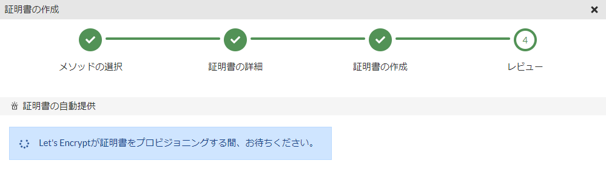
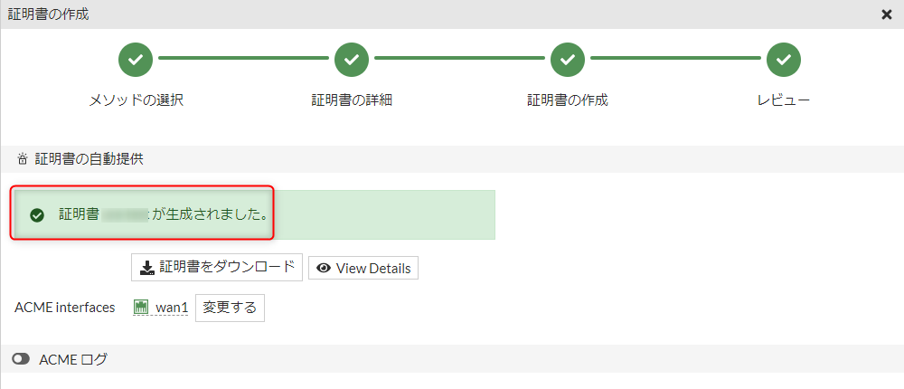
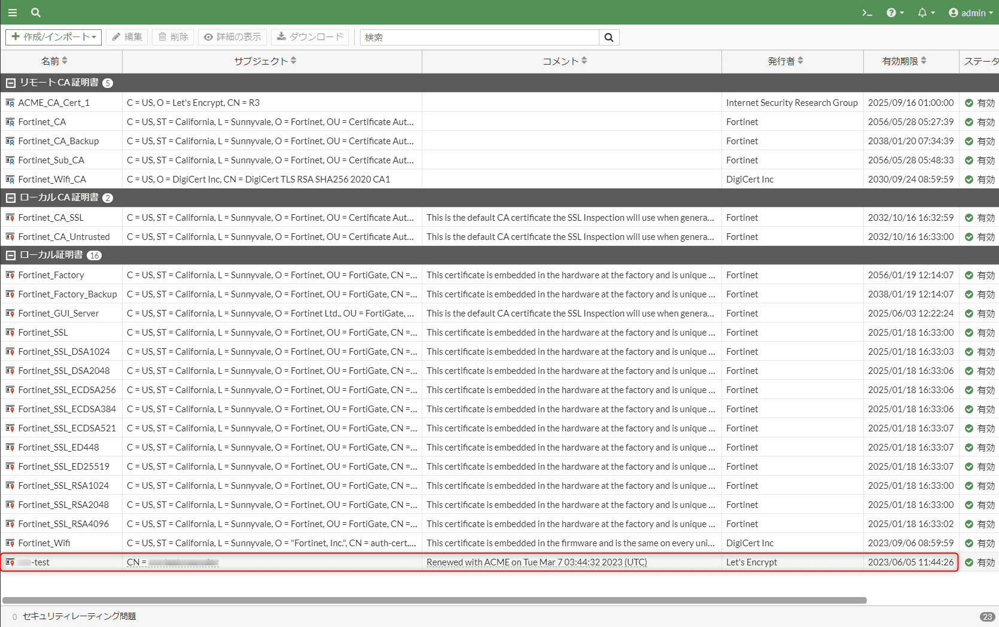
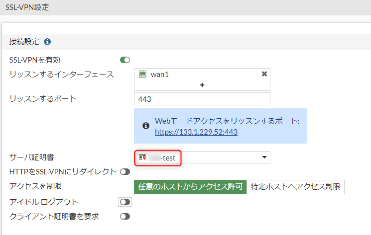

こんにちは、ひらたつです。

FortiGate の SSLVPN でサーバー証明書を設定せずにクライアントから接続すると以下の警告が表示されます。

このような警告が出ると、安全と分かっていても少し不安になってしまいます。

これは SSL VPN にサーバー証明書を設定すれば解決しますが、毎年証明書の更新が必要になります。

そこで、この記事では FortiGate の SSL VPN に Let's Encrypt の証明書を設定する方法を紹介します。

## 想定環境

- Forti OS：v7.2.4

## 前提条件

[Automatically provision a certificate | FortiGate / FortiOS 7.2.4](https://docs.fortinet.com/document/fortigate/7.2.4/administration-guide/822087/automatically-provision-a-certificate)

- FortiGate の wan インタフェースの IP アドレスがインターネットに公開されていること
- 上記 IP アドレスにドメイン名が設定されていること
- ポート 80 が空いていること

    Let's Encrypt 証明書を設定する場合はポート 80 が空いている必要があります。詳細は以下を参照してください。  
    [チャレンジの種類 - Let's Encrypt - フリーな SSL/TLS 証明書](https://letsencrypt.org/ja/docs/challenge-types/)

    ポート 80 が空いているかどうかは以下のサイトなどを使って確認できます。  
    [ポートチェック【外部からポート開放確認】](https://www.cman.jp/network/support/port.html)

## Let's Encrypt 証明書の取得方法

1. [VPN] > [SSL-VPN設定] から「証明書の作成」をクリックします。

2. 「Let's Encryptを使用」をクリックします。

3. 以下の必要事項を入力します。
- `証明書名`：任意の名前を入力ください
- `ドメイン`：登録しているドメイン名を入力ください
- `Eメール`：任意のアドレスを入力ください

4. 証明書が生成される

少し待つと証明書が生成されます。

[システム] > [証明書] で一覧を確認すると、証明書が登録されていることが分かります。

※ [システム] に [証明書] が存在しない場合は、[システム] > [表示機能設定] の [証明書] を ON にしてください。

## Let's Encrypt 証明書の設定方法

[VPN] > [SSL-VPN設定] の [サーバ証明書] で先ほど作成した証明書を選択ください。

以上で設定は完了です。

VPN を接続して、警告ウィンドウが表示されなくなっていることをご確認ください。

## 終わりに

今回は FortiGate の SSL VPN に Let's Encrypt の証明書を設定する方法を紹介しました。

ご参考になれば幸いです。

では、次の記事でお会いしましょう。

## 参考

FortiGate の公式 HP にも登録方法が載っています。
今回はこちらを参考にして登録しました。

[Automatically provision a certificate | FortiGate / FortiOS 7.2.4](https://docs.fortinet.com/document/fortigate/7.2.4/administration-guide/822087/automatically-provision-a-certificate)
