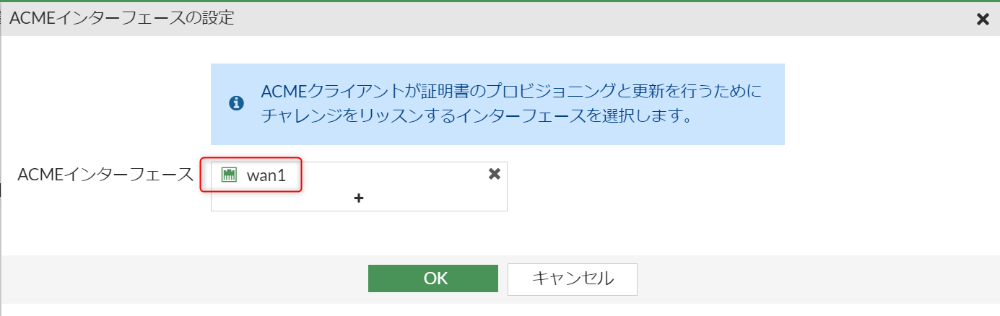
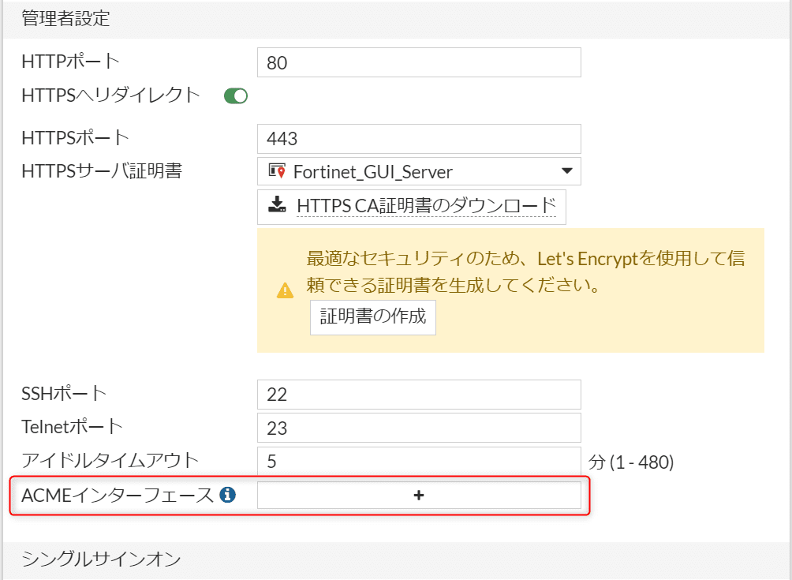

こんにちは、ひらたつです。

FortiGate の SSL VPN でサーバー証明書を設定せずにクライアントから接続すると以下の警告が表示されます。


このような警告が出ると、安全な接続先と分かっていても少し不安になってしまいます。

これは SSL VPN にサーバー証明書を設定すれば解決しますが、毎年証明書の更新が必要になります。

そこで、この記事では FortiGate の SSL VPN に Let's Encrypt の証明書を設定し、自動更新する方法を紹介します。

## 想定環境

- Forti OS：v7.2.4

## 前提条件

1. FortiGate の wan インタフェースの IP アドレスがインターネットに公開されていること
2. ドメイン名で FortiGate にアクセスできること
3. 上記 wan インタフェースの [管理者アクセス] で `HTTP` が許可されていること（ポート 80/tcp が開いていること）

    

    項目3について、ポートスキャンするとポートの開き状況が分かりますが、 **[管理者アクセス] で `HTTP` を許可していないとポートが開きません。**

    ```{numberLines:1}{7}
    hiratatsu04@pc:~$ nmap 192.168.1.99
    Starting Nmap 7.80 ( https://nmap.org ) at 2023-06-07 10:08 KST
    Nmap scan report for 192.168.1.99
    Host is up (0.0021s latency).
    Not shown: 996 filtered ports
    PORT     STATE  SERVICE
    80/tcp   open   http　　👈 [管理者アクセス] で HTTP を許可している
    113/tcp  closed ident
    443/tcp  open   https

    Nmap done: 1 IP address (1 host up) scanned in 5.79 seconds
    hiratatsu04@pc:~$
    hiratatsu04@pc:~$ nmap 192.168.1.99
    Starting Nmap 7.80 ( https://nmap.org ) at 2023-06-07 10:09 KST
    Nmap scan report for 192.168.1.99
    Host is up (0.0012s latency).
    Not shown: 997 filtered ports
    PORT     STATE  SERVICE
    113/tcp  closed ident
    443/tcp  open   https
    👆 [管理者アクセス] で許可していないため、HTTP の項目がない

    Nmap done: 1 IP address (1 host up) scanned in 5.88 seconds
    ```

    ※ **Let's Encrypt 証明書を設定する場合はポート 80/tcp が空いている必要があります。** 詳細は以下を参照してください。  
    [チャレンジの種類 - Let's Encrypt - フリーな SSL/TLS 証明書](https://letsencrypt.org/ja/docs/challenge-types/)


## Let's Encrypt 証明書の取得方法

#### 1. [VPN] > [SSL-VPN設定] から「証明書の作成」をクリック


#### 2. 「Let's Encryptを使用」をクリック


#### 3. 必要事項を入力


- `証明書名`: 任意の名前を入力ください
- `ドメイン`: FortiGate にアクセスできるドメイン名を入力ください
- `Eメール`: 任意のメールアドレスを入力ください  

※ この `Eメール` は証明書を発行する工程では使用されないみたいです。  
メールアドレスの用途を調べると、以下などの情報を送るために使用されるみたいでした。  

> これまでLet’s Encryptからメールで届いた情報は、  
> 「証明書の有効期限が間近」  
> 「Agreement（利用規約）の変更）」  
> 「認証方式 TLS-SNI-01 が廃止されるので、現在の設定を変更するように」  
> といったことぐらいでしょうか。
引用元：[Let’s EncryptによるSSLサーバー証明書の取得、自動更新設定（2021年3月版） | 稲葉サーバーデザイン](https://inaba-serverdesign.jp/blog/20210331/snap-lets-encrypt-ssl-certificate-update.html)

必要事項を入力後、画面下部にある「作成」をクリックしてください。

#### 4. ACME インタフェースの設定

ACME (Automated Certificate Management Environment) プロトコルで使われる、「チャレンジ」を受けるインタフェースを設定する画面が表示されます。

ACME チャレンジを受けるためにポート 80/tcp を開けたので、ここではポートを開けたインタフェースを設定します。



この ACME チャレンジを受けるポートは [システム] > [設定] から変更できます。



インタフェースを設定後、「OK」をクリックしてください。

#### 5. 証明書が作成される

少し待つと証明書が生成されます。


[システム] > [証明書] で一覧を確認すると、証明書が登録されていることが分かります。

※ [システム] に [証明書] が存在しない場合は、[システム] > [表示機能設定] の [証明書] を ON にしてください。


## Let's Encrypt 証明書の設定方法

[VPN] > [SSL-VPN設定] の [サーバ証明書] で先ほど作成した証明書を選択してください。


以上で設定は完了です。

VPN 接続後に警告ウィンドウが表示されなくなっていることを確認してください。

## 終わりに

今回は FortiGate の SSL VPN に Let's Encrypt の証明書を設定する方法を紹介しました。

ご参考になれば幸いです。

## 参考

FortiGate の公式 HP にも登録方法が載っています。  
今回はこちらを参考にして登録しました。

[Automatically provision a certificate | FortiGate / FortiOS 7.2.4](https://docs.fortinet.com/document/fortigate/7.2.4/administration-guide/822087/automatically-provision-a-certificate)
