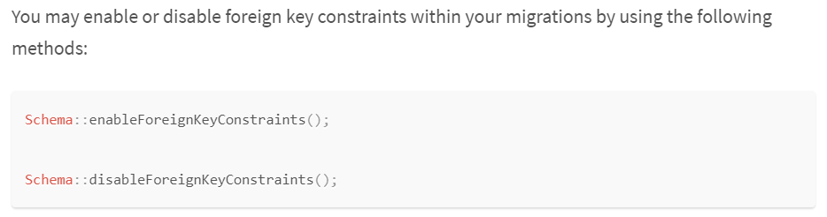
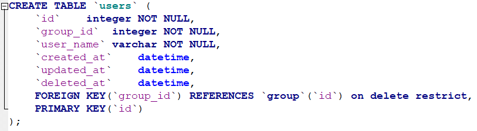

こんにちは。この度、新加入いたしました「**ふっくん**」です。
よろしくお願いいたします。

さて、現在Laravelを使用して開発を行っており、ローカル環境ではDBに**SQLite**を採用しました。
その際の、**外部キー制約**を設定する方法を備忘録として残します。

※**SQLiteでは、SQLite3から外部キーの設定が可能になりました**。

また、DBの作成はマイグレーションで行います。
マイグレーションについての説明は過去記事の[Laravel 5.3 Eloquent ORM 入門 2 (マイグレーション)](/laravel-53-eloquent-orm-2/)をご確認ください。


※以下に記載する内容は **Laravel 5.5.3** を前提としております。

## LaravelでSQLiteを使用するには？

SQLiteを使用するには、まずLaravelにSQLiteの設定をしてあげないといけません。
`.env`ファイルを以下のように編集してください。

```php
DB_CONNECTION=sqlite
DB_HOST=/*SQLiteに接続するためのホスト*/
DB_PORT=/*SQLiteに接続するためのポート番号*/
DB_USERNAME=/*SQLiteに接続するためのユーザー名*/
DB_PASSWORD=/*SQLiteに接続するためのパスワード*/
```

編集が完了したら、`database`ディレクトリ直下に`touch database.sqlite`などで、`database.sqlite`というファイルを作成すればOKです！
これで、LaravelからSQLiteに接続する準備は整いました！

## 外部キー制約のコードはどこに書けばいいの？

さて、これから外部キー制約のコードを書いていくのですが、そのコードはどこに書けばいいのでしょう？

今回は、サンプルとして`groups_table`と`users_table`を用意します。
ディレクトリ構成はこんな感じです！

```directory
database
  └ migrations
     ├2017_11_10_000001_create_groups_table.php
     └2017_11_10_000002_create_users_table.php
```

`groups_table`を参照先テーブル、`users_table`を参照元テーブルとします。
外部キー制約のコードは**参照元テーブル**に記載します！！
つまりここで言うと`2017_11_10_000002_create_users_table.php`に記載すればいいのです。
それでは、実際にどんなコードになるかと言うと、

```php
public function up(){
  Schema::create('users', function (Blueprint $table) {
    $table->integer('id')->unsigned();
    $table->primary('id');
    $table->integer('group_id');
    $table->string('user_name');
    $table->timestamps();
    $table->softDeletes();

    // 外部キー制約
    $table->foreign('group_id') // このテーブルの外部キー列
    ->references('id') // 参照先テーブルの ID 列
    ->on('groups') // 参照先テーブル
    ->onDelete('restrict');
  });
}
```

こんな感じです！
テーブルを作る順番に気をつけてくださいね。
「参照先」を作ってから「参照元」を作らないと怒られます。
外部キーを削除するコードも忘れずに書いてくださいね。

```php
public function down(){
  Schema::table('users', function (Blueprint $table) {
    $table->dropForeign(['group_id']);
  });

  Schema::dropIfExists('users');
}
```

## SQLiteの外部キー制約を有効にする

しかし、どうやらこれだけではSQLiteの外部キー制約は有効にならないようです。
なぜ有効にならないのか？

[SQLiteの公式サイト](https://sqlite.org/foreignkeys.html)を見てみると、

>Foreign key constraints are disabled by default (for backwards compatibility), so must be enabled separately for each database connection.
>**後方互換のため外部キー制約はデフォルトで無効になっていますので、データベース接続ごとに有効にする必要があります。**

ふむ。
SQLiteの外部キー制約を有効にするには`PRAGMA foreign_keys = ON;`のコマンドを実行しろ！とありますね。
しかし、今回はSQLiteのコマンドを叩くのではなく、Laravel上でソースコードを書いて外部キー制約を有効したい。
どうすれば。。。。

その答えは、[Laravel公式サイト（ページ下部）](https://laravel.com/docs/5.5/migrations)にありました！！！



>You may enable or disable foreign key constraints within your migrations by using the following methods:
>```
>Schema::enableForeignKeyConstraints();
>
>Schema::disableForeignKeyConstraints();
>```

ふむ。
外部キー制約を有効にするには**`Schema::enableForeignKeyConstraints();`**メソッドを書け！とありますね。
これをマイグレーションコードに書いてあげてください。

今回はマイグレーション以外でも有効にしたいので`AppServiceProvider.php`に書きました。

```directory
app
  └ Providers
     └AppServiceProvider.php
```

```php
<?php

namespace App\Providers;

use Illuminate\Support\Facades\Schema; // <- 追加
use Illuminate\Support\ServiceProvider;
use DB; // <- 追加

class AppServiceProvider extends ServiceProvider {
  public function boot() {
    // SQLiteの時、外部キー制約を有効にする
    if (\DB::getDriverName() == 'sqlite') {    // <- 追加
      Schema::enableForeignKeyConstraints();
    }
  }

  public function register() {
        //
  }
}
```

ここまで完了したらマイグレーションを実行しましょう！！
`php artisan:migrate`

そして、SQLiteの中を見てみると、、、、
（私は[DB Browser for SQLite](http://sqlitebrowser.org/)でSQLiteの中身を確認しています。）



`` FOREIGN KEY(`groups_id`) ``

きたーーーー！！！
めでたしめでたしでした。

