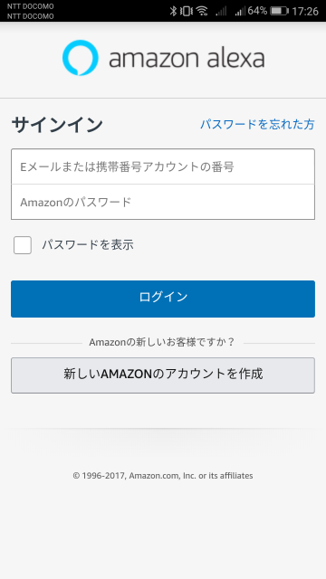
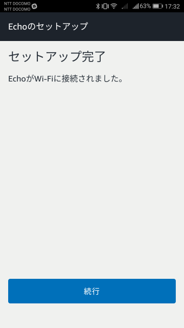

こんにちわ！ふっくんです！！

遂に、**例の物が我が社にやってきました。**

## Amazon Echo 現る
じゃーーーーん！！

 

というわけで、MSENに**Amazon Echo**がやってきました！！

**Amazon Echo**は**音声だけでリモート操作ができるスマートスピーカー**です。中枢であるAI音声サービスである **Alexa** が内蔵されています。

何ができるのかは、後で記載します。

記念撮影会を開催しましたので、まずはその写真をどうぞ。

この堂々たる風貌。。。かっこいい。。。

## Amazon Echoのセットアップ

撮影会も無事に終え、早速、先輩と共にセットアップです！！
まずは、自分のスマートフォンに専用アプリをインストールします。

アプリのインストールが完了したら、まずはアカウントを作成します。

すると、Alexaアプリのホーム画面が表示されます。

まずは**Echo自体がアクセスポイント**となってくれるので、スマートフォンのWi-Fi設定画面から、 **Amazon-7TV** に接続します。

接続すると「Echoに接続しました」となります。

次に、Echoに対して、自宅や会社のWi-Fiを設定してやります。

これでセットアップ完了です！！

さて、いよいよどんなことができるのか試していきます！！

## Amazon Echoができること

まず、付属の説明書によると、Alexaとおしゃべり、ニュース、各種情報、スマートホームなど記載されています。

さらに調べてみると、音楽をかけたり、家電と接続したり、銀行口座と連携することで残高・入出金の明細確認ができたり、料理のレシピを確認できたり、電車の運行情報を確認できたりするみたいですね。

これらは、*スキル*と呼ばれる拡張機能を追加していくことで、更にできることが増えていくようです。
（スマートフォンにいろんなアプリをインストールすることで、1台のスマートフォンでいろんなことができるのと同じ感覚です。）

例えば、音楽を聴きたいときは*「アレクサ、音楽かけて」*と言うだけで、音楽を再生してくれます。
しかも、*Amazon Music*と連携しているので、センスのいい音楽ばかり流してくれます！！

それに音も良い！

更に、スキルを見ていくと

？？ピカチュウトーク？？？（笑）
早速、*「アレクサ、ピカチュウ呼んで」*と話しかけてみます。
すると、間髪入れずに*「ピッピカチュウ～♪」*と、子どもの頃から聞き覚えのある声がスピーカーから聞こえてきました。

こちらの選択した言葉に反応してピカチュウのテンションが上がったり下がったり。
こういう遊び心大好きです。

アレクサに話かけて、実行されたスキルが履歴としても残っていくみたいです。

まだまだいろんなスキルがありますので、これからいろいろ試していこうと思います！

## 実際に使ってみた感想

まず、思ったことは*とにかく反応が早い！*
それに*言葉を読み取る精度が高い！*
これには驚きました。本当に家に1台あればかなり便利な代物だと思います。

子育てをしていて手が離せないママさんや、ご年配の方にもおすすめの代物だと思います。
あとは、せっかくベッドに入ったのに電気切るの忘れた、音楽聞きたいけどベッドから出るの嫌だ、という時に最適だと私個人の感想です（笑）

## エンジニアとしてAmazon Echoをどう使うか

Amazon Echoをサービスとして使用できる幅、可能性というのはとても広いと思います。
それにAWSと連携しているのでプログラムを組めば様々なサービスを展開できると思います。

弊社もこれを使って、こういうのを作ろう、こんなの作ってみたいというのがどんどん上がってきています。

機会があればぜひみなさんも購入してみてください！