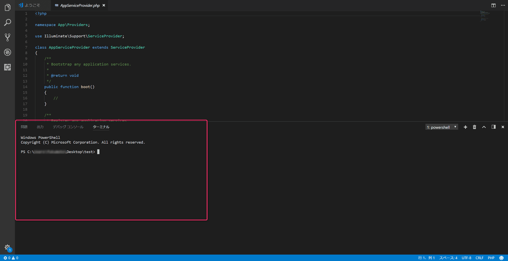

こんにちは。ふっくんです。

Laravelを使いだしてまもないので、「あれ？あのコマンドなんだっけ？」となることが多々ありますので、**Laravelでよく使うArtisanコマンド**をまとめます。
※以下に記載する内容は **Laravel 5.5.3** を前提としております。

## エディターはVisual Studio Codeがおすすめ ##

まず、Visual Studio Codeとは何でしょう？
マイクロソフト社が開発したエディターです！！

[Visual Studio Code - Visual Studio](https://www.microsoft.com/ja-jp/dev/products/code-vs.aspx)

ではなぜ、おすすめなのでしょう？

Laravelで開発を行っていると、度々Artisanコマンドを叩くことがあります。
開発を行っている時って、開発に使用しているソフト、実際に動いている画面、参考資料などいろんなアプリケーションを立ち上げますよね。
それに加えて、コマンドプロンプト（macOSではターミナル）も立ち上げて、もうデスクトップがゴチャゴチャ。。。

そこで！！
**Visual Studio Code**を使えば、エディタでソースコードを編集しつつ、同じ画面でArtisanコマンドを叩くことができます。

Visual Studio Codeを立ち上げて、 `表示` → `統合ターミナル` を選択してみてください。
(または、 `Ctrl` + `@` )



こんな感じで、エディタ内にターミナルが表示され、エディタ内でArtisanコマンドを叩けるようになります！
しかも、自動的にルートディレクトリまで移動してくれてるので、楽ですね。

ぜひ、Laravelの開発の際にVisual Studio Codeを使用してみてください。

## よく使うコマンド一覧 ##

それでは、Laravelでの開発の際によく使うArtisanコマンドを記載していきます。

参照サイト[Laravel5.5](https://readouble.com/laravel/5.5/ja/)

※私はデータベース回りを担当していますので、マイグレーションのArtisanコマンドが中心になります。
マイグレーションについては、過去のこちらの記事をご確認ください。
[Laravel 5.3 Eloquent ORM 入門 2 (マイグレーション)](/laravel-53-eloquent-orm-2/)

### 使用可能な全Artisanコマンドを確認 ###
```bash
php artisan list
```
利用できる全てのArtisanコマンド一覧を表示します。

### 使用できる引数、オプションを表示 ###
```bash
php artisan help
```
コマンドは合ってるはずなのに、引数やオプションを付けたらエラーになったという場合は、これ。

### ローカルサーバー起動 ###
```bash
php artisan serve
```
サーバーが起動されます。

### マイグレーションの実行 ###
```bash
php artisan migrate
```
用意したマイグレーションを全て実行します。

### 最後のマイグレーション操作をロールバックする ###
```bash
php artisan migrate:rollback
```
最後に実行したマイグレーションを元に戻します。

### 全マイグレーションをロールバックする ###
```bash
php artisan migrate:reset
```
`reset` という名前の通り、全てを元に戻します。

### 全マイグレーションをロールバックし、全部実行し直す ###
```bash
php artisan migrate:refresh
```
一度実行されたマイグレーションファイルは基本的に再度実行されないので、再度実行したい場合は `refresh` を付けましょう。
データベース全体を作り直したいときなどに便利。


以上！！
良きLaravelライフを！！