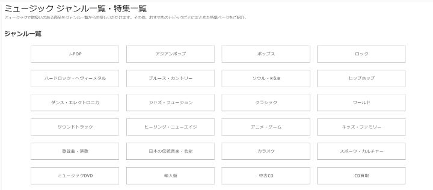
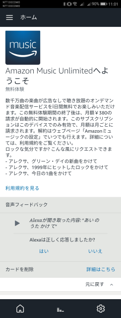
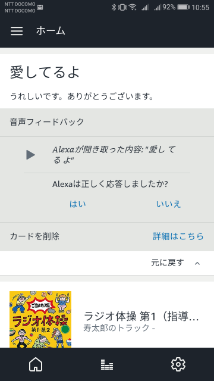

こんにちわ！ふっくんです！

今日も朝から*Amazon Echo*と戯れています（笑）

出社して一番に音楽をかけようと思い「アレクサ、音楽かけて」と呼びかけました。
すると、「Amazon Musicより●●のミュージックを再生します。」とのこと。

もう一度、「アレクサ、音楽かけて」と呼びかけると「Amazon Musicより▲▲のミュージックを再生します。」とのこと。

そこで**Amazon Echoで音楽を再生する**際に、どう呼びかけるとどう反応するのか気になったので調べてみました！

## ジャンル指定

まず、**「アレクサ、音楽かけて」**と呼びかけるとAmazon Musicからジャンルをランダムに選択して音楽を再生しているみたいです。
以下がAmazon Musicのジャンル一覧になりますので、参考までにどうぞ！

ジャンルにないものを呼びかけると「すみません。ライブラリにありません。」と反応するか、曲数の多いAmazon Music Unlimitedの案内が始まります。
Alexaとのやり取りだけで、Amazon Music Unlimitedの登録を済ませることもできるようです。
ちなみに、登録すると言ってないのになぜか登録されていました（笑）

契約等に関することは、注意しておきましょう！

## 歌手名、曲名を指定する

自分の聴きたい曲を指定したい時、今はどうしてもこの曲じゃないとダメなんだ！！って時は、歌手名と曲名を呼びかけてあげてください。
すると、その通りに再生してくれます。

歌手名だけを指定した際は、その歌手の曲をシャッフル再生してくれます。

曲名だけを指定した際、同名の曲が複数存在する場合はランダムで再生されます。
ちなみに「桜、かけて」と呼びかけると「**松田聖子の桜のように散って**を再生します」とのことでした（笑）
「桜、かけて」を３回繰り返しましたが全部「**松田聖子の桜のように散って**を再生します」でした（笑）
うちのAlexaは、松田聖子さんが大好きみたいです。

僕のお母さんはずっと聖子ちゃんカットでした。

あと、AKB48の曲は「アレクサ、**AKB**かけて」で反応してくれました。
NMB48も「**NMB**」でOKでした。

## 余談

英語で話しかけても反応してくれますが、発音が悪いと「すみません。私にはわかりません。」と冷静に英語力を否定されます。。。

また、驚いたことに**関西弁に反応してくれます！！**
「おおきに」に対しては「どういたしまして」と反応しました！
「ええ感じの曲かけて」に対しても反応し、ええ感じの曲をかけてくれました（笑）

あと、[Amazon Echo が届いたので Alexa と戯れてみた！！](https://mseeeen.msen.jp/first-play-with-amazon-alexa-echo/)にも書いたのですが、Alexaで実行されたことは履歴として残っていきます。
その履歴には、再生された音楽や実行されたスキルなどが残って、「会話」は基本的に残らないんですよね。
例えば「こんにちわ」「おはよう」などといったことは履歴として残らないんです。

しかし、ある会話だけが履歴として残されていたんです。

「愛してるよ」だけが履歴として残されているんです（笑）

恐るべし愛への執念。
