あけましておめでとうございます！ふっくんです！

さて、実際にAmazon Alexaのスキルを作成していきたいと思います！

今回は、Alexaに**一発ギャグ**をしてもらうスキルを作成することにします（笑）

Amazon Alexaのスキルを作成するには、**Amazon 開発者ポータル**と**AWS Lambda**を使用します。

## 全体の流れ

スキル作成の全体の流れとしては、以下のようになります。

1. 対話モデルの作成
[Amazon 開発者ポータル](https://developer.amazon.com/ja/)での作業となります。
ここでは、Alexaに呼びかける発話とその際のAlexaの反応を設定していきます。

2. サービスエンドポイントとなるAWS Lambda Functionの作成
[Amazon Web Service(AWS)](https://aws.amazon.com/jp/register-flow/)での作業となります。
ここでは、Alexaと連携させるサービスエンドポイントの作成を行います。

3. サービスエンドポイントの設定とテストを行うための設定
Amazon 開発者ポータルでの作業となります。
ここでは、AWS Lambdaで作成したサービスエンドポイントをAlexaに設定し、作成したスキルのテストを行うための設定を行います。

4. 実機でのテスト
こちらは必須ではありませんが、作成したスキルをAmazon Echoなどの実機でテストする方法を紹介いたします。

それでは、それぞの詳細を見ていきましょう！

## 対話モデルの作成

まずは、[Amazon 開発者ポータル](https://developer.amazon.com/ja/)にログインしてください。
ログインできたら、上部メニューから「ALEXA」を選択してください。

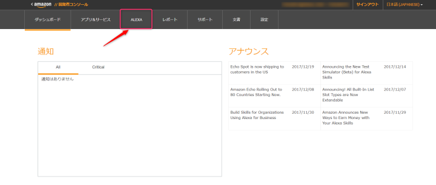

画面が切り替わったら、Alexa Skills Kitの「始める」を選択してください。

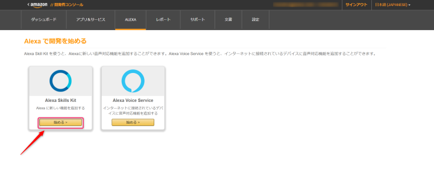

また画面が切り替わったら「新しいスキルを作成する」を選択してください。

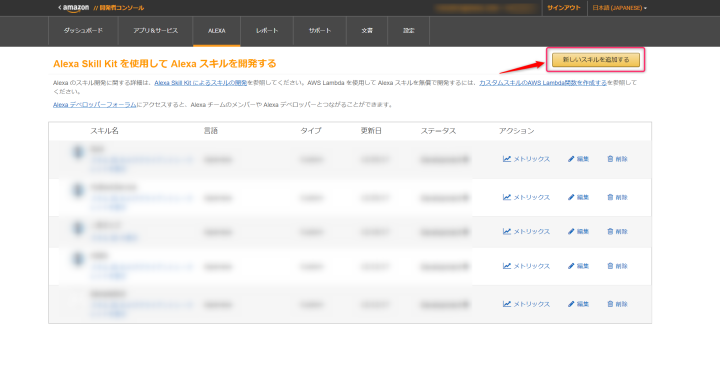

そうすると、スキルを作成する画面に切り替わります。

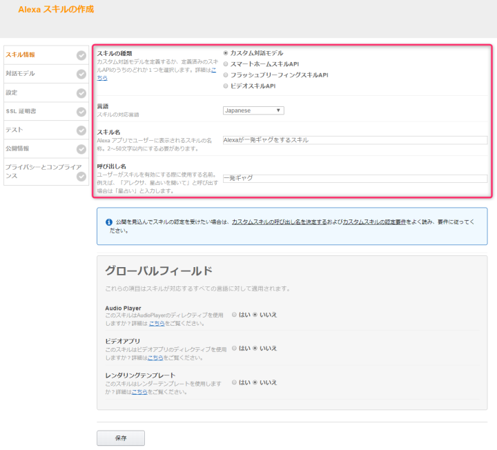

**スキルの種類**は、カスタム対話モデルを選択してください。
**言語**は、Japaneseを選択します。
**スキル名**は、[Amazon Alexa](https://alexa.amazon.com/spa/index.html#cards)上でユーザーに表示されるスキルの名前になります。

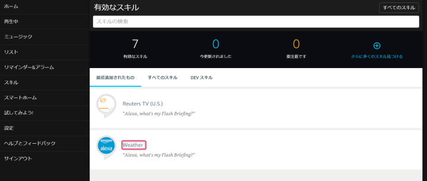

赤枠の部分ですね！これは、デフォルトで追加されていた「Weather」という名前のスキルです。つまり今回はここが「Alexaが一発ギャグをスキル」になります。

**呼び出し名**は、このスキルを起動するときにAlexaに呼びかけるワードになります。
つまり今回の場合は「アレクサ、一発ギャグを開いて」と呼びかけると、このスキルが起動します。
ちなみに呼びかけるとき、語尾に「**を開いて**」を付けないと作成したスキルは起動しませんので、覚えておいてください。

入力が完了したら、保存ボタンを押してください。
すると、新しいスキルとして保存されますので、「次へ」を押してください。

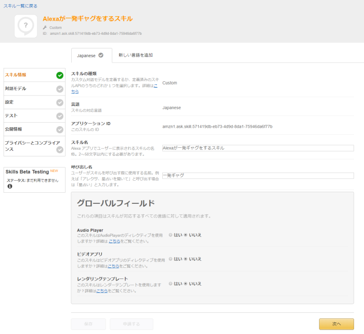

さて、ここからいよいよAlexaとの対話モデルを構築していきます。
JSON形式で構築もできるのですが、**スキルビルダー**という便利なツールが用意されていますので、こちらを使用しましょう。

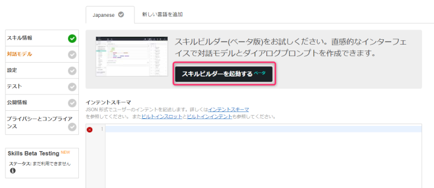

スキルビルダーが起動したら、Intentsの横にある「ADD」を選択してください。

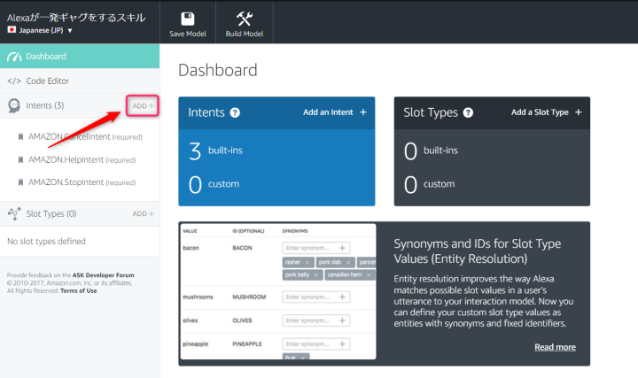

Intentには、Alexaに呼びかけるサンプル発話を設定します。

**Intent（インテント）**とは、ユーザーの音声によるリクエストを満たすアクションを表します。
つまり、**ユーザーがどのように呼びかけるとAlexaに反応してほしいか**をIntentに設定します。

今回の場合だと「アレクサ、一発ギャグして」「アレクサ、一発ギャグお願い」「アレクサ、一発ギャグするんだ」と呼びかけると一発ギャグをしてほしいので、設定するサンプル発話は以下のようになります。
`一発ギャグして`、`一発ギャグお願い`、`一発ギャグするんだ`

Intentの作成は以下の通りです。

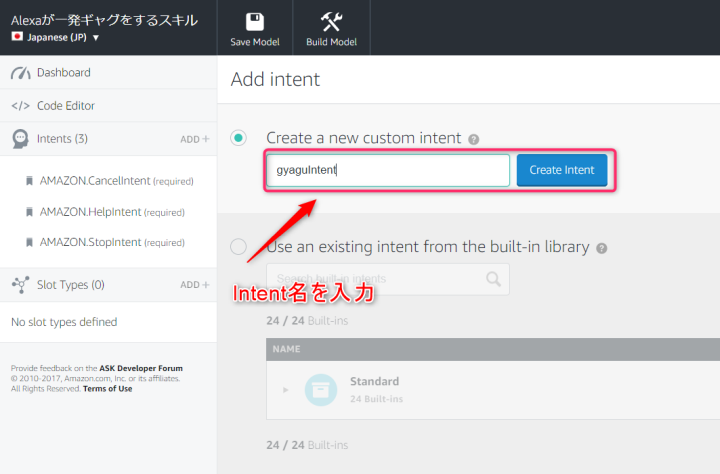

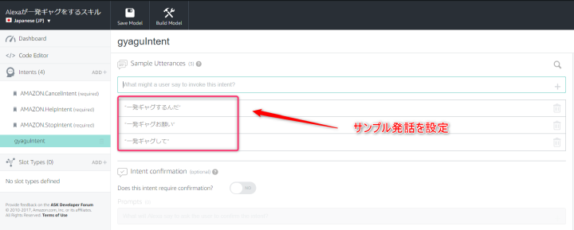

また、Amazonがあらかじめ提供しているIntentがデフォルトで設定されています。
これについては、詳しくは以下をご確認ください。

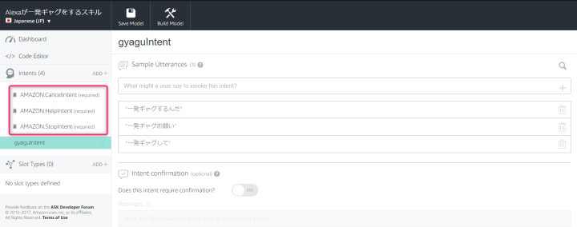
>[一般的標準インテント | Custom Skills](https://developer.amazon.com/ja/docs/custom-skills/standard-built-in-intents.html)

ここまでできたら「Save Model」を押して保存して、「Build Model」を押してください。
Buildには少しだけ時間がかかりますので、プログレス（ぐるぐる回ってるやつ）が消えるまで待ってください。
Buildが完了したら、「Configuration」を押して設定画面に戻りましょう。

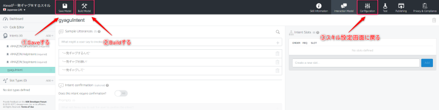

設定画面に戻ったら、Amazon 開発者ポータルでの作業は一旦中断します。
次は、AWS Lambdaでエンドポイントとなるfunctionを作成します。

## サービスエンドポイントとなるAWS Lambda Functionの作成

まずは、[Amazon Web Service(AWS)](https://aws.amazon.com/jp/register-flow/)にログインしてください。
ログインできたら、コンソールから「Lambda」を選択してください。

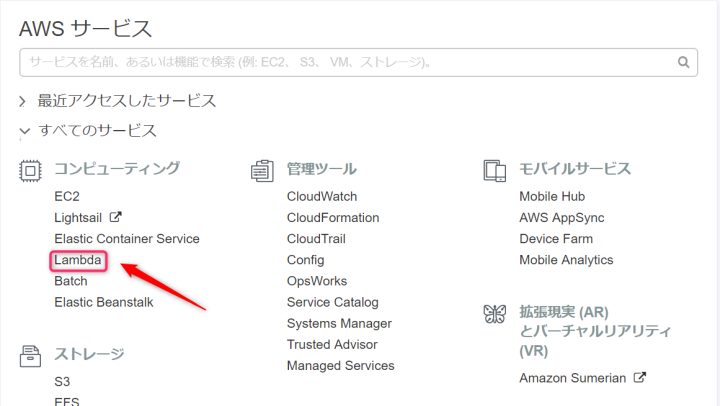

Lambdaを選択したら、右上の「関数の作成」を押してください。
すると、関数の作成画面が開きますので、画面上部右側の「設計図」を選択してください。

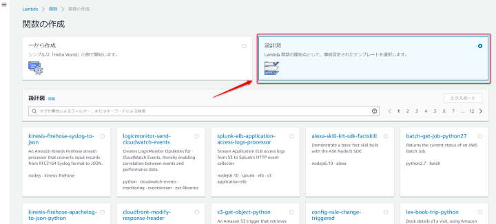

そのあと、検索ボックスに「Alexa」と入力し、検索結果から「alexa-skill-kit-sdk-factskill」を選択してください。

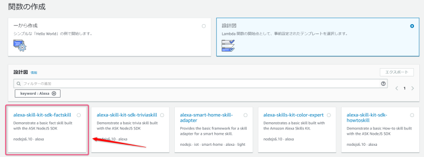

次に、基本情報を設定します。
「名前」には任意の関数名をつけてください。
「ロール」はベーシックなもので構いませんが、念のため選択したロールに*AWSLambdaBasicExecution*のポリシーがアタッチされているか確認しておいてください。

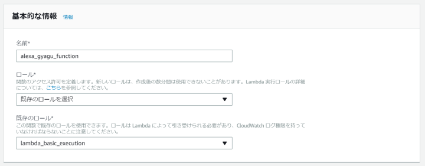

次にいよいよコードを書いていきます。
まず*Alexa Skills Kit*のトリガーを選択しておいてください。

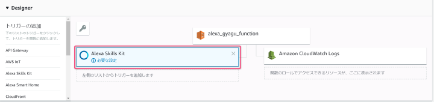

トリガーを選択したら、画面下部の「追加」を押してください。

さて、コードは以下のようになります。

```javascript
'use strict';
 
const Alexa = require('alexa-sdk');
 
const APP_ID = undefined;
 
const handlers = {
    'LaunchRequest': function () {
        this.emit(':ask', '私の一発ギャグを聴きますか？');
    },
    'gyaguIntent': function () {
        this.emit(':tell', 'サンシャイーーン！アレクサ！イエーーーーーイ！！');
    },
    'AMAZON.HelpIntent': function () {
        this.emit(':ask', '一発ギャグをします。私に一発ギャグをしてと言ってみてください。');
    },
    'AMAZON.CancelIntent': function () {
        this.emit(':tell', '新しいネタを考えておきますので、また遊んでくださいね。');
    },
    'AMAZON.StopIntent': function () {
        this.emit(':tell', '新しいネタを考えておきますので、また遊んでくださいね。');
    },
};
 
exports.handler = function (event, context) {
    const alexa = Alexa.handler(event, context);
    alexa.APP_ID = APP_ID;
    alexa.registerHandlers(handlers);
    alexa.execute();
};
```

コードの説明を簡単に説明しておきます。
`LaunchRequest`は、この**スキルを起動させた時**のAlexaの反応です。
つまり、ここでは
ユーザー「アレクサ、一発ギャグを開いて」
Alexa　「私の一発ギャグを聴きますか？」
という風になります。

`gyaguIntent`は、**サンプル発話に設定した呼びかけに対して**のAlexaの反応です。
つまり、ここでは
ユーザー「一発ギャグするんだ（一発ギャグお願い）（一発ギャグして）」
Alexa　「サンシャイーーン！アレクサ！イエーーーーーイ！！」
となります。

`AMAZON.HelpIntent`は、**スキルの使い方をAlexaに教えてもらいたい時**のAlexaの反応です。
例えば
ユーザー「アレクサ、使い方を教えて」
Alexa　「一発ギャグをします。私に一発ギャグをしてと言ってみてください。」
となります。

`AMAZON.CancelIntent`と`AMAZON.StopIntent`は**スキルをキャンセルさせたい時や、終了させたい時**のAlexaの反応です。
ユーザー「アレクサ、キャンセルして（アレクサ、中止して）」
Alexa　「新しいネタを考えておきますので、また遊んでくださいね。」となります。

`AMAZON.HelpIntent`、`AMAZON.CancelIntent`、`AMAZON.StopIntent`に関して、詳しくは以下をご確認ください。
>[一般的標準インテント | Custom Skills](https://developer.amazon.com/ja/docs/custom-skills/standard-built-in-intents.html)

さて、コードの入力が完了したら、「保存」を押して**ARN**をコピーしておいてください。

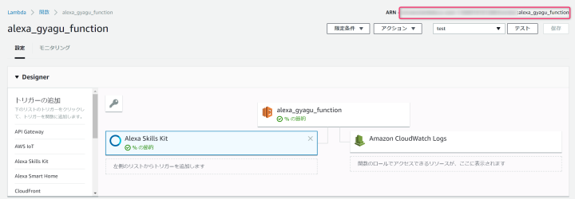

ここまでできたら再び[Amazon 開発者ポータル](https://developer.amazon.com/ja/)に戻ってスキルの設定をおこないます。

## サービスエンドポイントの設定とテストを行うための設定

Amazon 開発者ポータルを開いたら、左側のメニューで「設定」を選択してください。
そして、エンドポイントのタイプを**AWS Lambda の ARN**として先ほどAWS LambdaでコピーしたARNを張り付けて「次へ」を押してください。

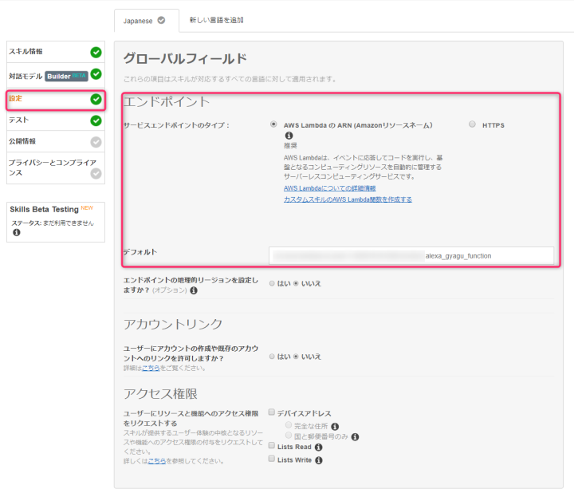

さて、いよいよテストを行います。
Amazon 開発者ポータルでは、Amazon Echoなどの実機を持っていなくてもシミュレーターで作成したスキルのテストを行うことができます。

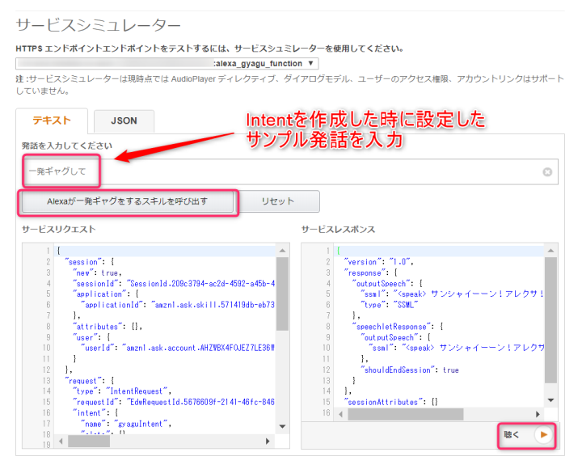

サンプル発話に設定したテキストを入力→スキルを呼び出す→聴く　を押してください。
すると設定通りにシミュレーターが反応がします。
いやー、設定通りに反応してくれた時は感動しました！！

もし、ここでエラーが出た場合は、スキルビルダーで設定したIntent名とAWS Lambdaでコードを書いたときのIntent名が一致しているかなどを確認してみてください。

## 実機でのテスト

Amazon Echoなどの実機でもテストを行うことができますので、その方法を紹介しておきます。

まず、[Amazon 開発者ポータル](https://developer.amazon.com/ja/)を開いてください。

左側メニューの「公開情報」と「プライバシーとコンプライアンス」の入力項目を埋めていきます。
全項目入力しないと実機テストができないということを覚えておいてください。

「公開情報」に関しては、テストをするだけで、スキルを公開しないのであれば「test」などととりあえず入力しておけばいいと思います。
「画像」の設定も必須ですので設定するようにしてください。
小アイコンは 108px × 108px、大アイコンは 512px × 512px という決まりがありますので、それぞれのサイズの画像を用意しておいてください。

「プライバシーとコンプライアンス」に関しても、全項目入力してください。ここは入力というよりも選択ですね。
そして、**テストのみで公開しないのであれば、「申請する」ボタンを押さずに「保存」ボタンを押してください**。

すると、**スキルのベータテスト**というボタンが選択できるようになりますので、選択してください。

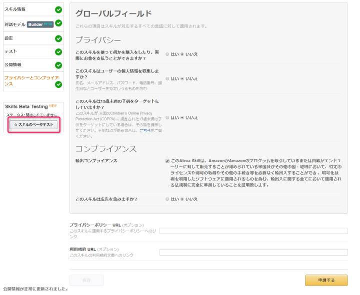

そして、テスターを追加する画面が開きますので、テスターのメールアドレスを入力して、「テスターの追加」「テストを開始」とボタンを押してください。
すると、入力したメールアドレス宛にメールが届きます。

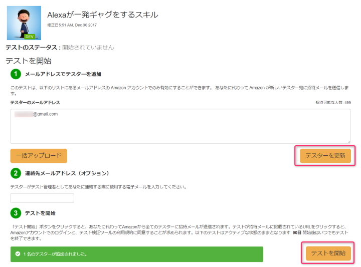

※上の画像では既にテスターを追加していたため「テスターの更新」というボタンが表示されていますが、初めての追加する場合は「テスターの追加」と表示されています。
※テスターのメールアドレスは[Amazon Alexa](https://alexa.amazon.com/spa/index.html#cards)のアカウント（Amazon.com アカウント）と同じメールアドレスになるようにしておいてください。
　詳しく検証できていませんが、アカウントの連携がうまくいかず実機テストできないことがありましたので、アカウントと同じメールアドレスにした方が無難かと思います。

届いたメールを確認すると、`Enable Alexa skill "Alexaが一発ギャグをするスキル"`という同じ名前のリンクが2つあるのが確認できます。
[Amazon Alexa](https://alexa.amazon.com/spa/index.html#cards)のアカウント（Amazon.com アカウント）の言語を日本語に設定している場合は`JP customers: To get started, follow this link:`という方のリンクを選択してください。

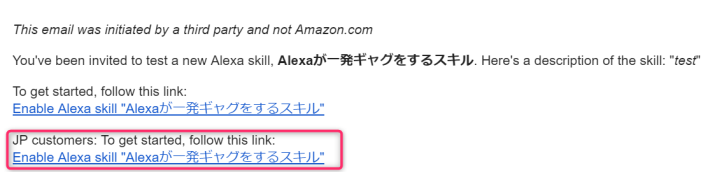

すると、[Amazon Alexa](https://alexa.amazon.com/spa/index.html#cards)に遷移し、スキルのテストをするための同意確認が表示されますので、同意するを選択してください。

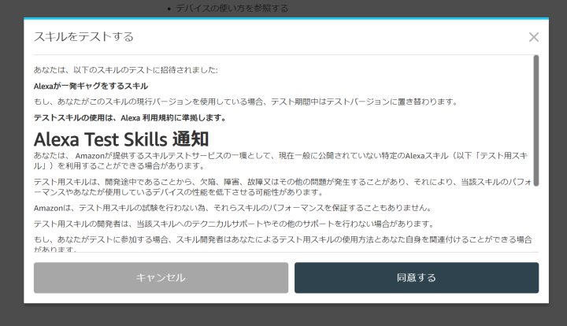

そうしたら、作成したスキルが表示されますので「有効にする」を選択すれば、あとはAlexaに話かけるだけです！

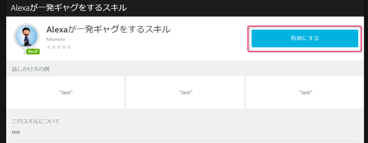

話し方の例で「test」となっている箇所は[Amazon 開発者ポータル](https://developer.amazon.com/ja/)の「公開情報」を設定する項目の「サンプルフレーズ」に入力した値が表示されます。
今回はテスト用に設定したので「test」と適当なものを入力しましたが、本来ならIntentのサンプル発話に設定したフレーズを入力するべきですね。
横着してすみません。。。（笑）

今回は、クラスメソッド様の以下のブログを参考にさせていただきました。
>[【祝Alexa日本上陸】とりあえず日本語でスキルを作ってみる #alexa #aws #amazon #ask ｜ Developers.IO](https://dev.classmethod.jp/etc/first-step-of-making-alexa-custom-skills/)

ありがとうございました！
