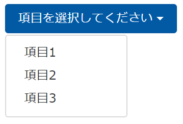

こんにちは！ふっくんです。

Bootstrapを使用してドロップダウンボタンを作って、選択した項目をボタンに表示させたい時ありますよね？



こういうドロップダウンで「項目1」を選択すると、


こんな感じで。

[Bootstrapの公式ページ](https://v4-alpha.getbootstrap.com/components/dropdowns/)には、このような動作をするドロップダウンは用意されてなかったため、処理を書いてみました。
ちなみに、JavaScriptの処理を書かないと無理っぽい？感じでした。

* 本記事では HTML5 を使用することを前提としております。

## HTMLのソースコード

まず、[Bootstrapの公式ページ](https://v4-alpha.getbootstrap.com/components/dropdowns/)には、ドロップダウンの以下のようなサンプルコードが用意されてます。

```html
<div class="btn-group">
    <button type="button" class="btn btn-primary dropdown-toggle" data-toggle="dropdown" aria-haspopup="true" aria-expanded="false">
        Action
    </button>
    <div class="dropdown-menu">
        <a class="dropdown-item" href="#">Action</a>
        <a class="dropdown-item" href="#">Another action</a>
        <a class="dropdown-item" href="#">Something else here</a>
        <div class="dropdown-divider"></div>
        <a class="dropdown-item" href="#">Separated link</a>
    </div>
</div>
```

これは、項目を選択するとその項目の `href属性` に記載されたURLに遷移するよーってやつですね。

今回はリンクをさせたいわけではなく、 *選択した項目をボタンに表示したい* ので、以下のように修正してください。

```html
<div class="dropdown">
    <button type="button" class="btn btn-primary dropdown-toggle" data-toggle="dropdown" aria-haspopup="true" aria-expanded="false">項目を選択してください</button>
    <ul class="dropdown-menu">
        <li><button class="dropdown-item" value="項目1">項目1</button></li>
        <li><button class="dropdown-item" value="項目2">項目2</button></li>
        <li><button class="dropdown-item" value="項目3">項目3</button></li>
    </ul>
</div>
```

## JavaScriptのソースコード

JavaScript側の処理は以下のようになります。

```javascript
$(function(){
    $('.dropdown-menu .dropdown-item').click(function(){
        var visibleItem = $('.dropdown-toggle', $(this).closest('.dropdown'));
        visibleItem.text($(this).attr('value'));
    });
});
```

これで、ドロップダウンで選択した項目がボタンに表示されます。

`colsest()` は、開始要素から最も近い先祖要素を選択します。
>[closest(\[expr\]) - jQuery 日本語リファレンス](http://semooh.jp/jquery/api/traversing/closest/%5Bexpr%5D/)

つまり、 `var visibleItem = $('.dropdown-toggle', $(this).closest('.dropdown'));` は、内容の反映先 `button.dropdown-toggle` を取得しています。
そして、 `visibleItem.text($(this).attr('value'));` では、 `$(this)` で `button.dropdown-item` を取得し、選択された項目の `value` の値に書き換えています。

ソースコード全体はこんな感じになります。

```html
<!DOCTYPE html>
<html lang="ja">
    <head>
        <!-- Required meta tags -->
        <meta charset="utf-8">
        <meta name="viewport" content="width=device-width, initial-scale=1, shrink-to-fit=no">

        <!-- Bootstrap CSS -->
        <link rel="stylesheet" href="https://maxcdn.bootstrapcdn.com/bootstrap/4.0.0-alpha.6/css/bootstrap.min.css" integrity="sha384-rwoIResjU2yc3z8GV/NPeZWAv56rSmLldC3R/AZzGRnGxQQKnKkoFVhFQhNUwEyJ" crossorigin="anonymous">
    </head>
    <body>
        <div class="dropdown">
            <button type="button" class="btn btn-primary dropdown-toggle" data-toggle="dropdown" aria-haspopup="true" aria-expanded="false">項目を選択してください</button>
            <ul class="dropdown-menu">
                <li><button class="dropdown-item" value="項目1">項目1</button></li>
                <li><button class="dropdown-item" value="項目2">項目2</button></li>
                <li><button class="dropdown-item" value="項目3">項目3</button></li>
            </ul>
        </div>

        <!-- jQuery first, then Tether, then Bootstrap JS. -->
        <script src="https://code.jquery.com/jquery-3.1.1.slim.min.js" integrity="sha384-A7FZj7v+d/sdmMqp/nOQwliLvUsJfDHW+k9Omg/a/EheAdgtzNs3hpfag6Ed950n" crossorigin="anonymous"></script>
        <script src="https://cdnjs.cloudflare.com/ajax/libs/tether/1.4.0/js/tether.min.js" integrity="sha384-DztdAPBWPRXSA/3eYEEUWrWCy7G5KFbe8fFjk5JAIxUYHKkDx6Qin1DkWx51bBrb" crossorigin="anonymous"></script>
        <script src="https://maxcdn.bootstrapcdn.com/bootstrap/4.0.0-alpha.6/js/bootstrap.min.js" integrity="sha384-vBWWzlZJ8ea9aCX4pEW3rVHjgjt7zpkNpZk+02D9phzyeVkE+jo0ieGizqPLForn" crossorigin="anonymous"></script>
        <script>
            $(function(){
                $('.dropdown-menu .dropdown-item').click(function(){
                    var visibleItem = $('.dropdown-toggle', $(this).closest('.dropdown'));
                    visibleItem.text($(this).attr('value'));
                });
            });
        </script>
    </body>
</html>
```
