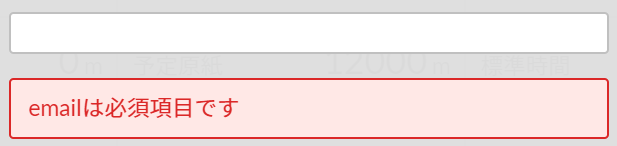
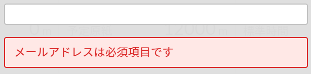
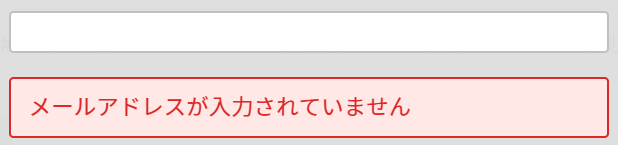

こんにちは。ふっくんです。

Vue.jsのバリデーションライブラリ `VeeValidate` の固有メッセージを変更する方法を紹介します。

※既にVeeValidateを導入されている方を対象としています。
VeeValidateの導入方法などは本記事では紹介しません。
メッセージの日本語化についても本記事では紹介しません。

## 基本的なVeeValidateの使用方法の確認

入力フォームの必須チェックを例に見てます。

```html
<input type="text" class="" v-model="emailAddress" name='email' v-validate="{ required: true }">
```



`v-validate="{ required: true }"` で必須チェックが有効になります。
`v-validate="'required'"` でも可能です。

このように、要素の `name属性の属性値 + requiredの固有メッセージ(は必須項目です)` というメッセージが表示されます。
※メッセージのデザインは独自のスタイルを適用しています。

name属性の属性値をそのまま表示せずに、任意のテキストに変更する場合は `data-vv-as` を使用します。

```html
<input type="text" class="" v-model="emailAddress" name='email' v-validate="{ required: true }" data-vv-as="メールアドレス">
```



ここまでが基本的なVeeValidateの使用方法です。

## 固有メッセージの変更方法

上記の例の場合 `は必須項目です` が `required` の固有メッセージとなります。
これを変更したい場合は以下のようにします。

```javascript
import { Validator } from 'vee-validate'

const dict = {
  custom: {
    email: {
      required: 'メールアドレスが入力されていません'
    },
  }
}
Validator.localize('ja', dict)
```



`custom` に対象となるルール名をキー、メッセージを値として定義してください。
そうすると、VeeValidateにデフォルトで定義されている固有のメッセージを上書きすることができます。

>参考
[Error Messages | VeeValidate](https://baianat.github.io/vee-validate/guide/messages.html#field-names)