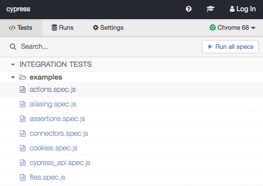
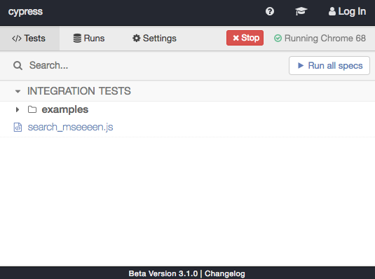
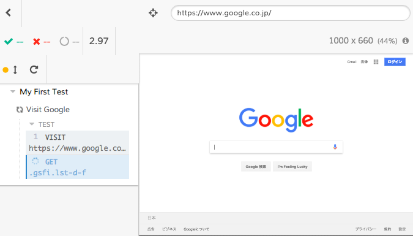
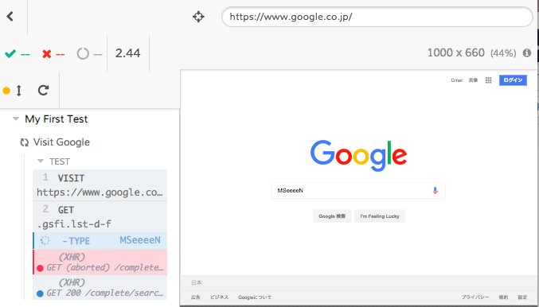
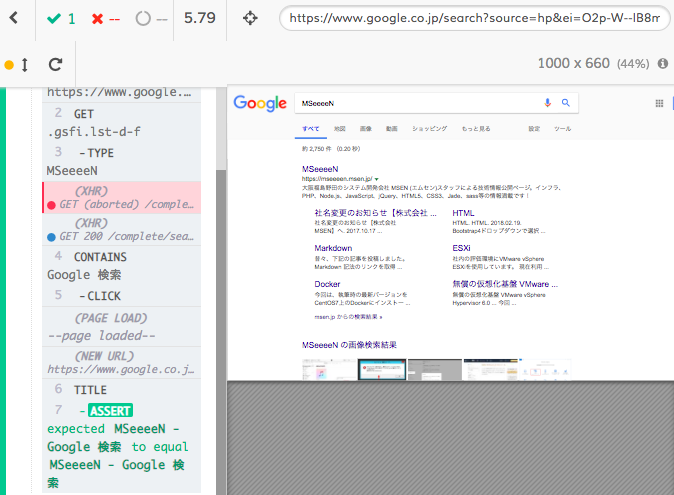

こんにちは。ふっくんです。

今回は自動テストツール `Cypress` のご紹介をします。

※検証環境 macOS 10.12
※node.jsを事前にインストールしておいてください。

## Cypress とは

Web UIの自動テストをしてくれるツールです。
有名どころでいうSeleniumと同様のツールですね。
以前にSeleniumを使用したことがあるのですが、WebDriverのインストールやなんちゃらでとにかくセットアップが大変でした。。。
それに比べ、Cypressはコマンド１回実行すれば、準備OKです。

また、検証できるブラウザはChromeのみ、テストコードはJavascriptのみの対応となっているようです。

## インストール

公式ドキュメントの通りですが（[Installing Cypress | Cypress Documentation](https://docs.cypress.io/guides/getting-started/installing-cypress.html#System-Requirements)）まず初めに、テストを実行するプロジェクトのディレクトリに移動してください。
`cd /your/project/path`

次に、Cypressをインストールします。
`npm install cypress --save-dev`

これでインストールは完了です。

## 起動

インストールが完了したら、Cypressを起動します。
`npx cypress open`

しばらくすると、CypressのIDEが起動します。


サンプルですでにいくつかのテストファイルが用意されています。
任意のファイルを選択すると、自動テストが実行されます。

テストファイルを追加する場合は、 `npx cypress open` を実行すると `cypress` というフォルダが作成されます。
その配下の `integration` の中にテストファイルを追加していきます。

## テスト実行

Googleのトップページから本ブログのタイトルである「MSeeeeN」を検索してみたいと思います。
まず　`integration` 配下に `search_mseeeen.js` というファイルを作成します。

テストコードは以下のようになります。

```javascript
describe('My First Test', function() {
　　it('Visit Google', function() {
 　　// googleを開く
  cy.visit('https://www.google.co.jp')
  // 検索ウィンドウに MSeeeeN と入力する
  cy.get('.gsfi.lst-d-f')
  　　.type('MSeeeeN')
  // Google 検索ボタンを押下する
  cy.contains('Google 検索')
  　　.click()
  // DOMのtitleタグが MSeeeeN - Google 検索 であることを確認する
  cy.title().should('eq', 'MSeeeeN - Google 検索')
　　})
})
```

保存すると自動的にCypressのIDEに追加したファイルが追加されています。



`search_mseeeen.js` を選択すると自動テストが開始されます。







凄いですね！
あととにかくテスト実行時間が早いです。
上記は簡単なテストですが、わずか５秒ほどでテストが完了しました。

まだ、詳しい使い方を把握できていないので、もっと複雑なテストを実行する方法を勉強しておきます。

スクリーンショットを撮ることも可能っぽいですね！
テストコードとスクリーンショットから、テストを実行させると自動的に手順書作れないかなーーーー。

今回はこちらの記事を参考にさせていただきました！
ありがとうございました！！
>[Web UI の自動テストツール Cypress のご紹介](https://qiita.com/kkakizaki/items/4b6625a56fd2fa4c741c)