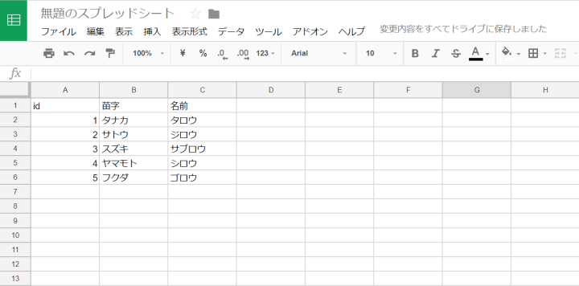

こんにちわ！ふっくんです。

Google スプレッドシートを使用して、 PHP で値を取得する方法を紹介いたします。
Google スプレッドシートを更新すれば、 PHP で取得する値も更新されますので非常に便利です。

※2020.05.24 共有設定の手順を追加しました。

## Google スプレッドシートでデータを準備する

まずは、Google スプレッドシートにデータを入力してください。
今回はサンプルとして以下のようなデータを準備しました。



## Google スプレッドシートの共有設定を行う

データの準備が完了したら、Google スプレッドシートの共有設定を行います。


画面右上の「共有」をクリックすると以下のようなダイアログが表示されます。


リンクを取得 の下部に `制限付き 追加されたユーザーのみが、このリンクから開くことができます` と表示されている場合は、 **リンクを知っている全員に変更** をクリックしてください。


上記のダイアログが表示されますので、 **リンクを知っている全員** に切り替わっていることを確認し、「完了」をクリック

Google スプレッドシートの名前を設定していない場合、下記のダイアログが表示されます。


必要に応じて名前を設定してください。スキップを選択しても支障はありません。

## Google スプレッドシートをWebに公開する

共有設定が完了したら、以下の順に操作し、 Google スプレッドシートをウェブに公開します。


画面上部の「ファイル」をクリックし、メニューから「ウェブに公開] をクリックします。


「公開」をクリックします。


確認ダイアログが表示されるので、「OK」をクリックします。


**変更が加えられたときに自動的に再公開する** にチェックをいれておけば、 Google スプレッドシートを更新した時、わざわざ再公開の操作を行わなくて済みます。

## データをJSONに変換する

Google スプレッドシートの値を PHP で取得するためには、データを JSON 形式に変換する必要があります。
その方法は、 URL を変更するだけです。

`https://spreadsheets.google.com/feeds/list/GoogleスプレッドシートのIDを入力/od6/public/values?alt=json`

Google スプレッドシートの ID というのは、データを入力したシートの URL のこの部分になります。
`https://docs.google.com/spreadsheets/d/GoogleスプレッドシートのID/edit#gid=0`


## PHP で値を取得する

さて、いよいよ PHP で値を取得していきます。

```php
<?php
$data = "https://spreadsheets.google.com/feeds/list/GoogleスプレッドシートのIDを入力/od6/public/values?alt=json";
$json = file_get_contents($data);
$json_decode = json_decode($json);

$names = $json_decode->feed->entry;

foreach ($names as $name) {
	echo $name->{'gsx$苗字'}->{'$t'};
	echo $name->{'gsx$名前'}->{'$t'};
        echo ",";
}
```
以上で OK です！
これで、 PHP で値を取得することができます。

Google スプレッドシートの値を JSON 形式に変換したものは以下のような構造になっているので、

```json
object(stdClass)#1 (3) {
  ["version"]=>
  string(3) "1.0"
  ["encoding"]=>
  string(5) "UTF-8"
  ["feed"]=>
  object(stdClass)#2 (12) {
    ["xmlns"]=>
    string(27) "http://www.w3.org/2005/Atom"
    ["xmlns$openSearch"]=>
    string(39) "http://a9.com/-/spec/opensearchrss/1.0/"
    ["xmlns$gsx"]=>
    string(52) "http://schemas.google.com/spreadsheets/2006/extended"
    ["id"]=>
    object(stdClass)#3 (1) {
      ["$t"]=>
      string(105) "https://spreadsheets.google.com/feeds/list/GoogleスプレッドシートのID/od6/public/values"
    }

    、、、中略

    ["entry"]=>
    array(5) {
      [0]=>
      object(stdClass)#17 (9) {
        ["id"]=>
        object(stdClass)#16 (1) {
          ["$t"]=>
          string(111) "https://spreadsheets.google.com/feeds/list/GoogleスプレッドシートのID/od6/public/values/cokwr"
        }

       、、、中略

        ["gsx$id"]=>
        object(stdClass)#23 (1) {
          ["$t"]=>
          string(1) "1"
        }
        ["gsx$苗字"]=>
        object(stdClass)#24 (1) {
          ["$t"]=>
          string(9) "タナカ"
        }
        ["gsx$名前"]=>
        object(stdClass)#25 (1) {
          ["$t"]=>
          string(9) "タロウ"
        }
      }

      、、、中略

        }
      }
    }
  }
}
```

まずは JSON 文字列を `$json_decode = json_decode($json);` でデコードします。
次に `$names = $json_decode->feed->entry;` でプロパティを指定して `$name->{'gsx$苗字'}->{'$t'}` と取得したい値を指定してください。

PHP ファイルを実行してみると、指定した`苗字`と`名前`が Google スプレッドシートから取得できていることがわかります。


## Excel として出力する

また、 Google スプレッドシートのデータは Excel としても保存することができますので、ぜひご活用ください！

