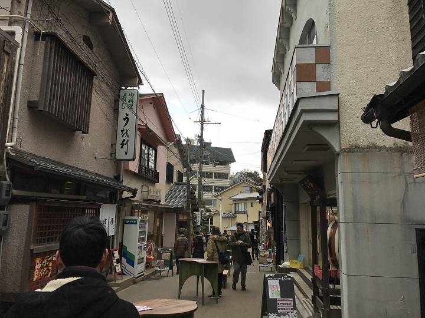
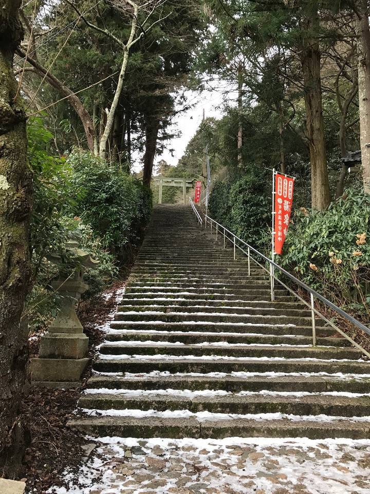

こんにちは！ふっくんです。

2月3日、4日に慰安旅行へ行ってきました！！

日々の疲れを取り、リフレッシュしよう！ということで *有馬温泉* へ行きました！
待ちに待ったこの日。旅行前日はまるで遠足前の小学生のようにワクワクして眠れませんでした（笑）

リフレッシュにはぜひ有馬へ。ということで、記事にまとめたいと思います。

## 温泉街

到着してまず最初に、温泉街を歩きました。
雪がちらついており、冬の温泉街にはぴったりな風景でした。

そして、有馬温泉と言えば*炭酸せんべい*！
歩けば炭酸せんべいを販売しているお店があるという感じでした。

*生炭酸せんべい*もありました！
焼きたてから5秒以内に食べて！とのこと。
通常の炭酸せんべいとは違う触感で美味でした！
しかし、熱すぎて5秒だと一口かじるのが精一杯。。。（笑）

そして、歩くたびに発見する怪しい看板。。。

子ども。。。？おじさん。。。？飛び出し坊やか！！（笑）

有馬温泉には全部で9つこの看板が設置されているそうです！
ぜひ全部見つけてみてください！（笑）

こういう遊び心大好きです（笑）

そしてまた歩いていると、なにやら風情のある階段を発見！！
そこを駆け上がると

神社を発見！！
神社に雪。神々しいですね。

ここは[湯泉神社（とうせんじんじゃ）](http://www.tousen.or.jp/)という神社で、*子宝・安産・厄除け・交通安全・商売繁盛・健康長寿祈願*などのご利益があるとのことで、メンバー全員にご利益があるようにしっかり参拝してきました。

## 旅館

さぁ、そろそろ宿のチェックインの時間が近づいてきましたので、宿へ向かいました。
今回は[兵衛向陽閣](https://www.hyoe.co.jp/)さんにお世話になります。

なんと、創業700年の歴史があるそうで、3種類の温泉があります！
どんな部屋かわくわくしながら、向かうと、、、、

*！！！！*
いやー、素晴らしい。

入室すると同時にメンバー全員がくつろいでいました（笑）

ゆっくりしたところで、いざ温泉へ！！

温泉は、*和風な一の湯*、*ローマ風な二の湯*、*湯治場風な三の湯*と三種類です。
日々の疲れをしっかりと癒させていただきました。
ちなみに、到着後、夜、翌朝とメンバー全員三種類満喫しました！！

>[有馬最大級の温泉施設 | 旅館 兵衛向陽閣【公式】](https://www.hyoe.co.jp/hotspa/)

さて、お楽しみの晩御飯です！
お品書きはこんな感じでした。

刺身、神戸牛、蟹などなど美味しいものをたくさんいただきました！

みんなでワイワイしながら、お酒も進み、非常に楽しい時間となりました。

そして食事のあとは、温泉と言えば恒例の、、、、*卓球大会！！！*
トーナメント方式で試合を行い、なんと上位3名には社長から*景品*が！！！

もうみんな必死ですよ（笑）

得点が入るたびに叫びながら、ガッツポーズしながら、みんな楽しそう（笑）
全員でスポーツしたりする機会も少ないので、こういうのも楽しいですね！！！

気になる景品ですが、上位3人は*Amazonギフト券*いただきました！

さて、お腹もいっぱいになり、卓球で盛り上がり、夜も更けてきましたので、部屋でしっぽり晩酌をして、そろそろお開きの時間が近づいてきました。
リフレッシュして、美味しいものを食べて、楽しかった思い出を胸にみんな寝床につきました。

このような機会を企画してくれた幹部の皆様には本当に感謝です。
しっかりとお返しができるように、日々精進していきます。

次回の慰安旅行を楽しみに頑張ります！