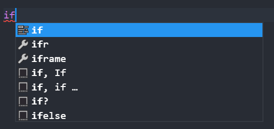
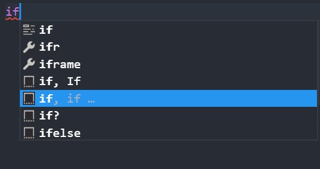
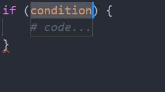
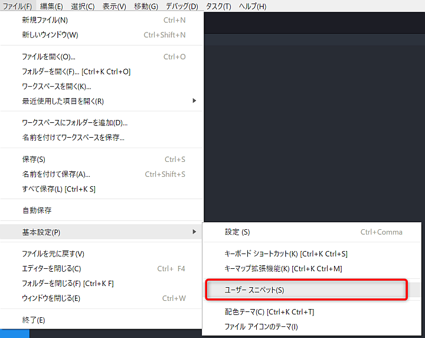
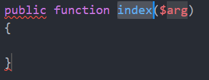

こんにちは。ふっくんです。

今回は `スニペット` について紹介いたします！
また、前提として本記事では `PHP7.1.11` 、テキストエディタには[Visual Studio Code](https://code.visualstudio.com/)を使用しています。

## スニペットとは

突然ですが、以下のコードを書いてみてください。

```php
public function test($input)
{
    foreach ($input as $record) {
        $userName = $record->user_name;
        $userAge = $record->user_age;
        echo("{$userName}({$userAge})");
    }
}
```
このコードを書くのにどのくらい時間がかかったでしょうか？
僕は **1秒** です！！

なぜ **1秒** で書くことができたのか？
それは **スニペット** を使用したからです！

スニペットを使用すれば **あらかじめ登録しておいたコードを補完として呼び出すことができる** のです。
上記の例は、使いどころが限られている極端な例(本記事用に登録しました)ですが、普段よく使用するコードをスニペットとして登録しておくと便利です！

## 独自スニペット

では、独自スニペットを登録してみましょう。
なぜ独自かというと `for文` や `if文` のような一般的によく使用されるものは既に登録されています。

試しに `if` と入力して `Ctrl + space` をしてみてください。
※Visual Studio Codeの初期設定では `Ctrl + space` が補完候補を表示するショートカットキーとなっています。



このようにいくつかの入力候補が表示されます。
例えば上から5番目の候補を選択してみると、以下のようにif文のフォーマットが自動的に生成されます。





では、実際に独自スニペットを登録してみましょう。
```
ファイル → 基本設定 → ユーザースニペット
```
と進んでください。



すると検索ウインドウが開きますので `php.json` を選択してください。
独自スニペットはこの `php.json` に登録していきます。

僕は以下のようなスニペットを登録しています。
```php
public function index($arg)
{
    
}
```

`php.json` ではどのようになっているかというと、以下のようになっています。

```php
"Public Function": {
    "prefix": "pubf",
        "body": [
            "public function ${index}($${arg})",
            "{",
            "\t",
            "}"
        ],
        "description": "public function"
}
```

`Public Function` はスニペットの名前です。登録するコードと関連性のあるわかりやすい名前にしておけば問題ないでしょう。
`prefix` は補完候補として表示されるためのトリガーとなる文字です。つまり、上の例では `pubf` と入力して `Ctrl + space` とすれば補完候補として表示してくれます。
`body` には展開されるコードを定義していきます。
`description` はスニペットの説明です。これは補完候補のウィンドウで表示されます。

`body` の中身も説明しておきましょう。
動的に変動する文字は `${index}` のようにします。
このようにしておけば、上の例だと `index` のメソッド名を入力後に `Tabキー` で `arg` にカーソルが移動するようになります。



※コーディング規約を設定してあるので、エラー表示が出ています。

また `\t` とすれば、タブスペースも設定することができます。

その他にも PHPDOCや
```php
"PHPDOC": {
    "prefix": "phpd",
    "body": [
        "/**",
        "* ${1:description}",
        "* @param ${2:datatype} ${3:arg} ${4:description}",
        "*/"
    ],
    "description": "phpdoc"
}
```

ログ出力や
```php
"Log Debug": {
    "prefix": "log",
    "body": [
    "Log::debug($$index);"
    ],
    "description": "debug"
}
```

普段はLaravelを使用しているので、Laravelのトランザクション処理を登録しています。
```php
"Transaction": {
    "prefix": "tra",
    "body": [
        "DB::beginTransaction();",
        "",
        "try {",
        "\t$1",
	"\tDB::commit();",
	"} catch (Exception $$exception) {",
	"\tDB::rollBack();",
	"\tthrow $$exception;",
	"}"
     ],
     "description": "transaction"
}
```

これ便利だよーっていうスニペット登録されている方は教えてください！
