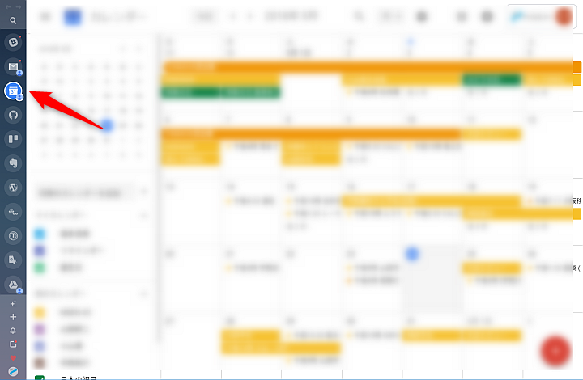

こんにちは。ふっくんです。

すごく便利なツールを見つけたのでご紹介します！！

## Station とは

一言で言えば**Webサービスを統合管理できるサービスです！**
恐らく、ほとんどの方は常時使用するWebサービスをブラウザ上で起動していると思います。
しかし、 気が付くとタブがこんな風になっていますよね？（笑）

そこで**Station**です！
[Station](https://getstation.com/)を使用すれば、Station上で様々なWebサービスを起動し、ワンクリックで切り替えることができます。

下の画像は実際の画面なのですが、ここでは[Trello](https://trello.com/)を開いています。

この状態でGoogleカレンダーを確認したい場合は、左サイドメニューからGoogleカレンダーのアイコンを選択するだけです！

Webサービスを切り替えるときも、タイムラグはなくアイコンをクリックと同時に切り替わります！

## Station にWebサービスを追加する

普段よく使用するWebサービスをStationに追加しておきましょう。
Slack、WordPress、Trello、Evernote、GitHub、Outlook、Gmail、Dropboxなど、メジャーなWebサービスはもちろん、対応しているWebサービスは400?500?ぐらいあるのではないかなという感じです。

Webサービスを追加するには、まず「＋」アイコンを押下してください。

するとStationで使用可能なWebサービス一覧が表示されますので、あとは使用したいWebサービスの「＋」アイコンをクリックするだけです！

みなさんもぜひ使用してみてください！！
