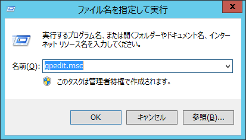
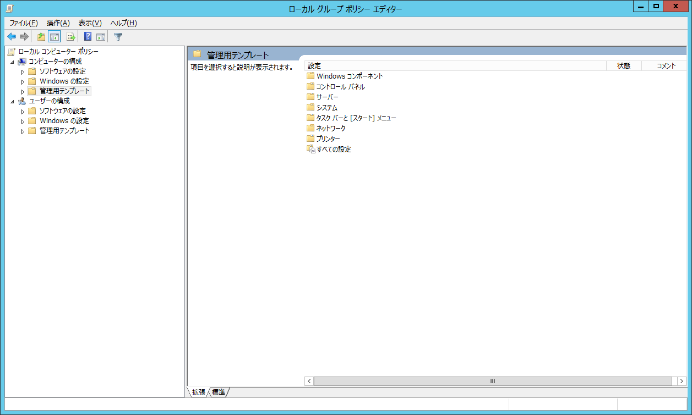
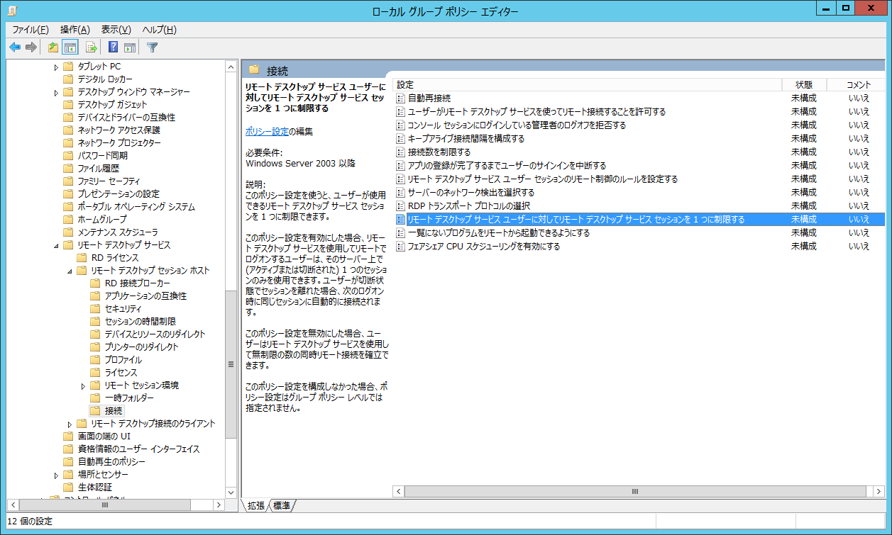
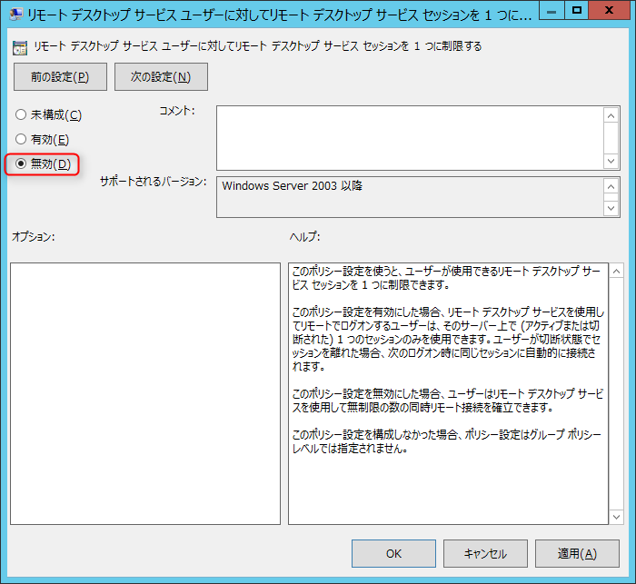
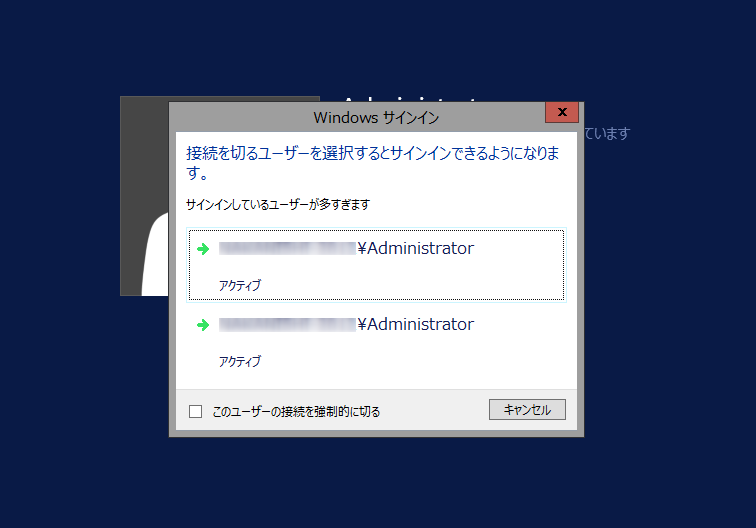

はじめましてこんにちは、じんないです。
主にインフラ関係の記事を書いていきます。よろしくお願いいたします。

サーバの構築なんかをしていると、効率よく並行して作業したいってことよくありますよね。
一方でアプリのインストールしながら、もう一方で設定をしたりとか。
そこで今回はWindows Server 2012 R2のリモートデスクトップを2セッション有効にする方法を紹介します。

## グループポリシーの設定
[Windowsキー + R]で「ファイル名を指定して実行」を起動させ、[gpedit.msc]と入力

ローカルグループポリシーエディターが起動します。

[ローカルコンピューターポリシー]-[コンピューターの構成]-[管理用テンプレート]-[Windowsコンポーネント]-[リモートデスクトップサービス]-[リモートデスクトップセッションホスト]-[接続]の順にクリック

下から3つめ、[リモートデスクトップサービスユーザーに対してリモートデスクトップサービスセッションを1つに制限する]をダブルクリック

[未構成]から[無効]に変更

[OK]をクリックすれば完了です。再起動の必要はありません。

## 2セッション有効になっていることを確認
対象のサーバにリモートデスクトップ接続をし、2セッションまで入れることを確認します。

3セッション目を張ろうとして怒られているの図。

## あとがき
ちょっとした設定でとっても便利になる(しかも無料)ので、試す価値は十分にあると思います。
3セッション以上有効にしたい場合は、別途追加ライセンスを購入する必要があります。

なお、Windows 8やWindows 10などのクライアントOSでは、通常の方法ではマルチセッションにすることはできません。
非サーバーOSで複数接続したい場合は "termsrv.dll" でググると幸せになれるかもしれません。

今後もお役立ち情報を紹介していきます。

ではまた。