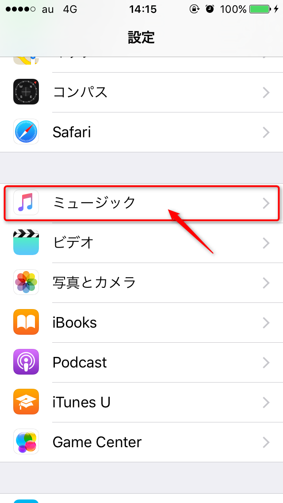
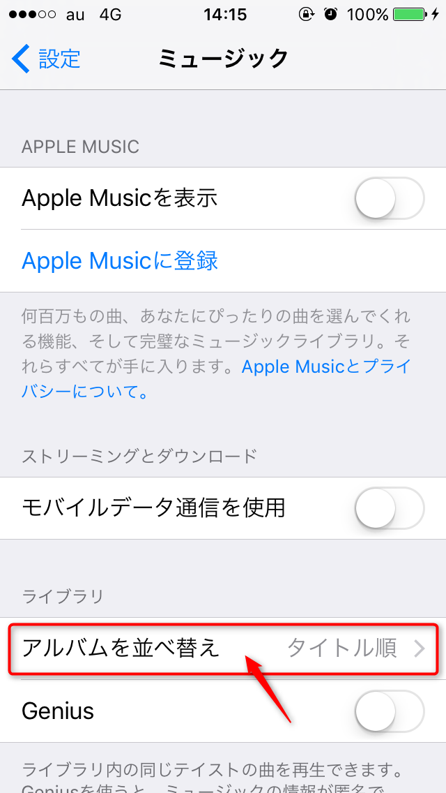
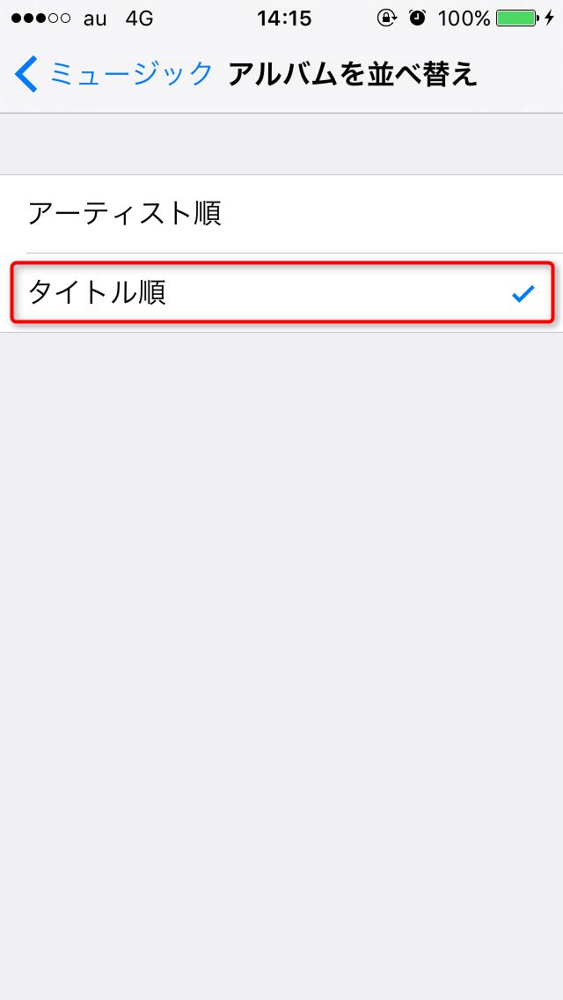
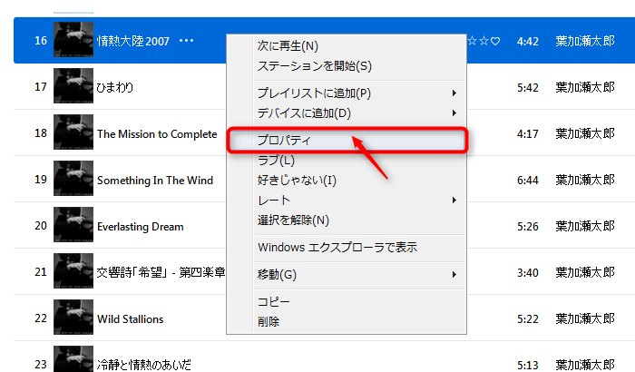
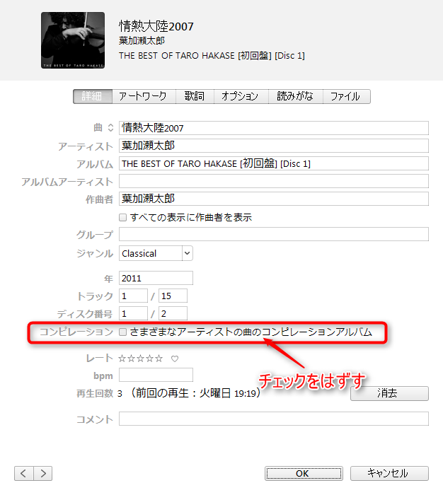

こんにちは、じんないです。

私はiPhoneに音楽を入れて、通勤途中や車でときどき聴いています。
いつもアーティストごとに聴いているのですが、、、

**「CDを借りてきてiPhoneに入れたはずなのに、入ってない？！」**

とか、

**「新しいiPhoneにしたら、曲が消えてしまった？！」**

なーんて経験ありませんか？

プレイリストにはちゃんと入っているのですが、アーティストごとにすると表示されない。
そんなときに確認したい2つのポイントを紹介します。

なお、本稿は以下のバージョンを前提としています。
・iOS 9.3.2
・iTunes 12.5.1.21

## アプリの設定がタイトル順になっているか
まずは、iPhone本体の設定
これはiPhone 4S(iOS 6) → iPhone 5S(iOS 7)のときにはまりました。

iPhoneの設定から「ミュージック」をタップします。

設定画面が表示されるので「アルバムを並べ替え」をタップします。

タイトル順になっていることを確認します。
アーティスト順になっている場合は、タイトル順に変更しましょう。

## コンピレーションのチェックがはずれているか
つぎは、iTunesの設定
これはiPhone 5S(iOS 7) → iPhone SE(iOS 9)のときにはまりました。

iPhoneに同期しているプレイリストを開きます。
該当する楽曲を右クリックし「プロパティ」をクリックします。

「さまざまなアーティストの曲のコンピレーションアルバム」のチェックがはずれているか確認します。
チェックが入っている場合は、はずしてOKボタンをクリックします。

なお、iTunesは複数楽曲のプロパティを同時に変更できますので、以下の小技を駆使してらくらく変更しちゃいましょう。
**・任意の楽曲を選択**　
　　[Ctrl + 左クリック(曲選択)]
**・こっから～ここまでの楽曲を選択**
　　[左クリック(始めの曲を選択)] → [Shift + 左クリック(終わりの曲を選択)]
**・プレイリスト内の全楽曲を選択**
　　[Ctrl + A]

最後にiTunesとiPhoneを同期します。

## あとがき
どうですか、iPhoneに目的の楽曲は表示されましたか。
iOSのバージョンに依存するのだと思いますが、
機種変更するたびにアーティストが表示されなくなっています（笑）

操作も簡単で使い勝手の良いiPhoneですが、ミュージックアプリは少し落とし穴がありますね。
快適なミュージックライフを送りましょう。

ではまた。