こんにちは、じんないです。

先日、バッファローの外付けHDDを譲ってもらったのですが、どうにもこうにも認識しないので修理してみました。

**-- 注意事項 --**
本稿は、趣味の一環で行ったものです。
真似される場合は自己責任でお願いいたします。
故障した場合はメーカーに修理を依頼するか、新しいものを購入しましょう。

## さっそく分解してみる

分解はいたって簡単。
底面にあるこのプラスねじを外します。
※2番のプラスドライバーが必要です。
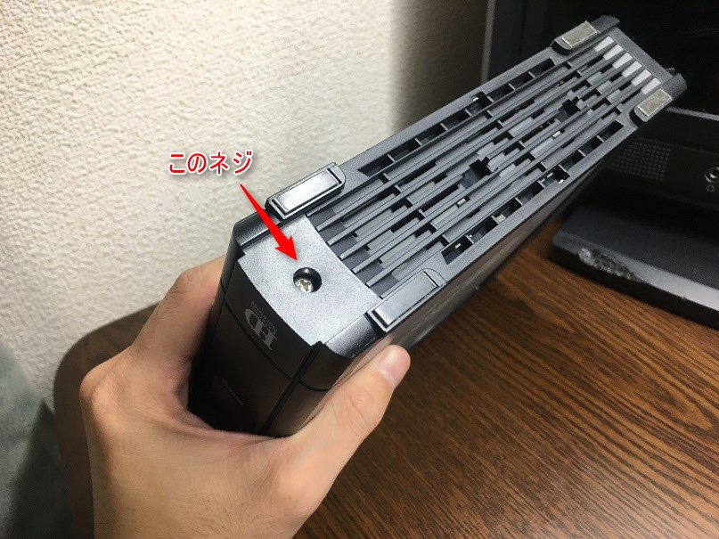

ねじが外れると、このようにパカッと外れます。
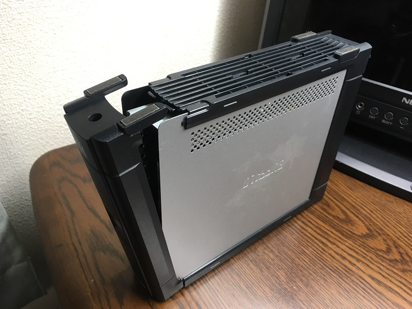

両サイドのパネルを前面方向に引き出します。
シールド用の薄い銅板がついているので、注意しましょう。
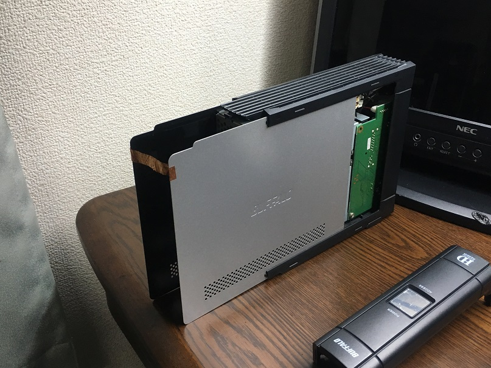

いよいよ中身が見えてきました。

## 犯人はコイツだ！

電源内蔵タイプのものなので、まずは電源回路周辺からチェックしていきます。
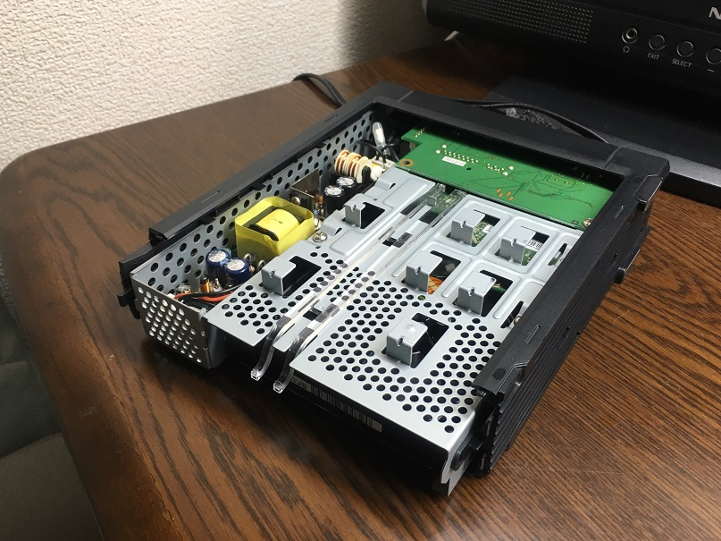

眺めていると、さっそく怪しいものが出てきました。
電源回路の電解コンデンサが膨らんでいるではありませんか。
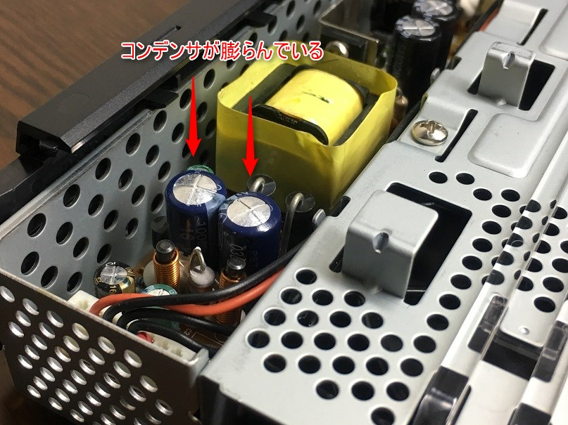

長時間の通電や熱がこもる状態(高温高負荷)だと、電解コンデンサの劣化が著しく早くなります。
症状が進行すると天面の溝(故意的に作った十字の溝)から破裂してしまうこともしばしば。。。
マザーボードのコンデンサでもよく見られる現象です。

これでは電源回路が正常に機能しないので、コンデンサを交換しちゃいましょう。

## 部品の交換

基板とケースを固定しているプラスねじ2本を取り外します。
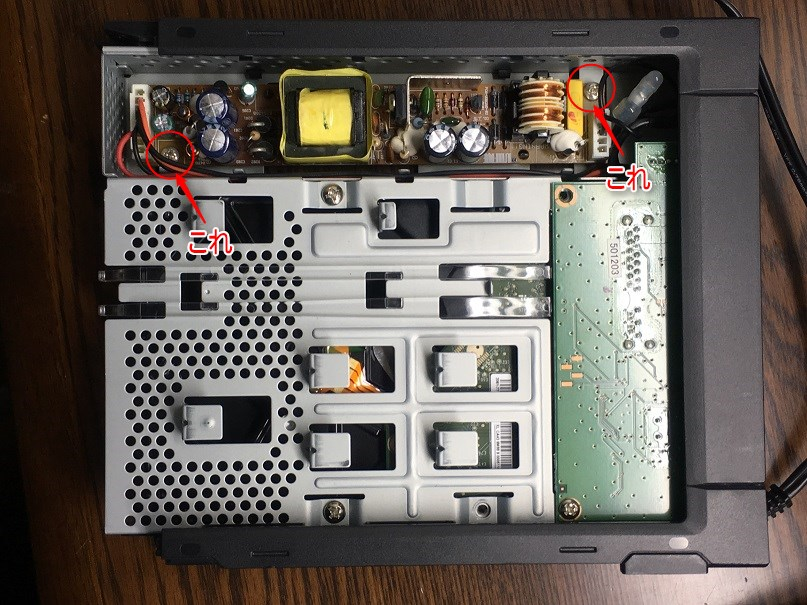

基板両端のコネクタをはずすと本体から分離できます。
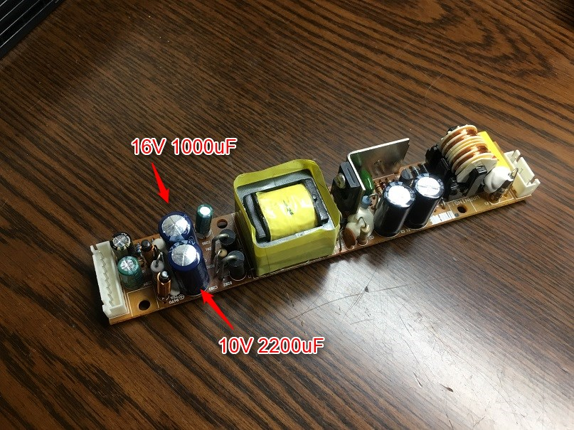

問題のコンデンサは以下の2つ。
**・16V 1000uF 105℃ × 1**
**・10V 2200uF 105℃ × 1**

では早速交換していきます。

新旧コンデンサ比較。
左：取り外したコンデンサ
右：新品のコンデンサ（東信工業製）
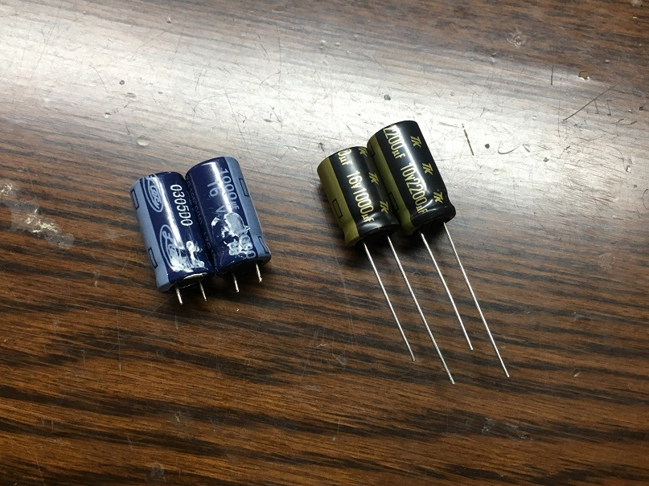

コンデンサはいつもお世話になっている[共立電子](http://silicon.kyohritsu.com/)さん(@日本橋)で購入しました。
WEBショップでも同じものを購入することができます。
[16V/1000uF/105℃品](http://eleshop.jp/shop/g/gE2K121/)
[10V/2200uF/105℃品](http://eleshop.jp/shop/g/g3CE138/)

新品のコンデンサをはんだ付けし、元通り組み上げていけば完成です。
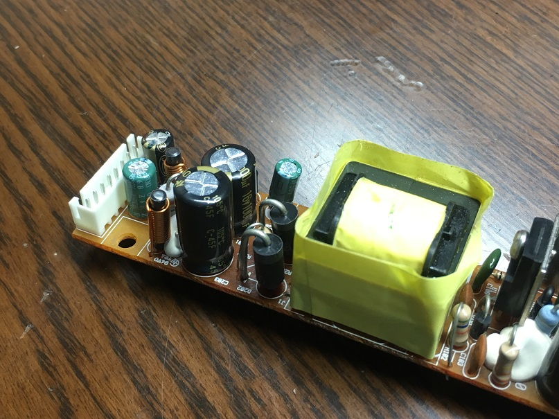

今回使用したツールはこれだけ。
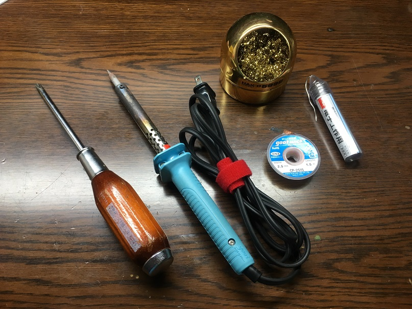
#2プラスドライバー、はんだごて、こて先クリーナー、はんだ吸い取り線、はんだ。
※ドライバーは貫通タイプでないものを推奨します。

はんだごては60Wのものを使用しました。
このほかに、[ミニバイス](https://www.amazon.co.jp/%E5%A4%AA%E6%B4%8B%E9%9B%BB%E6%A9%9F%E7%94%A3%E6%A5%AD-goot-ST-80-goo%EF%BD%94-%E3%83%9F%E3%83%8B%E3%83%90%E3%82%A4%E3%82%B9/dp/B001PR1KOM/ref=sr_1_2?ie=UTF8&qid=1475386055&sr=8-2&keywords=%E3%83%9F%E3%83%8B%E3%83%90%E3%82%A4%E3%82%B9)があると基板を固定できて便利です。

## 運命の瞬間

まずは外付けHDDに通電させ、異常がないこと確認します。

そしてPCに接続し、、、

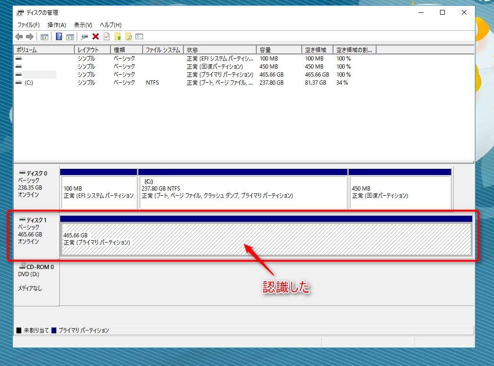

**無事に認識してくれました！**

※ディスクは500GBのものに交換しています。

## あとがき

普通なら処分してしまいがちですが、ちょっと手を加えると復活してくれることもあります。

この瞬間はなんとも言えませんね。

起動して思ったのは結構熱くなるので、常時運転する場合はファンを付けたほうが良さそうです。

**修理にかかった費用　145円**

ではまた。

