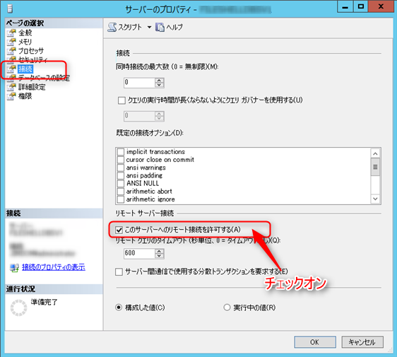

こんにちは、じんないです。

今回はMicrosoft SQL Server 2014 で[データベースミラーリング](https://msdn.microsoft.com/ja-jp/library/ms189852(v=sql.120).aspx)を構成する手順を紹介します。

最近ではSQL Serverの可用性を高める方法として、[AlwaysOn可用性グループ](https://msdn.microsoft.com/ja-jp/library/hh510230(v=sql.120).aspx)や[AlwaysOnフェールオーバークラスターインスタンス(FCI)](https://msdn.microsoft.com/ja-jp/library/ms189134(v=sql.120).aspx)などが主流かと思います。

しかしながら、Enterpriseライセンスが必要であったり、共有ストレージが必要だったりと制限事項が多いのも事実です。

将来的に廃止予定のミラーリングですが、まだまだ出番もあるかと思いますので、ここに記しておきます。

AlwaysOn可用性グループとAlwaysOn FCIについては[こちらで詳しく](http://www.slideshare.net/masayukiozawa/always-on-29859575)紹介されています。

## 想定環境
プリンシパルサーバー、ミラーサーバー、ミラーリング監視サーバーの3台から構成され、自動フェールオーバーができる環境を構築します。
※自動フェールオーバーが不要な場合は、ミラーリング監視サーバーは必要ありません。
また、OSはすべてWindows Server 2012 R2を使用します。

## 前提
* プリンシパルサーバーとミラーサーバーに**SQL Server Standard Edition**以上がインストールされている。
※同じエディションじゃないとだめです。
* ミラーリング監視サーバーに**SQL Server Express Edition**以上がインストールされている。  
* プリンシパルサーバーにミラーリングしたいデータベースが作成されている。
* 全サーバーでリモート接続の設定が完了している。
リモートの設定ができてない場合は、以下を実施してください。
### リモート接続設定(全サーバー)

* **ファイアウォールの例外設定**

以下のポートを開放します。
|種類|プロトコル|ポート|
|:--:|:--:|:--:|
|ポート|TCP|1433|
|ポート|TCP|5022|
|ポート|UDP|1434|

* **サーバーのプロパティを確認**
Microsoft SQL Server Management Studioを起動し、サーバーのプロパティを起動します。
左ペインの「接続」から「このサーバーへのリモート接続を許可する」に**チェックが入っている**ことを確認します。

* **TCP/IPを有効化**
Sql Server Configuration Managerを起動し、「SQL Serverネットワークの構成」>「MSSQLSERVERのプロトコル」より「TCP/IP」が**有効**になっていることを確認します。
**Express Editionはデフォルトが無効になっているので注意してください。**

## データベースのバックアップを取得
**【プリンシパル側で実施】**
### 復旧モデルの確認
ミラーリングには**完全復旧モデル**を使用するデータベースでないといけません。
**単純**や**一括ログ**復旧モデルではミラーリングがサポートされていないので注意が必要です。

対象のデータベースを右クリックし、「プロパティ」を起動。

左ペインの「オプション」をクリックし、復旧モデルを確認。
「完全」以外であれば、変更しておきます。

### バックアップは2つ必要
バックアップには**完全**と**トランザクションログ**の2種類が必要です。

対象のデータベースを右クリックし、「タスク」 > 「バックアップ」の順にクリック。

バックアップの種類で「完全」を選択し、「OK」をクリック。

ダイアログが出るので、「OK」をクリック。

同様の手順で「トランザクションログ」もバックアップを取得します。
このとき、バックアップ先を確認しておきましょう。

確認したディレクトリにバックアップが作成されていることを確認します。
※「完全」と「トランザクションログ」の2つをバックアップしましたが、作成されるファイルは1つです。

このファイルをコピーし、ミラーサーバーの同じディレクトリに格納します。

## バックアップから復元
**【ミラー側で実施】**

左ペインの「データベース」を右クリックし、「データベースの復元」をクリック。

「デバイス」を選択し、右側の「...」をクリック。

「追加」をクリック。

先ほどプリンシパルからコピーしてきたバックアップファイルを選択し、「OK」をクリック。

ちゃんと**完全**と**トランザクションログ**が含まれていることを確認します。

左ペインの「オプション」から復旧状態を**「RESTORE WITH NORECOVERY」**に変更し、「OK」をクリック。

ダイアログがでるので、「OK」をクリック。

復元が完了すると、こんな表示になります。

## ミラーリング設定
**【プリンシパル側で実施】**

対象のデータベースを右クリックし、「タスク」 > 「ミラー」の順にクリック。

「セキュリティの構成」をクリック。

ウィザードが起動します。「次へ」をクリック。

今回はミラーリング監視サーバーも構成するので、「はい」を選択して「次へ」をクリック。

「ミラーリング監視サーバー インスタンス」にチェックが入っていることを確認し、「次へ」をクリック。

「次へ」をクリック。

ミラーサーバーインスタンスを選択。

「接続」をクリック。

「次へ」をクリック。

同様に、ミラーリング監視サーバーインスタンスを選択し、接続できたら「次へ」をクリック。

ここは空白でもOK。「次へ」をクリック。

内容を確認して「完了」をクリック。

エンドポイントの構成に完了したら、「閉じる」をクリック。

ダイアログが表示されるので、「ミラーリングの開始」をクリック。

状態が「同期完了：データベースは完全に同期されています」となればミラーリングは成功。「OK」をクリックして終了します。
※「同期中」となった場合は、しばらくしてから「最新の情報に更新」をクリックしてみてください。

### ミラーリング開始中にエラーが発生した場合 (SQL Server エラー 1418)

ミラーリング中に以下のようなエラーが発生する場合があります。
**データベース <データベース名> のAlterに失敗しました。**

[マイクロソフトのWebページ(MSSQLSERVER_1418)](https://msdn.microsoft.com/ja-jp/library/aa337361.aspx)を見て、ネットワーク系かなと思いファイアウォールを無効にしてみたり、サービスアカウントの権限を変更してみたりしましたが、一向に解決する様子もなく。。。
結局は、**ミラサーバーでバックアップから復元時に「RESTORE WITH NORECOVERY」を選択し忘れていたことが原因**でした。

**NO**を見逃してはいけません。

## 自動フェールオーバーのテスト
さて、ミラーリング監視サーバーがちゃんと仕事をしているのか、チェックしてみたいと思います。

プリンシパルサーバーを以下のような方法でダウンさせます。

* MSSSQLSERVERのサービスを停止する
* LANケーブルをブチ抜く
* シャットダウンする

ミラーサーバーの状態を更新し、「プリンシパル/接続解除」と出ればOKです。

また、イベントログにも以下のように自動フェールオーバーが行われたと出力されます。

## あとがき
どうでしょう、うまくミラーリングできたでしょうか。
ポイントさえ押さえておけば問題なくミラーリングできるとかと思います。

ミラーリングされたデータベースを利用する際は[こちらのWebページ](https://technet.microsoft.com/ja-jp/library/ms366348(v=sql.105).aspx)を参考にしてください。
また、プリンシパルサーバーに障害が発生して接続できないときに、自動的にミラーサーバー(実際にはプリンシパルに昇格)に接続したいと思います。
その場合は、接続文字列の"Failover Partner属性"にミラーサーバーを指定すると良いでしょう。
接続試行で失敗する場合は以下を参考にしてみてください。
[イニシャル パートナーがダウンしている場合、フェールオーバー パートナーに接続できる確率を高める方法](https://blogs.msdn.microsoft.com/jpsql/2012/08/29/ado-netsnac/)

ではまた。