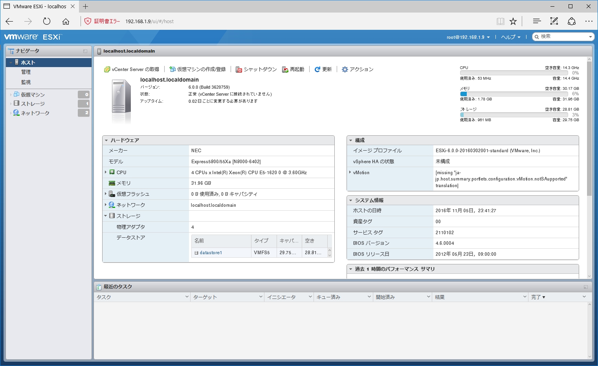

こんにちは、じんないです。

今回はVMware社から無償で提供されているvSphere Hypervisor 6.0（以下、ESXi）を使って、仮想環境を構築してみます。

ESXiはハードウェア上で直接動作するハイパーバイザーで、ホストOS(Windowsなど)を必要としません。
仮想化技術は大きく分けて「ハイパーバイザー型」と「ホスト型」に分類されます。

例として以下のようなものがあります。

* **ハイパーバイザー型**
 * VMwareのvSphere ESXi
 * MicrosoftのHyper-V
 * LinuxのKVM　

* **ホスト型**  
 * OracleのVirtualBox
 * VMwareのVMware Player

KVMについては、社長が紹介していますのでご覧ください。
[CentOS 7にKVMでコマンドラインのみで仮想マシンを構築する](https://mseeeen.msen.jp/make-virtual-machine-with-kvm-in-centos-7/)

では、早速ESXiを使ってみましょう。

## ESXiの入手

ざっくりとした流れは、
製品の登録 → パッケージのダウンロード(iso) → インストール → ライセンス登録 となります。

[VMwareのWebサイト](https://my.vmware.com/jp/web/vmware/evalcenter?p=free-esxi6)より、ESXiをダウンロードします。
ダウンロードにはVMwareアカウントが必要ですので、お持ちでない場合は「アカウントの作成」より作成してください。

製品の登録が完了するとライセンスキーが発行され、パッケージのダウンロードが可能となります。
「手動ダウンロード」をクリックし、ESXiのISOイメージをダウンロードします。

ダウンロードしたISOをブートメディアに焼きます。
サイズも357MBと小さいので、筆者はCD-Rにしました。

あとは、ESXiをインストールするマシンにブートメディアをセットし、インストールを行います。
画面のスクリーンショットが取れないので、インストール手順は割愛させていただきます。
手順は難しくなく、root用のパスワードを入力して15分足らずで完了します。
※このパスワードは後ほどESXiにリモート接続する時に使用します。

## ESXiにアクセスしてみる

インストールが完了したESXiの画面を見てもらえるとわかりますが、以下のような黄色とグレーの画面が表示されます。

ESXi単体ではIPアドレスやホスト名、DNSなどの設定をします。
実際に仮想マシンを操作する場合はVMwareが提供しているクライアントインターフェースからESXiにリモート接続しておこないます。
これらのインターフェースは3つほど用意されいます。

* vSphere Client(C#)
* vSphere Web Client（※vCenter Serverが必要）
* VMware Host Client(HTML5)　

今回は、ESXi 6.0 Update2よりリリースされたHTML5ベースのVMware Host Clientを使用してみたいと思います。

ESXiにはブラウザ経由でアクセスできます。
ブラウザを起動し、ESXiのIPアドレスを入力して接続します。
https://[IPアドレス]

ここでSSL証明書がインストールされていないためエラーが表示されますが、「このWebページの閲覧を続ける」をクリックします。
※ブラウザにより表現が異なります。

今回はHost Clientを使用しますので、「Open the VMware Host Client」をクリックします。
※ https://[IPアドレス]/ui/ で直接アクセスすることもできます。

ユーザー名にroot、ESXiのパスワードを入力し、ログインします。

ホーム画面はこんな感じです。
vSphere Web Clientによく似たUIです。

## ライセンス登録

ホーム画面の左ペインより、「ホスト」 > 「管理」をクリックします。

ライセンスタブより「ライセンスの割り当て」をクリックします。

ポップアップウィンドウが表示されるので、製品登録時に発行されたライセンスを入力し、「ライセンスの確認」をクリックします。

ライセンス認証に成功すると以下のように表示されます。

## まとめ

さて、いよいよ仮想化基盤の準備ができました。
図で示すと以下のような感じですね。
ハードウェア上に仮想化用のハイパーバイザーが載っている状態です。

次は仮想マシンを作っていきましょう。
[無償の仮想化基盤 VMware vSphere Hypervisor 6.0 (vSphere ESXi) を使ってみる。【 仮想マシン作成編 】](https://mseeeen.msen.jp/vmware-vsphere-hypervisor-6-esxi-intro-2/)

ではまた。