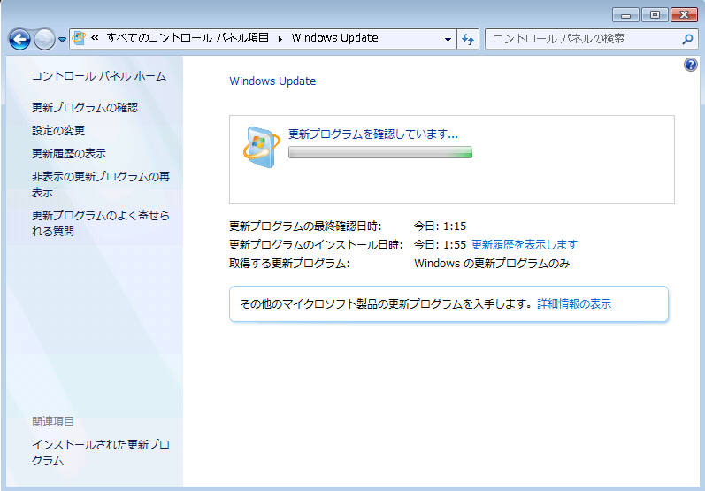
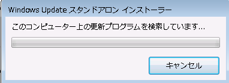
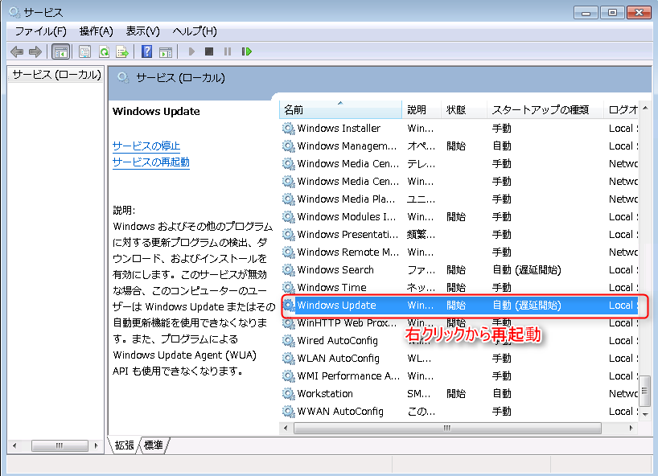
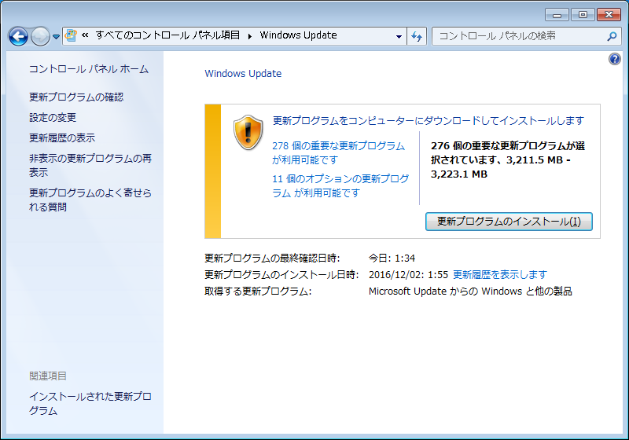

こんにちは、じんないです。

今回は、Windows 7でWindows Updateを進めていると、**更新プログラムを確認しています・・・**から全く進まない件の対策について紹介します。

## 概要
Windows 10を使われている方も多いと思いますが、システム評価などでまだまだWindows 7を使われるかたも多いと思います。
弊社はまさにシステム評価でWindows 7を新規でインストールし、一旦最新にしようとWindows Updateを実施しました。

Service Pack 1までは順調だったのですが、その後のWindows Updateで現象は発生しました。

1時間・・・
2時間・・・
3時間・・・　ここから変わりません。(笑)
実際にはもっと待ちましたｗ

## 対策

### 対策を実施するときの注意点
対策は基本的に次項のKBをダウンロードし、スタンドアロンインストールをしていく流れになりますが、インストールする際は**LANケーブルを抜くなど、物理的に外部との通信を遮断する**ことをおすすめします。

### 以下のKBを順番に適用

* [KB3177725](http://www.catalog.update.microsoft.com/Search.aspx?q=KB3177725)
* [KB3138612](http://www.catalog.update.microsoft.com/Search.aspx?q=KB3138612)
* [KB3185911](http://www.catalog.update.microsoft.com/Search.aspx?q=KB3185911)
* [KB3020369](http://www.catalog.update.microsoft.com/Search.aspx?q=KB3020369)
* [KB3172605](http://www.catalog.update.microsoft.com/Search.aspx?q=KB3172605)

### 検索していますから進まなくなった場合

もし、Windows Updateを実施している状態からインストールを試みるとインストールも進まない状態になる可能性がありますのでその場合は**コントロールパネル→管理ツール→サービス**から**Windows Update**を再起動してから再度実施してください。

**検索していますから進まない**

**Windows Updateサービスを再起動すると、一旦エラーになる。**

## 再度、更新プログラムの確認
無事に、KB3172605までインストールが終わったら、LANケーブルを再度接続し更新プログラムを確認します。
PCのスペックにもよるかと思いますが、約5分で更新プログラムの確認が終わりました。
あとはインストールするだけです。

## 目的のKBが適用されているかを確認する方法
コマンドプロンプトを開き、以下を実行します。例としてKB3172065を確認する場合です。
`systeminfo | find "KB3172605"`

適用されていればこのように出力されます。

もし、何も出力されなかった場合はそのKBは適用されていません。

## あとがき
途中から今回のような事例になった場合は[KB3172605](http://www.catalog.update.microsoft.com/Search.aspx?q=KB3172605)のみの適用で解決するようですが、
新規インストールをした場合、[KB3172605](http://www.catalog.update.microsoft.com/Search.aspx?q=KB3172605)を適用するには[KB3020369](http://www.catalog.update.microsoft.com/Search.aspx?q=KB3020369)を先に適用しておく必要があったりと少しややこしい部分がありますね。

仮想マシンであれば、最新の状態でテンプレート化しておくのも良いのではないでしょうか。

ではまた。

