こんにちは、じんないです。

あるコンピューターだけ特定のユーザーからのリモートデスクトップ接続を許可したいと思う場面もあると思います。

ワークグループ環境やローカルで個別に設定するのであれば、システムのプロパティ > リモートタブ > ユーザーの選択 からリモートデスクトップユーザーを追加することで可能になります。
<a href="images/allow-remote-desktop-users-by-group-policy-1.png">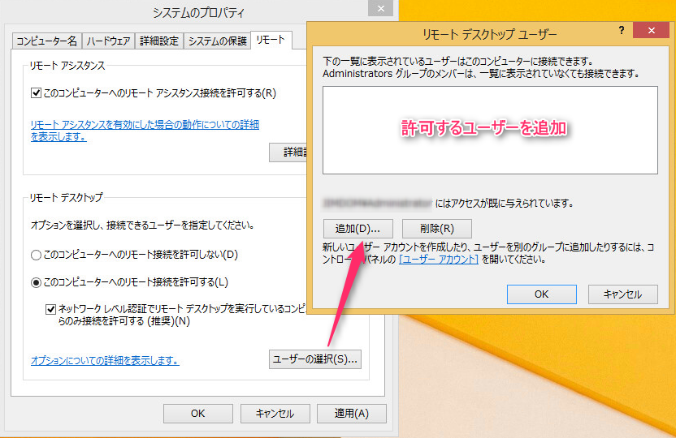</a>

ドメイン環境で対象のコンピューターが複数ある場合においてはグループポリシーから設定するのが便利です。

今回はグループポリシーを使って、特定のコンピューターに対してリモートデスクトップ可能なユーザーを設定する方法を紹介します。

大まかな流れは以下のとおりです。

**ポリシー割り当てる箱（OU）をつくる → ポリシーの作成 → ポリシー内容の設定 → ポリシーの割り当て**

ではさっそくはじめていきましょう。

## 想定環境

ドメインコントローラー：　Windows Server 2012 R2
クライアント：　Windows 8.1 

## ポリシーを割り当てるOUをつくる

まずは、対象のコンピューターを格納するためのOUをつくります。

このOUにリモートデスクトップを許可したいコンピューターを移動させることで、ポリシーがあたるようにします。

今回は分かりやすいように、**RDP OK Computers** としました。
<a href="images/allow-remote-desktop-users-by-group-policy-2.png">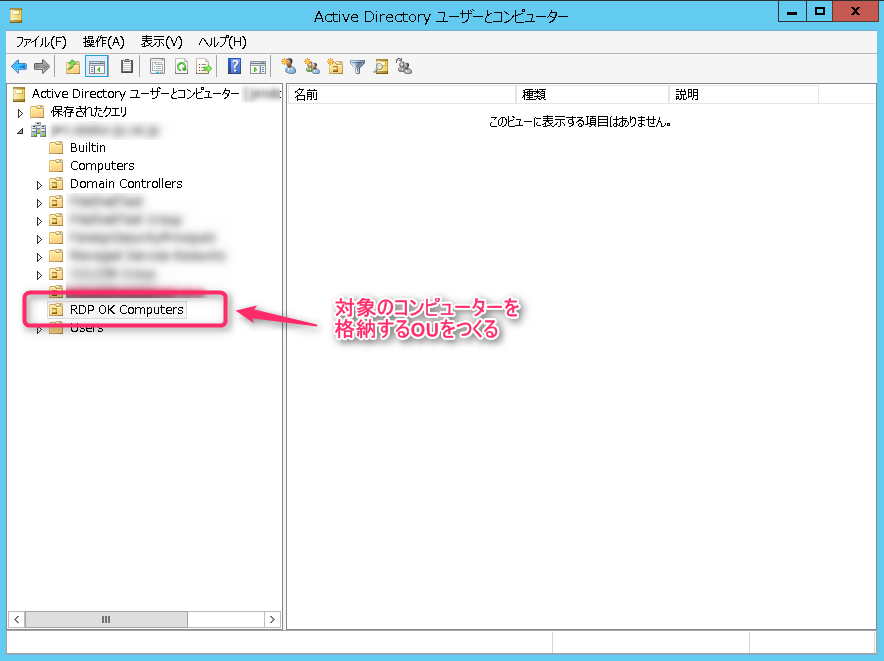</a>

## ポリシーの作成

本稿では便宜上ポリシーと表記していますが、実際には**グループポリシーオブジェクト（GPO：Group Policy Object）**と呼びます。

左ペインのグループポリシーオブジェクトから新しいポリシー（GPO）を作成します。
<a href="images/allow-remote-desktop-users-by-group-policy-3.png">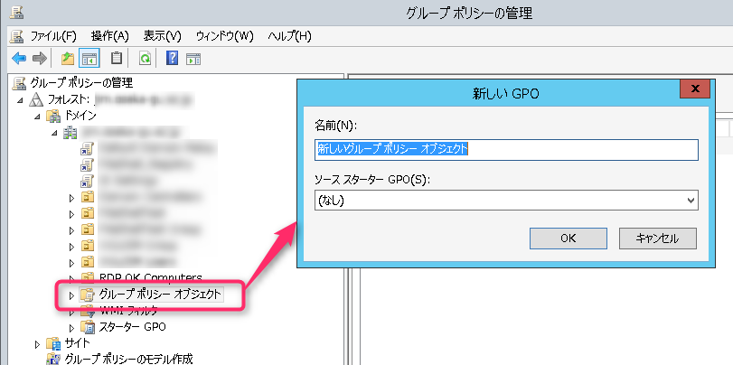</a>

ポリシーの名前は**Allow RDP** としました。このポリシーを**RDP OK Computers** にリンクします。
<a href="images/allow-remote-desktop-users-by-group-policy-4.png">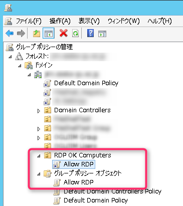</a>

対象はデフォルトで入っている**Authenticated Users**で構いません。
<a href="images/allow-remote-desktop-users-by-group-policy-5.png">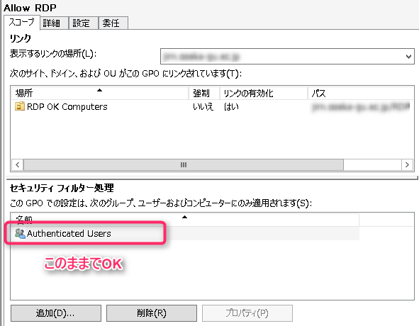</a>

Tech Netによると、Authenticated Usersについて以下のように記載されています。

> Authenticated UsersはIDが認証されたすべてのユーザーおよびコンピュータが含まれます(Guestを除きます)ので、Usersグループに含まれるユーザーなどはすべてAuthenticated Usersにも含まれます。

[Tech Net: Authenticated Usersについて](https://social.technet.microsoft.com/Forums/ja-JP/7b00c412-df42-4c68-8b8b-7a8f0138749d/authenticated-users?forum=windowsvistaja)

Usersとありますが、コンピューターも含まれているようです。

## ポリシー設定

ポリシーは以下のとおり設定します。

### 制限されたグループにRemote Desktop Usersを追加

* コンピューターの構成 > ポリシー > Windowsの設定 > セキュリティの設定 > 制限されたグループ

かなり苦戦をした部分ですが、リモートを許可するにはローカルアカウントの**Remote Desktop Users**に所属している必要があるようです。

デフォルトは何もないので、グループ追加で**Remote Desktop Users**を追加します。
<a href="images/allow-remote-desktop-users-by-group-policy-6.png">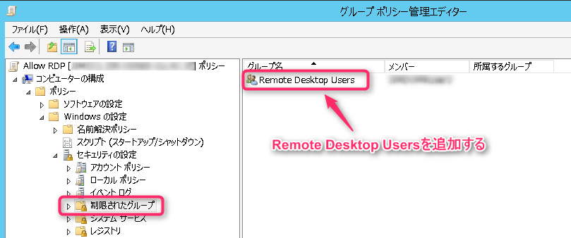</a>
 
このとき、許可したいユーザーをグループに追加しておきましょう。

### サービスの自動起動設定

* コンピューターの構成 > ポリシー > Windowsの設定 > セキュリティの設定 > システムサービス

**Remote Desktop Service**を自動起動に設定します。

**このポリシーの設定を定義する**にチェックを入れて、サービスのスタートアップモードを**自動**にします。
<a href="images/allow-remote-desktop-users-by-group-policy-7.png">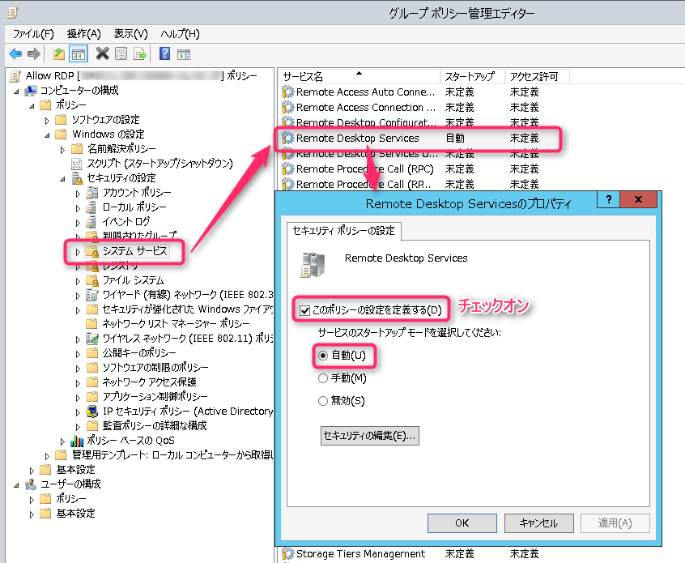</a>

### ファイアウォールの許可

* コンピューターの構成 > ポリシー > Windowsの設定 > セキュリティの設定 > セキュリティが強化されたWindows ファイアウォール > セキュリティが強化されたWindows ファイアウォール > 受信の規則

リモートデスクトップをファイアウォールで許可します。

右クリックして新しい規則を追加します。

事前定義で**リモートデスクトップ**を選択します。
<a href="images/allow-remote-desktop-users-by-group-policy-8.png">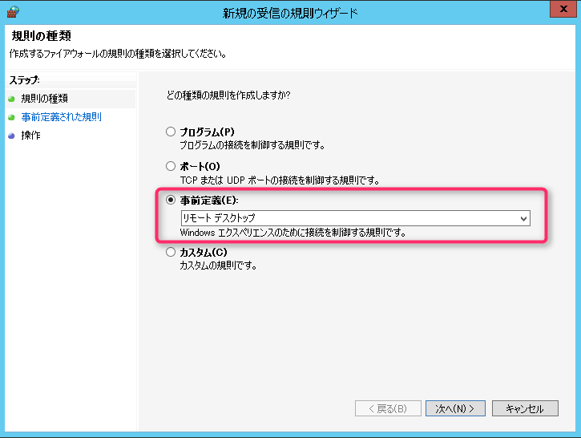</a>

すべてにチェックが入っていることを確認します。
<a href="images/allow-remote-desktop-users-by-group-policy-9.png">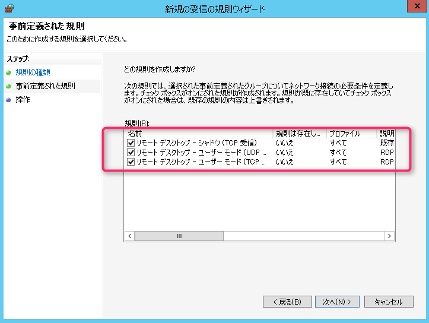</a>

**接続を許可する**が選択されていることを確認し、完了します。
<a href="images/allow-remote-desktop-users-by-group-policy-10.png">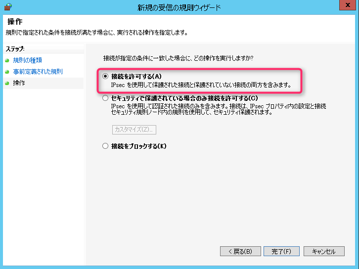</a>

適用するプロファイルを変更する場合は、個別にプロパティを開いて変更してください。
<a href="images/allow-remote-desktop-users-by-group-policy-11.png">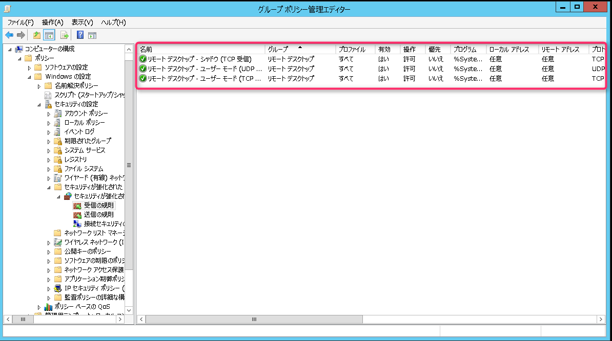</a>

### リモート接続の許可

* コンピューターの構成 > ポリシー > 管理用テンプレート > Windowsコンポーネント > リモートデスクトップサービス > リモートデスクトップセッションホスト > 接続

これをやっとかないとそもそもリモート接続ができないので、注意してください。

**ユーザーがリモート デスクトップ サービスを使ってリモート接続することを許可する**を未構成から**有効**にします。
<a href="images/allow-remote-desktop-users-by-group-policy-12.png">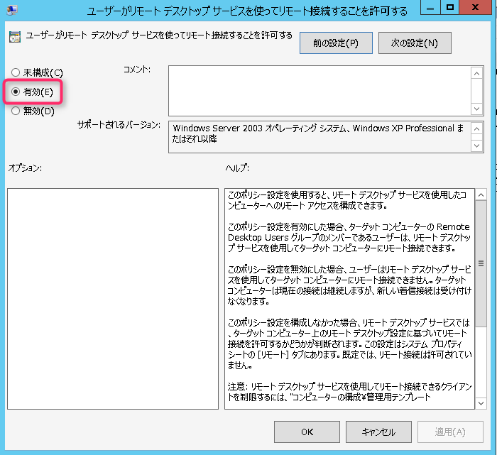</a>

「ネットワークレベル認証でセキュリティを向上したいわ」とお考えの方は以下の設定を実施してください。

※リモートを許可する上の設定では必須ではありません。

* コンピューターの構成 > ポリシー > 管理用テンプレート > Windowsコンポーネント > リモートデスクトップサービス > リモートデスクトップセッションホスト > セキュリティ

**リモート接続にネットワーク レベル認証を使用したユーザー認証を必要とする**を未構成から**有効**にします。
<a href="images/allow-remote-desktop-users-by-group-policy-13.png">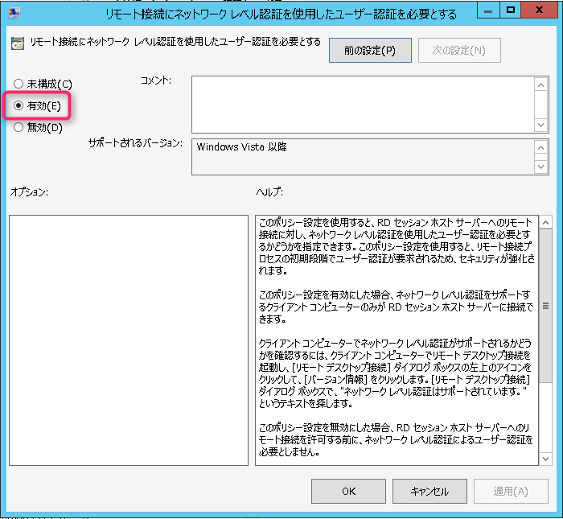</a>

ネットワークレベル認証については以下を参照してください。

[Tech Net: リモート デスクトップ サービス接続のネットワーク レベル認証を構成する](https://technet.microsoft.com/ja-jp/library/cc732713(v=ws.11).aspx)

## ポリシーの割り当て

ポリシーの作成が完了したら、対象のコンピューターへとポリシーを割り当てます。

**RDP OK Computers**のOUに対象のコンピューターを移動させることでポリシーを割当てることができます。

デフォルトでは**Computers**に格納されているので、右クリック > 移動 から移動先のOUを指定します。
<a href="images/allow-remote-desktop-users-by-group-policy-14.png">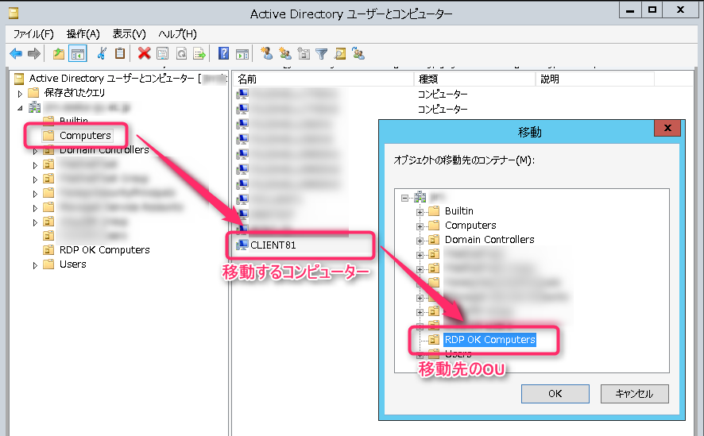</a>

これでポリシーの割り当ては完了です。

## 接続チェック

対象のコンピューターに対象のユーザーでリモートデスクトップ接続を行います。

正常にログオンできればOKです。

### ログオンできない場合

グループポリシーの反映に遅延が生じている場合があります。

対象のコンピューターで以下のコマンド実行し、グループポリシーの再読み込みを行います。

` gpupdate /force `

それでも、ログオンできない場合はそもそもグループポリシーが割り当たっているのかを確認します。

以下のコマンドを実行して、コンピューター設定 > 適用されたグループポリシーオブジェクトに**Allow RDP**の有無を確認します。

` gpresult /r `

<a href="images/allow-remote-desktop-users-by-group-policy-15.png">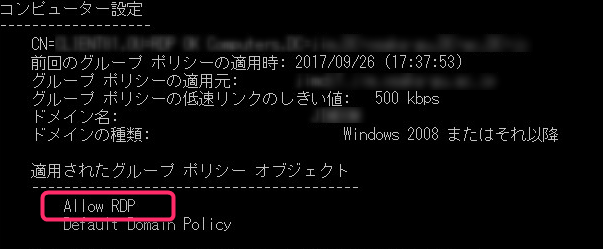</a>

無い場合は、グループポリシーが割り当たっていないので、これまでの手順を確認してみてください。

ではまた。