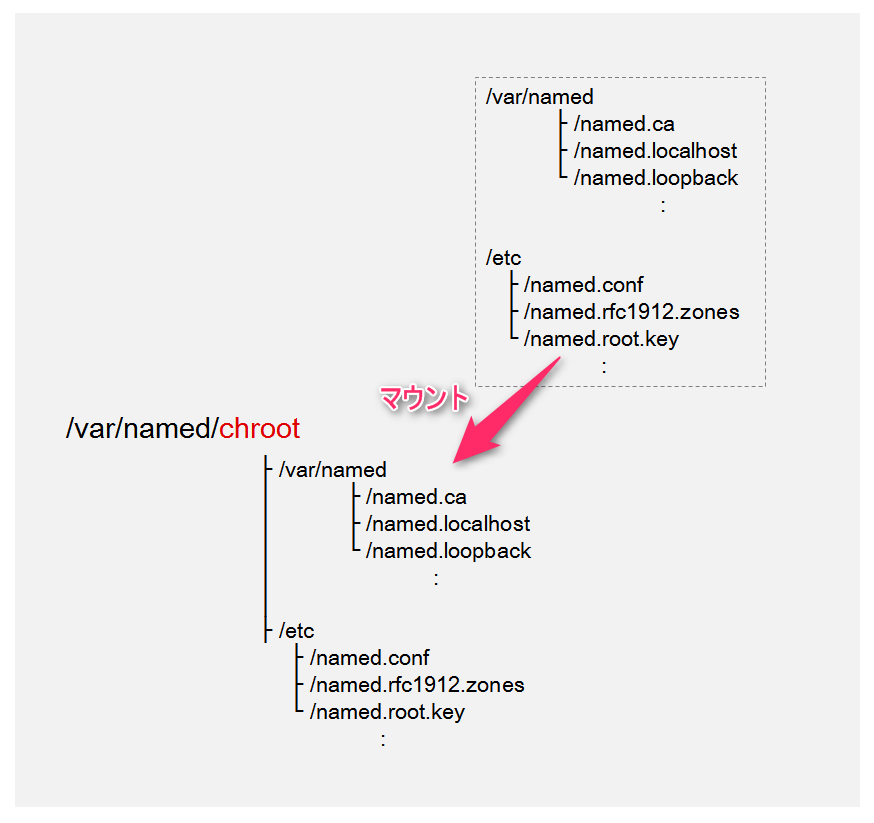

こんにちは、じんないです。

RedHat Enterprise Linux 7.3 (CentOS 7.3)とbind 9.9.4を使って内部DNSサーバの構築をしていました。

bindによるDNSサーバの構築事例はたくさんありますが、どうもエラーが発生しうまくいきませんでした。

今回は同じような経験をされている方やbindを始めたばかりという方に、bind-chrootで注意しておきたいポイントを紹介します。

前提としてnamed.confやゾーンファイルの書き方は記載していません。

## 概要

bindを使ったDNSサーバの構築事例を見ていると、以下のような手順が多く見受けられます。

1. bindのインストール
2. chroot化のスクリプト実行
3. named.confの編集
4. ゾーンファイルの作成
5. named-chrootの起動

すんなりいけばいいのですが、5の起動が失敗した場合に「あれ、さっきまであったファイルがなくなったぞ！」となってしまうだけでなく、あれこれいじっている間にエラーのスパイラルに陥ってしまいます。

なぜそのようなことになるのかを紐解いていきますが、**結論から言うと「chroot化のスクリプト実行」がよくない**なのです。

chroot化のスクリプトは ` /usr/libexec/setup‐named‐chroot.sh ` で、bind-chrootのインストールと共に自動で生成されます。

## そもそもchroot化って

ルートディレクトリを変更することを言います。

bindのルートディレクトリは` / ` ですが、chroot化することで ` /var/named/chroot `がルートディレクトリになります。

プロセスがアクセス可能な範囲を制限することが目的です。

万が一攻撃された場合に必要外のファイルを参照させないなど、セキュリティ面において実施されることが多いかと思います。

## chroot化のスクリプトがやっていること

chroot化のスクリプトとして、以下のコマンドを実行しています。

` /usr/libexec/setup‐named‐chroot.sh /var/named/chroot on `

これは何をしているかというと、bindに必要なディレクトリとファイルを` /var/named/chroot `にマウントしているんですね。

例を挙げると以下のような感じです。

* /etc/named.conf　→　/var/named/chroot/etc/named.conf
* /var/named/"ゾーンファイル"　→　/var/named/chroot/var/named/"ゾーンファイル"

これをoffにするとマウントは解除されます。

` /usr/libexec/setup‐named‐chroot.sh /var/named/chroot off `

実際にon / offし、lsコマンド等でマウントの動きを見てみることをおすすめします。

そして、先に**「chroot化のスクリプト実行」がよくない**と述べた理由ですが、` named-chroot.service `の起動 / 停止に伴ってマウント / アンマウントが自動的に行われています。

つまり、本来は**「chroot化のスクリプト実行」をする必要がない**んです。

それを知らずに「5. named-chrootの起動」で失敗した場合、マウントが解除されてしまって当の本人は「あれ、さっきまであったファイルがなくなったぞ！」とパニックになるわけです。

bindのstatusにも「このファイルがない」「あのファイルがない」とエラーがでて、いろいろいじくっていたら何がなんだかわからないという状態に。

私もこれにはずいぶんとハマりました。

## ハマらないための構築手順

chrootでハマらないためには**chroot化スクリプトを使わないこと**と、**マウントされたファイルは触らないこと**に注意して以下の手順で構築してみてください。

**1. bindのインストール**

` [root@jinnai7 ~]# yum -y install bind bind-chroot bind-utils `

` bind-utils ` は dig や nslookup コマンドを使うために必要です。

**2. named.confの編集**

編集するファイルは` /etc/named.conf `

**3. ゾーンファイルの作成**

作成するファイルは` /var/named/"ゾーンファイル" `

**4. named-chrootの起動**

` [root@jinnai7 ~]# systemctl start named-chroot.service `

OS起動時に自動起動させる場合は、以下もあわせて実施してください。

` [root@jinnai7 ~]# systemctl enable named-chroot.service `

設定の編集が必要になった場合は、サービスを停止させて2～4の手順を踏めば大丈夫です。

繰り返しになりますが、最初にchroot化しないことでハマる確立はぐっと下がります。

作業前にはバックアップやスナップショットとっておき、いつでもクリーンな状態に戻せるようにしておくとさらにgoodです。

bindでハマるとなかなか抜け出せませんが、あきらめずトライしてみてください。

ではまた。