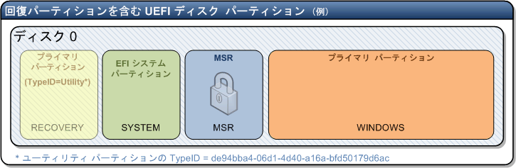
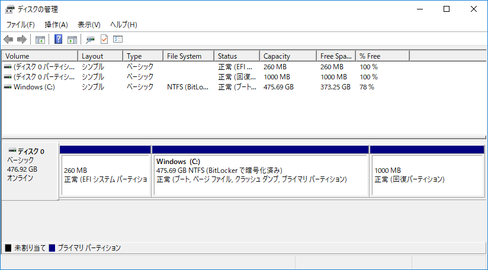

こんにちは、じんないです。

ディスクの管理では表示されない **Microsoft予約パーティション(MSR)のサイズをDISKPARTコマンドから確認する方法** を紹介します。

※MSR：Microsoft Reserved

## UEFIのパーティション構成

UEFIベースのシステムでは、以下のパーティション構成がとられています。



左から、回復パーティション、EFIシステムパーティション(ESP)、Microsoft予約パーティション、システムパーティション

これらのパーティションサイズはディスクの管理から確認することができます。



しかしながら **ディスクの管理では Microsoft予約パーティション(MSR)のサイズは確認することができません**。

### Microsoft予約パーティション(MSR)とは

Microsoftでは以下のように掲載されています。

> MSR は UEFI システムでのみ使用されます。MSR には、他のシステム パーティションに関する情報が格納され、この情報は Microsoft アプリケーションで使用されます。

[ディスク パーティションとは - Windows IT Pro Center](https://technet.microsoft.com/ja-jp/library/dd799232(v=ws.10).aspx)

実際にこのパーティションへアクセスし、格納されているファイルの中身を見ることは制限されているようです。

それだけ通常は意識する必要がないのでしょうね。

## Microsoft予約パーティションのサイズを確認する

サイズの確認にはDISKPARTコマンドを使用します。

コマンドプロンプトを開き、**diskpart** と入力します。

``` dos
c:\>diskpart
```

まずは、ディスク情報を確認するため **list disk** と入力します。

``` dos
DISKPART> list disk

  ディスク      状態           サイズ   空き   ダイナ GPT
  ###                                          ミック
  ------------  -------------  -------  -------  ---  ---
  ディスク 0    オンライン           476 GB      0 B        *
```

確認したいディスクを選択します。今回はディスク0を選択するので **select disk 0** と入力します。

``` dos
DISKPART> select disk 0

ディスク 0 が選択されました。
```

パーティション情報の確認には **list partition** と入力します。

``` dos
DISKPART> list partition

  Partition ###  Type                Size     Offset
  -------------  ------------------  -------  -------
  Partition 1    システム               260 MB  1024 KB
  Partition 2    予約                  16 MB   261 MB
  Partition 3    プライマリ              475 GB   277 MB
  Partition 4    回復                1000 MB   475 GB
```

**partition 2の予約と書かれたところがMicrosoft予約パーティション(MSR)** となります。

終了する場合は、 **exit** と入力します。

``` dos
DISKPART> exit
```

確認が必要な場面は少ないですが、OS設計などにご活用ください。