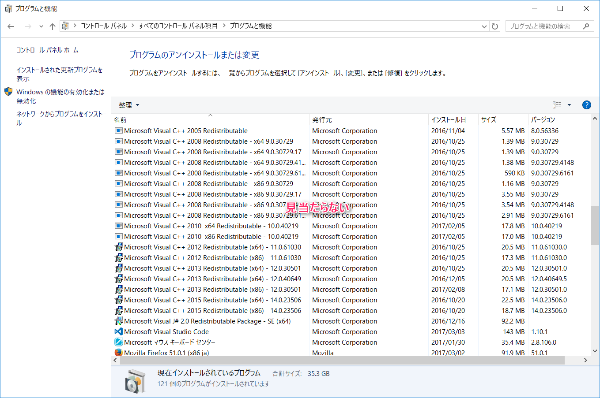
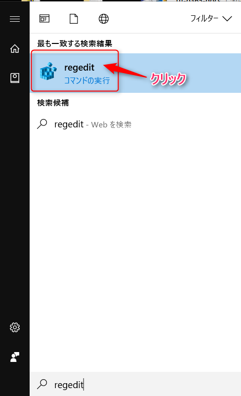
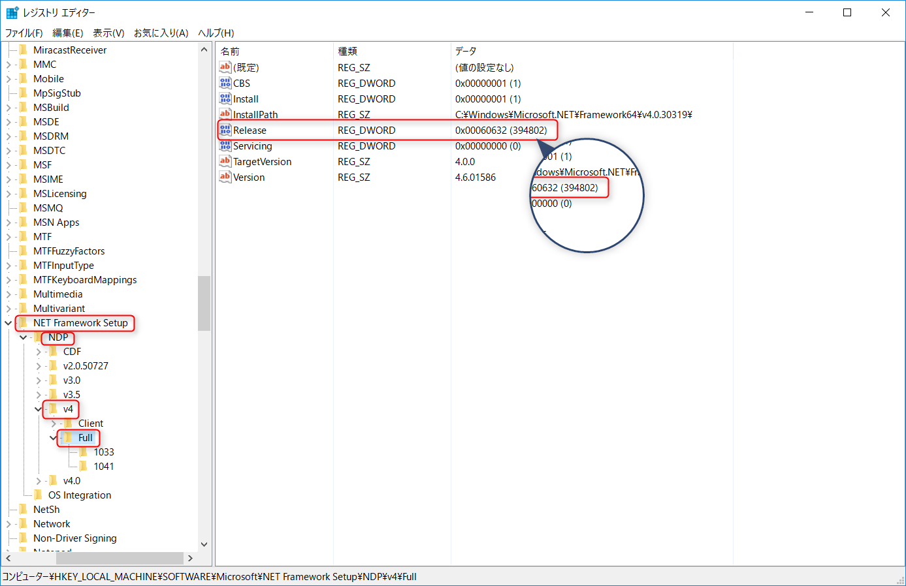

こんにちは、じんないです。

何か新しいソフトウェアのインストールしようと思ったときに、その要件として *.NET Framework 4.5.2 以上がインストールされていること* などの記載を見かけることがあると思います。

では、現在どのバージョンがインストールされているのか？を知りたいですよね。

プログラムと機能から確認するのが手っ取り早いのですが、**OSに組み込まれているバージョンはここに表示されません**。

そのようなときの確認方法として、今回はレジストリから確認する方法を紹介します。

## 前提

本手順は、Windows 8.1とWindows 10 、 Windows Server 2012 R2で確認済みの方法です。

## バージョンの確認方法

1. 画面左下のWindowsマークをクリックし、`regedit` と入力し、クリックで起動します。ユーザーアカウント制御の確認が出た場合は、はい をクリックして進みます。

1. `HKEY_LOCAL_MACHINE\SOFTWARE\Microsoft\NET Framework Setup\NDP\v4\Full` のキーを開き、Releaseのデータを確認します。ここでは `394802` と確認できました。

1. [Microsoft Webサイト](https://msdn.microsoft.com/ja-jp/library/bb822049(v=vs.110).aspx)の表の**インストールされた .NET バージョンを確認するには** の列から、前項で調べたRelease番号に対応するバージョンを確認します。今回は、.NET Framework 4.6.2 がインストールされていることが分かりました。

## バージョンの互換性

例えば今回のように.NET Framework 4.6.2がインストールされており、ソフトウェアの要件として *.NET Framework 4.5.2 以上がインストールされていること* と書かれていた場合、.NET Framework 4.5.2をインストールする必要があるのでしょうか？

答えは、不要です。

また、インストールすることもできません。

というのも、.NET Frameworkにはバージョンによって互換性があるからです。

.NET Framework 4.6.2においては、.NET Framework 4以上が内包されています。

.NET Framework 3.5が必要となった場合は、4.6.2では内包されていないため別途インストールする必要があります。

詳細は以下のサイトを参考にしてみてください。

[.NET Framework の各バージョン同士の関係](https://blogs.msdn.microsoft.com/jpvsblog/2015/04/06/net-framework-3/)

ではまた。