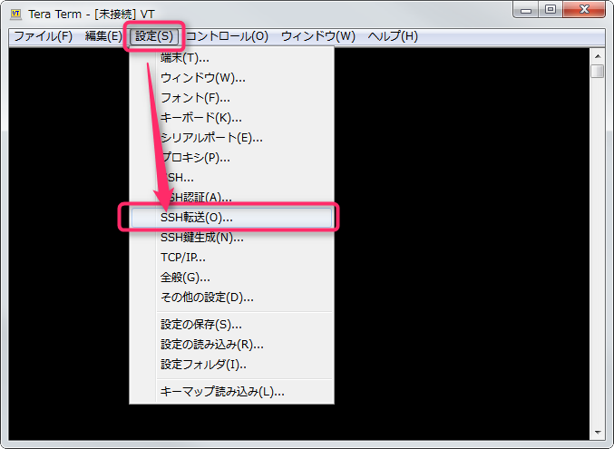
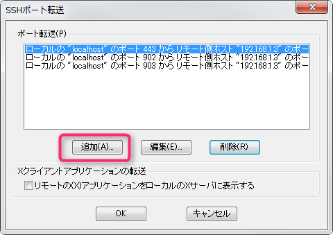
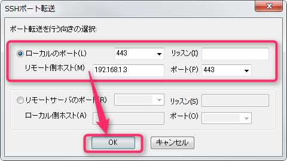
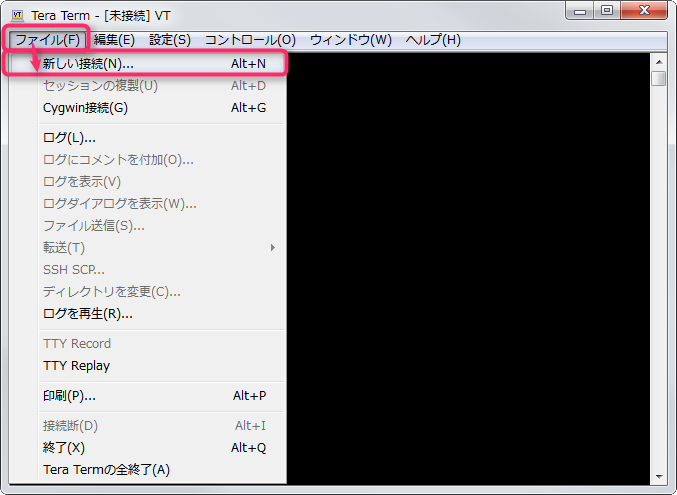
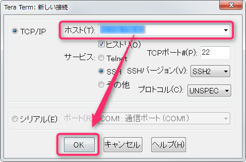
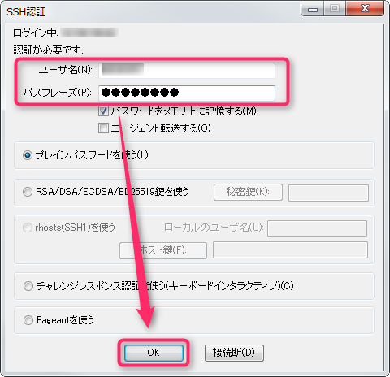
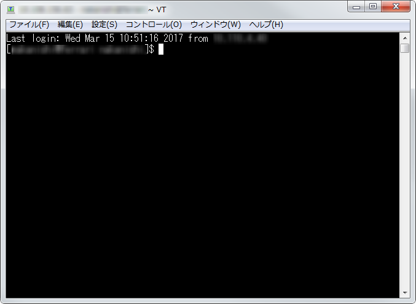
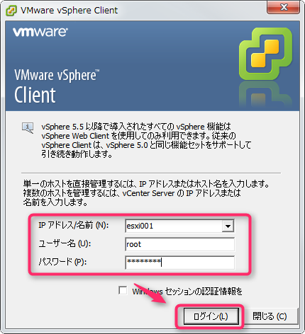
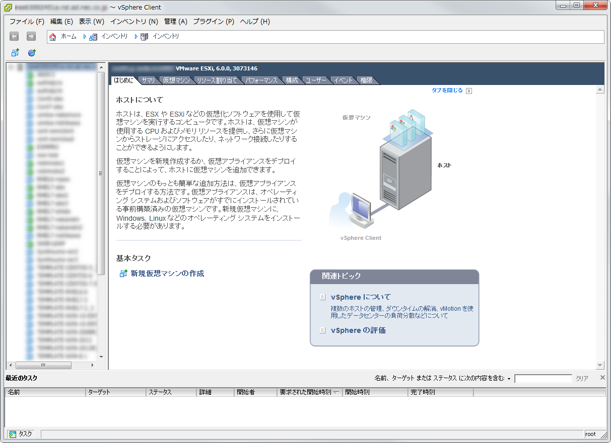
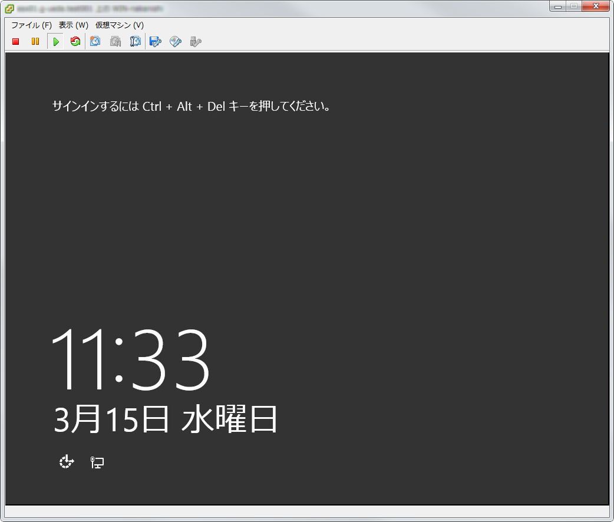

こんにちは、じんないです。

今回はvSphere Clientから別のネットワークに所属するESXiホストにポートフォワードを使用して接続する方法を紹介します。

通常、同一ネットワーク内であればクライアントからvSphere Clientを起動し、ESXiホストにダイレクトに接続しますが、別のネットワークに所属している場合やインターネットを跨いだ接続には、ひと手間掛けないといけません。

VPN環境が整っている場合は、VPN接続を行えばあたかも同一ネットワークに所属しているように振舞えますが、そうでない場合はSSHでポートフォワード（転送）してあげる必要があります。

大抵は管理サーバなるものがいて、管理サーバにポートフォワードでリモートデスクトップ接続し、そこからvSphere Clientを起動してESXiに接続するパターンが多いかと思います。

しかしながら、リポートデスクトップ接続できるサーバが無い場合はこれらをの手法を使うことはできませんし、構築の佳境時にリモートデスクトップのセッションを奪い合うなんてこともしばしばあります。。。

であれば、いっそのことESXiホストの接続に使用するポートをフォワードし、ダイレクトにつないでしまおうという考えです。

さっそく手順を紹介していきましょう。

※リモートデスクトップで複数セッションを有効化する方法は以下で紹介しています。
[リモートデスクトップで2セッション有効にする方法 – Windows Server 2012 R2](https://mseeeen.msen.jp/enable-multiple-session-in-windows-server-2012-r2/)

## 前提

vSphere ClientおよびESXiのバーションは6.0です。

SSH接続するターミナルソフトはTeraTermを使用します。

クライアントおよびESXiの両ネットワークに接続しているLinuxマシンを踏み台として使用します。

## 設定

### hostsの追記

ポート転送だけでもESXiホストに接続できますが、Consoleを起動すると画面が真っ黒のままで操作できません。

これを回避するためには、hostsへ以下の追記が必要です。

` 127.0.0.1	esxi001 `

ここで指定しているesxi001というホスト名は任意のものでよく、実際のESXiホストの名前と合致している必要はありません。

vSphere Clientから接続する際に使用しますので覚えておいてください。

### ポート転送設定

vSphere ClientからESXiへの接続は以下の3ポートを使用します。

* 443
* 902 
* 903

Tera Termを起動し、「設定」から「SSH転送」をクリック

「追加」をクリック

以下のとおり3セット設定します。
ここでは、ESXiホストのIPアドレスを192.168.1.3と例として設定しています。
お使いの環境に合わせてリモート側ホストのIPアドレスを変更してください。

| ローカルポート | リモート側ホスト | ポート |
|:------------:|:------------:|:------------:|
| 443 | 192.168.1.3 | 443 |
| 902 | 192.168.1.3 | 902 |
| 903 | 192.168.1.3 | 903 |

「ファイル」から「新しい接続」をクリック

踏み台となるLinuxマシンのIPアドレスを指定し、「OK」をクリック

「ユーザ名」と「パスワード」を入力して「OK」をクリック

無事に接続されると準備は完了です。

## ESXiホストに接続

vSphere Clientを起動し、先ほどhostsで設定した「esxi001」を入力し、ESXiホストのrootアカウントでログインします。

証明書の警告が表示された場合は、無視をクリックしてください。

無事に接続でき、インベントリ画面が表示されました。

ちゃんとコンソールも使用できます。

ファイアウォールでSSHに使用するポート(22など)を開放しておく必要がありますが、公開サーバを設けている場合はそれを踏み台とすることで、インターネット経由でもESXiホストに接続することができます。

ではまた。