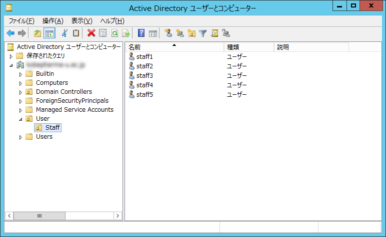
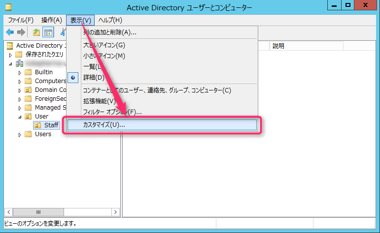
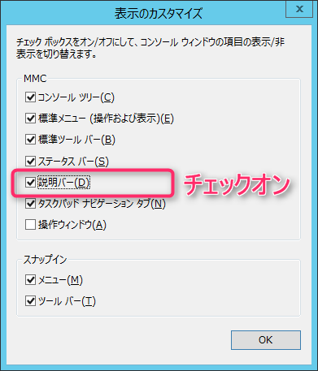
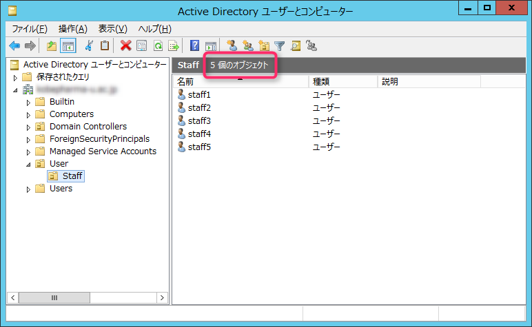
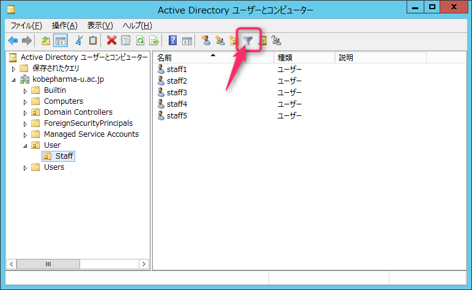
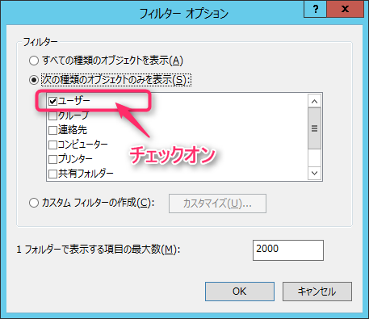
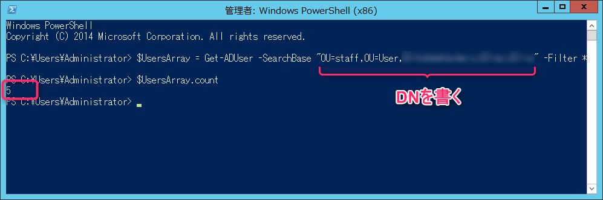
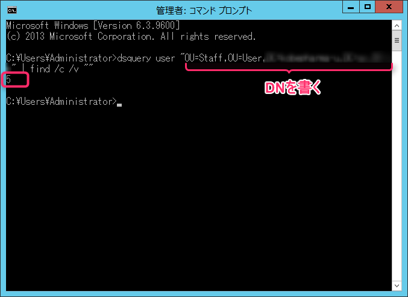

こんにちは、じんないです。

Active Directoryの特定のOUに、ユーザーが何人所属しているのか調べる方法をまとめました。

ドメインの規模を見積もったり、Active Directory連携システムでの確認など、使える場面が多いかと思います。

今回は細かい情報はいいから、ユーザー数だけ教えてくれって方にぴったりな情報をお届けします。

確認方法は3パターン。

いずれもActive Directoryがインストールされたサーバーで実施します。


## 想定環境

OS：Windows Server 2012 R2
対象OU：User配下の **Staff**
ドメイン： **jinnai.net**

<a href="images/count-activedirectory-users-1.png"></a>

Windows Server 2008 R2でも動作確認済みです。

## GUIから確認する

**Active Directoryユーザーとコンピューター** を起動します。
<a href="images/count-activedirectory-users-2.png"></a>

**表示** ＞ **カスタマイズ** の順にクリックします。
<a href="images/count-activedirectory-users-3.png"></a>

**説明バー** にチェックを入れ、 **OK** をクリックします。
<a href="images/count-activedirectory-users-4.png"></a>

すると、説明バーにオブジェクトの数が表示されます。
<a href="images/count-activedirectory-users-5.png"></a>

注意点としては、カウントするのはあくまでオブジェクトの数でありユーザー数ではないことです。

グループやコンピューターが同じOUに所属している場合はフィルターする必要があります。

フィルターのアイコンをクリックします。
<a href="images/count-activedirectory-users-6.png"></a>

**次の種類のオブジェクトのみを表示** を選択し、**ユーザー** にチェックを入れてOKをクリックします。
<a href="images/count-activedirectory-users-7.png"></a>

これでユーザー数のみが表示されるようになります。


## PowerShellから確認する

Windows PowerShellを起動し、以下のコマンドを実行します。

```
$UsersArray = Get-ADUser -SearchBase "OU=Staff,OU=User,DC=jinnai,DC=net" -Filter *

$UsersArray.count
```

**"OU=Staff,OU=User,DC=jinnai,DC=net"** の部分は環境にあったDNに変更してください。

Get-ADUserで取ってきたデータを一旦配列に入れ、そのデータの数をカウントします。

デフォルトでは一度にとってこれる件数が500件に制限されています。

多数のユーザーがいる場合は、以下のオプションを指定することで無制限にすることができます。

```
-ResultSetSize $null
```

<a href="images/count-activedirectory-users-8.png"></a>

また、Get-ADUserが無いよって怒られた場合は以下コマンドを実行してモジュールをインポートしてみてください。

```
Import-Module ActiveDirectory
```


## コマンドプロンプトから確認する

コマンドプロンプトを起動し、以下のコマンドを実行します。

```
C:\Users\administrator>dsquery user "OU=Staff,OU=User,DC=jinnai,DC=net" | find /c /v ""
```

**"OU=Staff,OU=User,DC=jinnai,DC=net"** の部分は環境にあったDNに変更してください。
<a href="images/count-activedirectory-users-9.png"></a>

## まとめ

ざっと見たいときやコマンドラインに不慣れな場合は最初に紹介したGUIから確認する方法がいいですね。

ユーザー数が多い場合はPowerShellやコマンドプロンプトから確認してみてください。

ではまた。