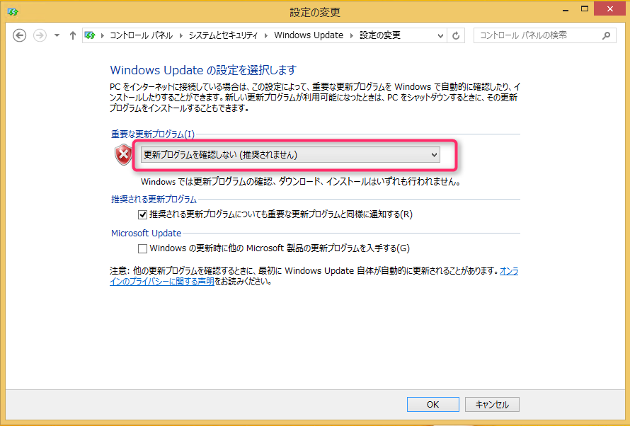
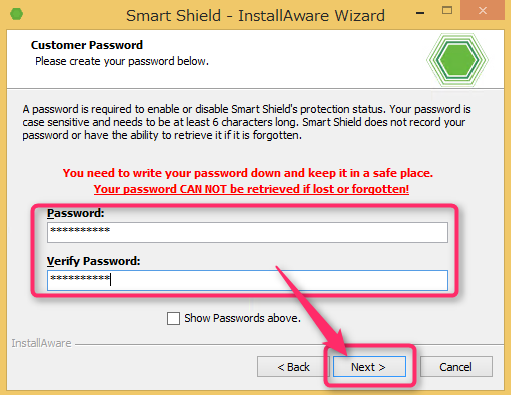

こんにちは、じんないです。

今回はIDK社の[ドライブシールドSS](http://www.idk.co.jp/page.php?d=bunkyo&f=driveshieldSS)を使った復元環境を構築してみます。

とあるシステム導入の際に復元環境に触れる機会がありました。

復元環境とは再起動すると元通りになる環境を指します。

導入によるメリットとしては**ファイルの改ざん**や**個人情報の流失防止**、**ウィルスなどによる外部脅威からの防御**などさまざまです。

学校や企業内PCをはじめ、パソコン教室、ホテルなど不特定多数のユーザが使用するPCに導入されています。

弊社でもドライブシールドSSを導入し、評価を実施しました。

使ってみて思ったのは、復元性の良さです。

評価では仮想化環境を使用することが多いのですが、スナップショットだとドメイン参加後に復元するとうまくいかないことがしばしばありました。

ところが、

複数の復元ポイントを作成することができませんが、トライ&エラーを繰り返す必要のあるテストなんかにはもってこいではないかと思います。

ではさっそっく、ドライブシールドによる復元環境を構築していきましょう。

## 前提
ドライブシールドSSには[スマートコントロール](http://www.idk.co.jp/page.php?d=bunkyo&f=smartcontrol)と呼ばれるリモートからクライアントを管理できるツールがありますが、今回は使用しません。

## 事前作業

### スリープ設定の無効化

コントロールパネル > ハードウェアとサウンド > 電源オプション > プラン設定の編集　より、「詳細な電源設定の変更」をクリック。

スリープ関係の設定をすべて**「なし」**や**「無効」**にします。

### 更新プログラム確認の停止

コントロールパネル > システムとセキュリティ > Windows Update > 設定の変更

重要な更新プログラムで **「更新プログラムを確認しない（推奨されません）」**に設定

### システム保護の無効化

コントロールパネル > システムとセキュリティ > システム　より**「システムの保護」**をクリック

システムの保護タブ > 構成 

**システムの保護を無効にする**に設定

## インストール

OSのビット数にあったインストーラを実行

ドライブシールドSSには.NET Framework 3.5が必要なため、「この機能をダウンロードしてインストールする」をクリック。

インストールが完了し、「閉じる」をクリック。

「Next」をクリック。

「Next」をクリック。

ライセンス条項に同意し、「Next」をクリック。

今回はインターネット経由でライセンス認証するた真ん中の「Select to Register Manually」を選択し、「Next」をクリック。

・**スマートコントロールから一括ラインセンス認証する場合**
 「Select to Register with Smart Controlo Managed Licensing」
・**インターネット環境がない or プロキシ環境でライセンス認証する場合**
「Select to Register Manually」

ライセンスキーを入力し、「Next」をクリック。
※認証が開始されます。

パスワードを指定し、「Next」をクリック。
このパスワードは復元を有効にしたり解除したりする場合に必要となります。

次にキーボード・マウスのロック解除用のパスワードを入力し、「Next」をクリック。
この設定はスマートコントロールからキーボードとマウスをロックした場合の解除用のパスワードです。
スマートコントロールを使用しない場合はそれほど意識する必要はありません。

今回はデフォルトインストールを行いますので、「Default Installation」を選択し「Next」をクリック。

設定内容を確認し、「Next」をクリック。

「Next」をクリックするとインストールが開始されます。

「Finish」をクリックすると再起動され、インストールが完了します。

## 動作チェック

### まずは復元を有効化

再起動が完了すると、タスクトレイに赤い六角形のアイコンが表示されます。

右クリックメニューから設定画面を起動します。

インストールした直後は**プロテクト解除モード**になっています。
「プロテクト有効」をクリックします。

パスワードを求められますので、インストール時に入力したものを入力し「OK」をクリック。

再起動が促されますので、再起動します。

再度ログイン後、タイスクトレイのアイコンが緑になっています。

設定画面では、「プロテクトモード」になっています。
これで復元が有効になりました。

### 復元されるかCheck!!

デスクトップ上に「復元テスト」というテキストファイルを作成します。

ここで、再起動をかけます。

再度ログインすると・・・

先ほど作成したテキストファイルが無くなっており、元の状態に戻っていました。

## あとがき

冒頭で復元環境のメリットを述べましたが、設定を変更しても元に戻るので実は評価用マシンにも最適だったりします。

仮想化されていればスナップショットで代用は可能ですが、物理環境でも復元できるのは大きなメリットではないでしょうか。

ではまた。