こんにちは、じんないです。

先日発表されたIntel CPUの脆弱性について、筆者のPCも該当していたので対応しました。

[Intel Q3’17 ME 11.x, SPS 4.0, and TXE 3.0 Security Review Cumulative Update](https://security-center.intel.com/advisory.aspx?intelid=INTEL-SA-00086&languageid=en-fr)

## Intel CPUの脆弱性

Intelのリモート管理機能に脆弱性が見つかり、攻撃された場合はネットワークからリモートアクセスが可能になるようです。

詳しい解説はニュースサイトに任せるとして、該当する場合はチップセットファームウェア＆ソフトウェアのアップデートが必要になります。

## 該当しているかをチェックする

Intelの公式サイトからチェックツールが配布されています。

[Intel Management Engine Critical Firmware Update (Intel-SA-00086)](https://www.intel.com/content/www/us/en/support/articles/000025619/software.html)

Intel-SA-00086 Detection Tools をクリックします。

<a href="images/handle-vulnerability-of-intel-for-thinkpad-x1-carbon-1.png">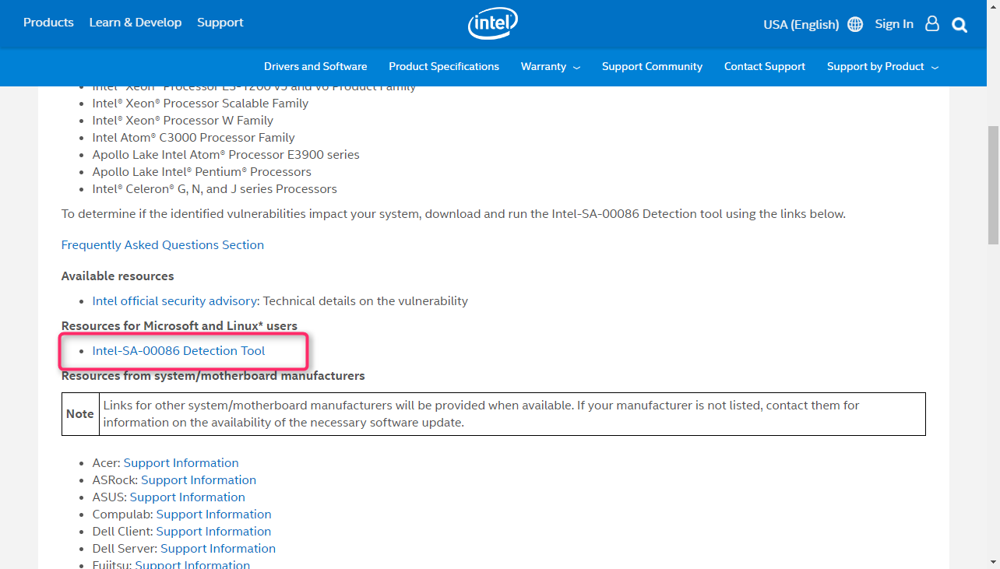</a>

SA00086_Windows.zip をダウンロードします。ライセンス条項への同意が必要です。

<a href="images/handle-vulnerability-of-intel-for-thinkpad-x1-carbon-2.png">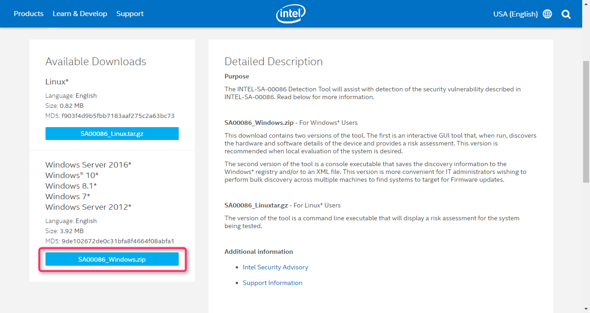</a>

ダウンロードファイルを展開し、DiscoveryTool.GUI フォルダにある Intel-SA-00086-GUI.exe を実行します。

<a href="images/handle-vulnerability-of-intel-for-thinkpad-x1-carbon-3.png">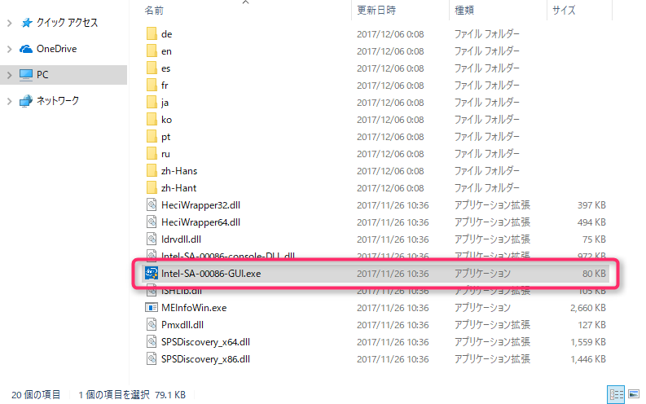</a>

しばらくすると分析結果が表示され、**脆弱性がある** ことがわかりました。

<a href="images/handle-vulnerability-of-intel-for-thinkpad-x1-carbon-4.png">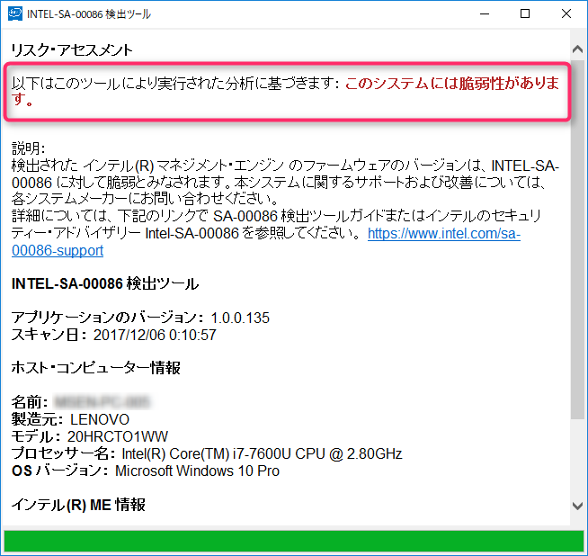</a>

## 脆弱性への対応

### マシンタイプの確認

セキュリティアップデートはモデルどごに異なるため、まずは自身のPCのマシンタイプを確認します。

Microsoft StoreアプリからLenovo Companionを起動してください。

<a href="images/handle-vulnerability-of-intel-for-thinkpad-x1-carbon-5.png">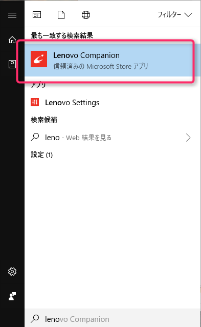</a>

デバイス情報で**タイプの項目に記載されている値をメモ**しておきます。

筆者のPCは20HRです。

<a href="images/handle-vulnerability-of-intel-for-thinkpad-x1-carbon-6.png">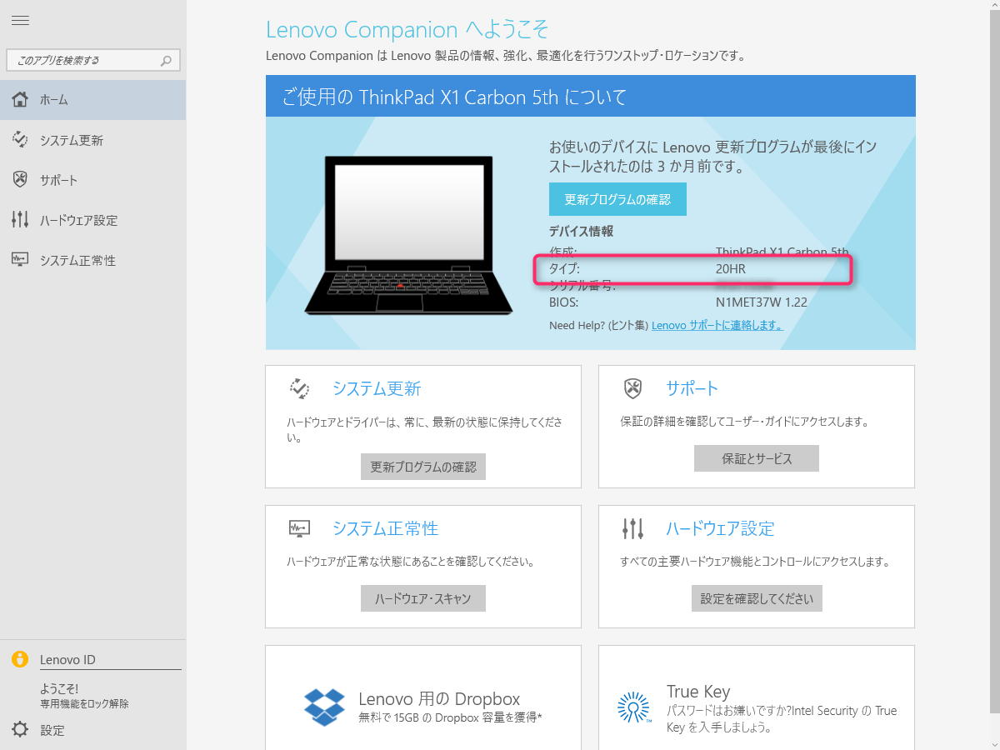</a>

### 修正パッチのダウンロード

修正パッチはLenovo公式サイトからダウンロードします。

[Intel ME 11.x、SPS 4.0、TXE 3.0 ファームウェアの累積的セキュリティアップデート](https://support.lenovo.com/jp/ja/product_security/len-17297)

ページにアクセスしたら該当するマシンタイプを探します。

面倒なので**Ctrl + F**で先ほど確認したマシンタイプを入力してジャンプしましょう。

20HRは**影響あり**と出てますね。

URLをクリックして、修正パッチをダウンロードします。

* ファームウェア（FW）：　11.8.50.3425
* ソフトウェア（SW）：11.7.0.1043

<a href="images/handle-vulnerability-of-intel-for-thinkpad-x1-carbon-7.png">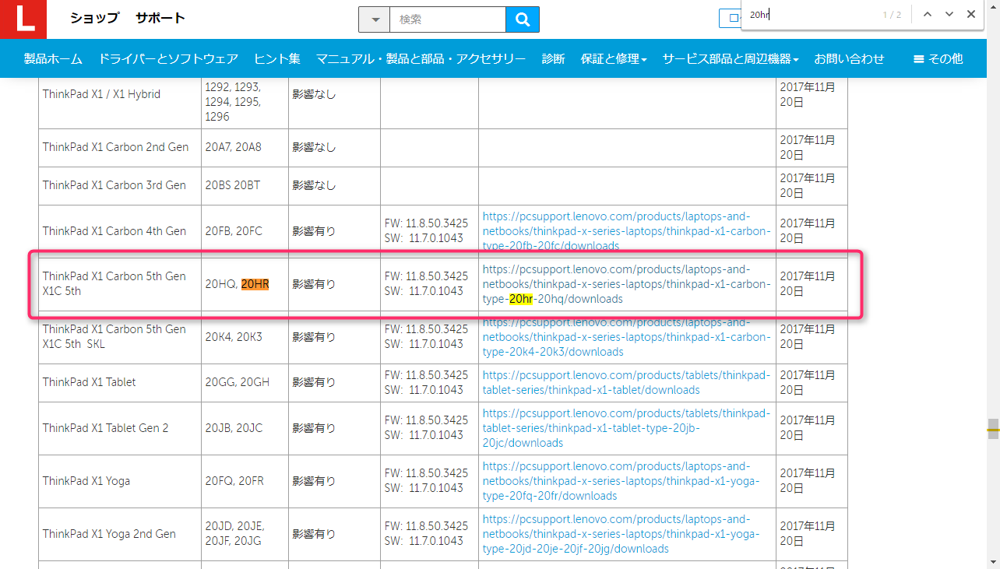</a>

チップセットからファームウェアとソフトウェアをダウンロードします。

Intelマネージメントエンジン11.8ファームウェア
<a href="images/handle-vulnerability-of-intel-for-thinkpad-x1-carbon-8.png">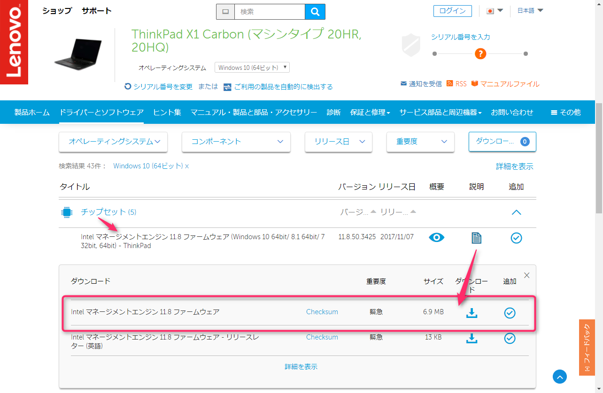</a>

Intelマネージメントエンジン11.7ソフトウェア
<a href="images/handle-vulnerability-of-intel-for-thinkpad-x1-carbon-9.png">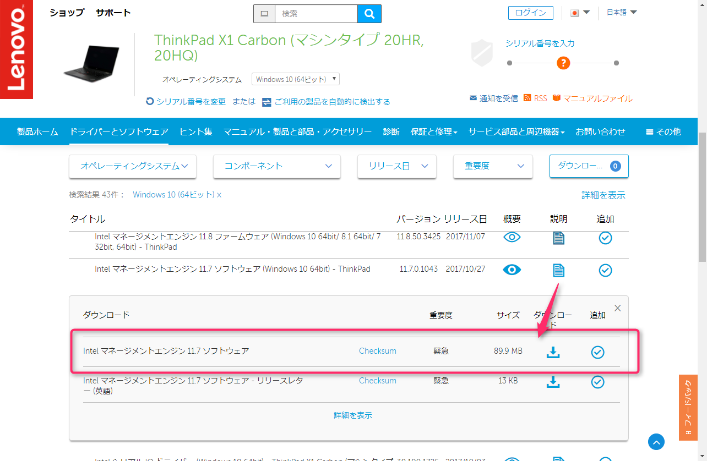</a>

### 修正パッチの適用

#### 1. Intelマネージメントエンジン11.8ファームウェアのアップデート

ダウンロードした**n1mrg19w.exe** を実行します。

インストーラが起動するのでなるがままに進めていきます。

<a href="images/handle-vulnerability-of-intel-for-thinkpad-x1-carbon-10.png">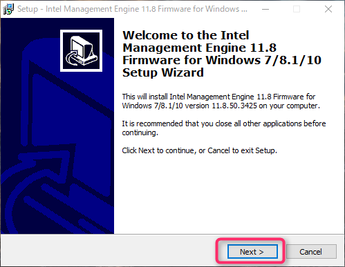</a>

<a href="images/handle-vulnerability-of-intel-for-thinkpad-x1-carbon-11.png">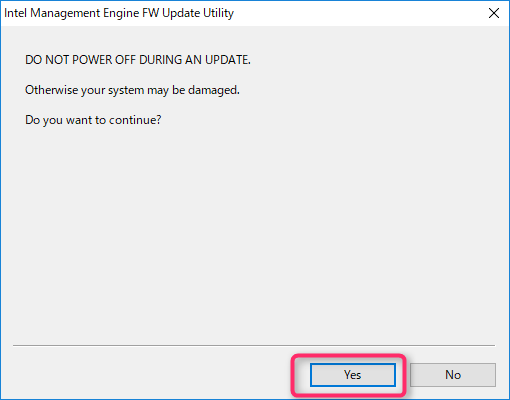</a>

しばらくすると、再起動がかかります。

#### ※windowsオーディオデバイスグラフアイソレーションのCPU使用率が上がる

ファームウェアのアップデート後に、windowsオーディオデバイスグラフアイソレーションのCPU使用率が膨大に上がってしまいました。

<a href="images/handle-vulnerability-of-intel-for-thinkpad-x1-carbon-12.png">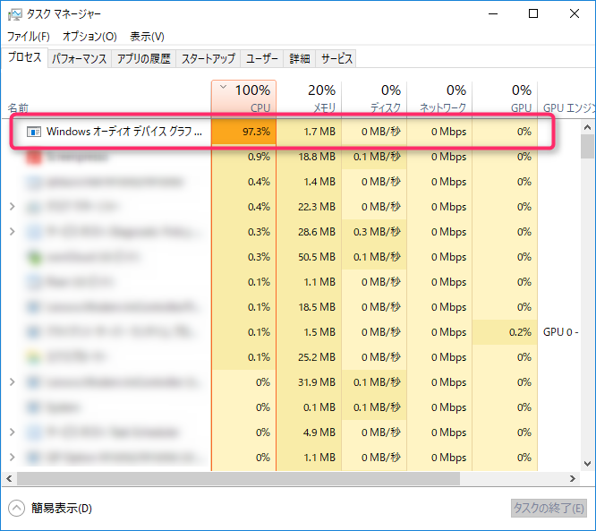</a>

しばらく経っても落ち着かないので、一旦タスクを終了してソフトウェアアップデートに移ります。

※ソフトウェアのアップデート後はCPUが上がることはありませんでした。

#### 2. Intelマネージメントエンジン11.7ソフトウェアのアップデート

ダウンロードした**n1mra15w.exe**を実行します。

インストーラが起動するのでなるがままに進めていきます。

<a href="images/handle-vulnerability-of-intel-for-thinkpad-x1-carbon-14.png">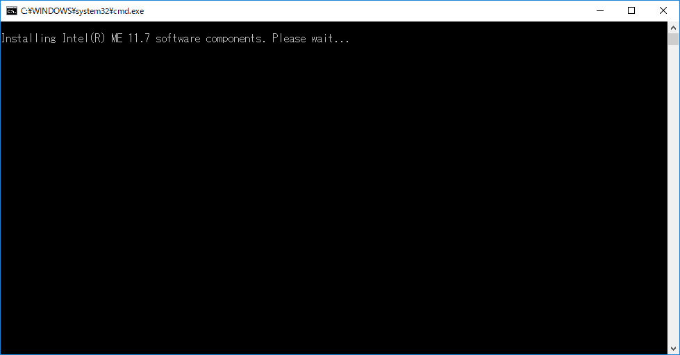</a>

コマンドプロンプトが消えるとアップデートは完了です。

再起動は促されませんでしたが、筆者は念のため再起動しておきました。

## パッチ適用の確認

再度、脆弱性チェックツール Intel-SA-00086-GUI.exe を実行します。

**このシステムに脆弱性はありません。パッチはすでに適用されています** となっていることを確認します。

<a href="images/handle-vulnerability-of-intel-for-thinkpad-x1-carbon-15.png">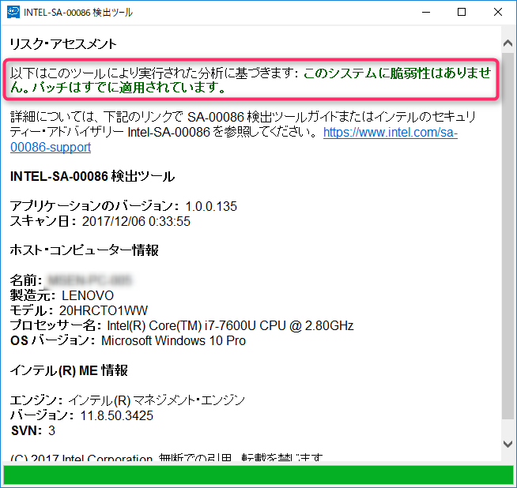</a>

これで一安心です。

## あとがき

比較的大きな脆弱性ですので、未実施の方は早急に対応しましょう。

アップデートをやっていて気づいたのですが、これ以外にもたくさんのパッチが提供されていました。

話題になってからではなくて、自らがチェックすることが我が身や組織を守ることにつながるのだと感じました。
