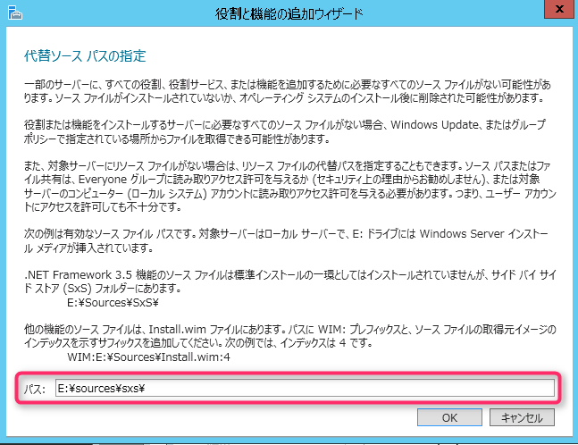
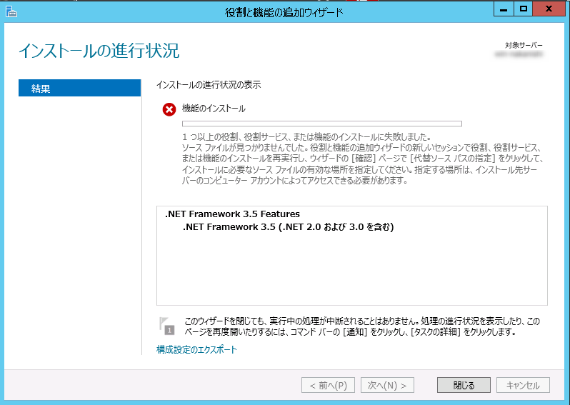
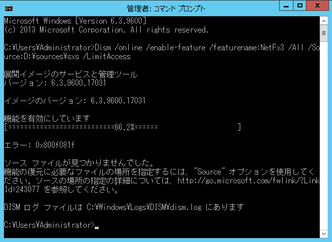
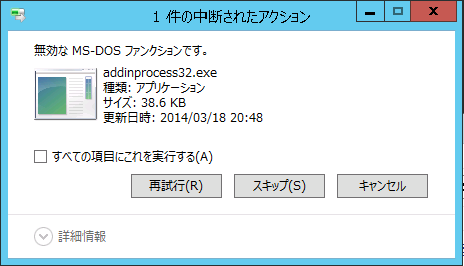
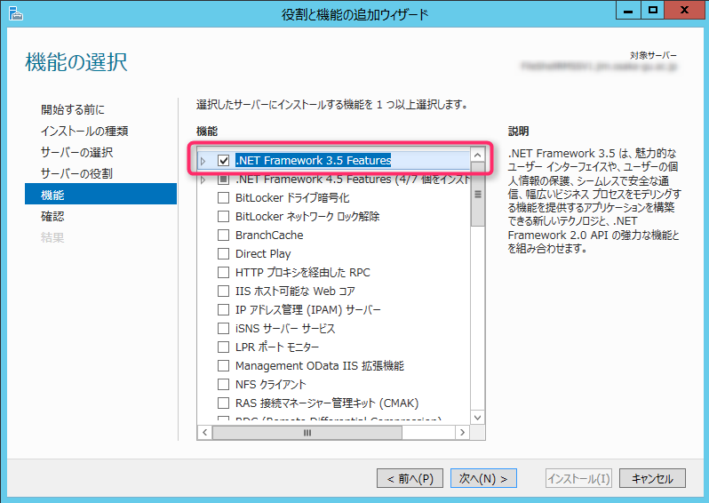
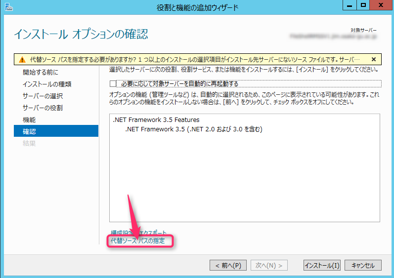
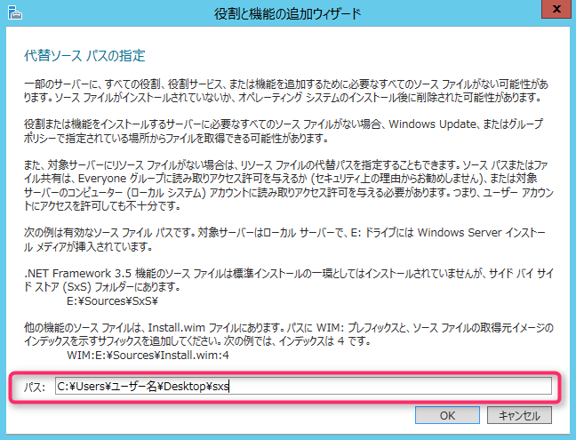
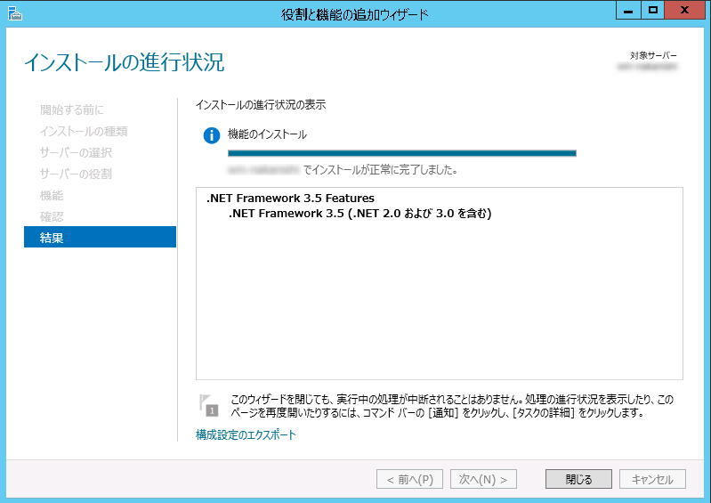

こんにちは、じんないです。

あるソフトウェアの要件に.NET Framework 3.5が必要でした。

Windows Server 2012 R2(OS)のISOイメージをVMware上の仮想マシンにマウントし、**役割と機能の追加ウィザード**から**.NET Framework 3.5 Features**をインストールしましたがエラーとなりました。

この現象は、VMwareの機能でOSのISOイメージをマウントし、ソースパスとして指定した場合に発生するようです。

同様の環境でお困りの方は以下に紹介する手順で解決してください。

## 想定環境

仮想環境：VMware vSphere 6.5
仮想マシンOS：Windows Server 2012 R2

## 現象とトラブルシューティング

とりあえずインストールしたいという方は読み飛ばしてもらって結構です。
### 1.代替ソースパスを指定する

**Windows Server 2012 R2には.NET Framework 3.5機能のソースファイルは標準でインストールされない**ため、代替ソースパスにOSのインストールメディア内のサイドバイサイドストアフォルダ（例 `E:\sources\sxs`）を指定してあげる必要があります。

しかしながらインストールを実行すると、以下のエラーがでてしまいます。

> 1つ以上の役割、役割サービス、または機能のインストールに失敗しました。ソースファイルが見つかりませんでした。役割と機能の追加ウィザードの新しいセッションで役割、役割サービス、または機能のインストールを再実行し、ウィザードの[確認]ページで[代替ソースパスの指定]をクリックして、インストールに必要なソースファイルの有効な場所を指定してください。指定する場所は、インストール先サーバーのコンピューターアカウントによってアクセスできる必要があります。

イベントログには**エラーコード 0x800F0906**が記録されていました。

### 2.Dismコマンドを使う

Microsoftのサポートサイトによると、Dismコマンドを使用してインストールする方法が紹介されていたので早速試してみます。

[.NET Framework 3.5 installation error: 0x800F0906, 0x800F081F, 0x800F0907](https://support.microsoft.com/en-us/help/2734782/net-framework-3-5-installation-error-0x800f0906-0x800f081f-0x800f0907)

**Error code 0x800F0906** の **Method 3: Use Windows installation media** の項目を参照し、Dismコマンドを実行します。

`Dism /online /enable-feature /featurename:NetFx3 /All /Source:<drive>:\sources\sxs /LimitAccess`

順調かと思えましたが「機能を有効にしています」が66.2%で止まってしまい、エラーがでました。

エラーコード：0x800f081f

> ソースファイルが見つかりませんでした。機能の復元に必要なファイルの場所を指定するには、"Source"オプションを指定してください。・・・

### 3.sxsフォルダをローカルにコピーする

マウント先からインストールしているのがいけないのかと思い、**.NET Framework 3.5 Features**のインストールに必要な` E:\sources\sxs `をローカルにコピーしてみます。

コピーしていると**無効な MS-DOS ファンクションです**とダイアログが表示され、ファイルのコピーができません。

今回に限った話かは不明ですが、**VMwareの機能でISOをマウントした場合、ファイル単位のコピーができないようです**。

以上の動作を踏まえて、.NET Framework 3.5のインストール方法を検討しました。

## .NET Framework 3.5のインストール方法

仮想マシンにOSのISOイメージを配置し、右クリックメニューからマウントします。
※Windows 8またはWindows Server 2012以降から、ISOイメージを右クリックメニューからマウントできるようになっています。

マウントしたのが、Eドライブだと仮定して以下のフォルダを任意の場所（今回はデスクトップ）にコピーします。

`E:\sources\sxs` → `C:\Users\ユーザー名\Desktop\sxs`

役割と機能の追加ウィザードで、**.NET Framework 3.5 Features**を選択します。

**代替ソース パスの指定**をクリックします。

パスは先ほどコピーしてきたフォルダ `C:\Users\ユーザー名\Desktop\sxs` を指定します。

あとはインストールが完了するのを待つだけです。

インストールが完了したら、先ほどコピーしてきたsxsフォルダは削除しても問題ありません。

## 読者の方へ

このあたり、私も勉強不足なのですがISOではなくDVDからマウントしていれば問題ないのかもしれません。

詳しい方がいらっしゃいましたらご教示いただければ幸いです。
