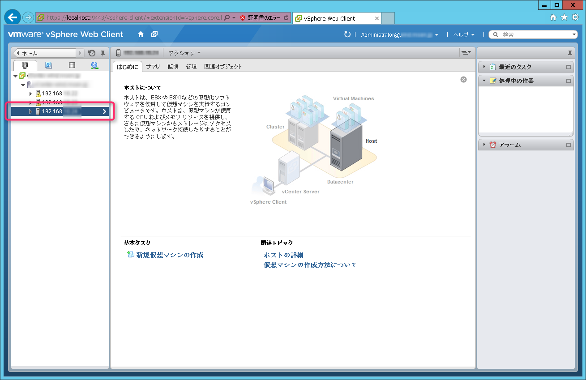
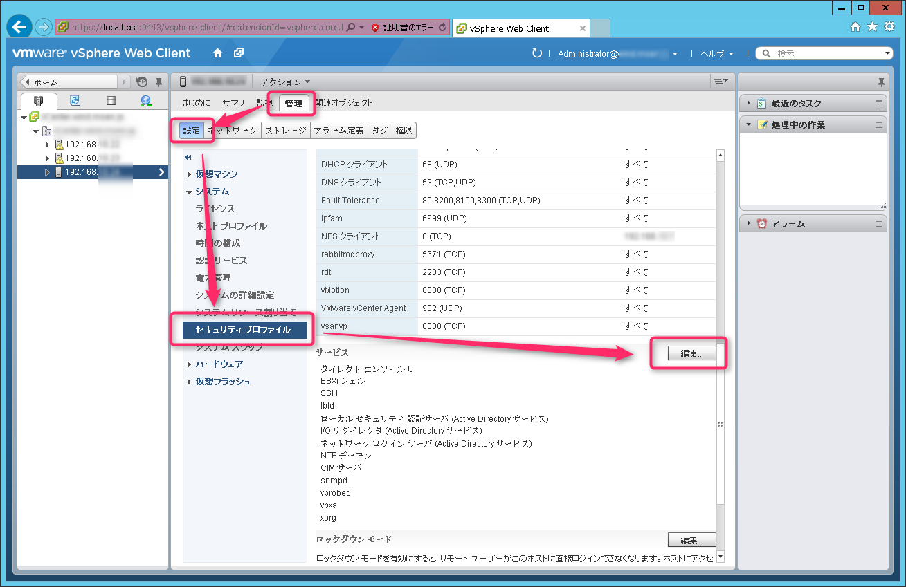
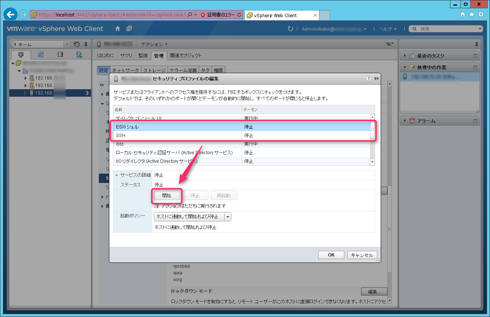
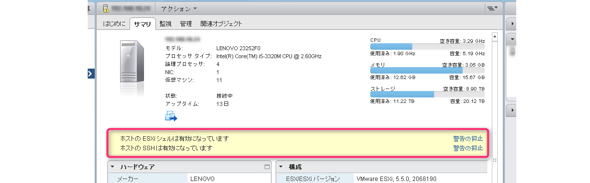
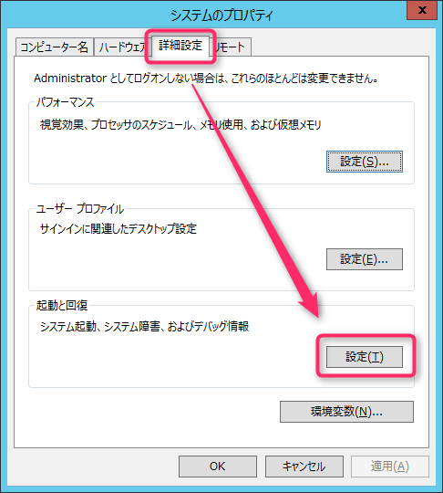
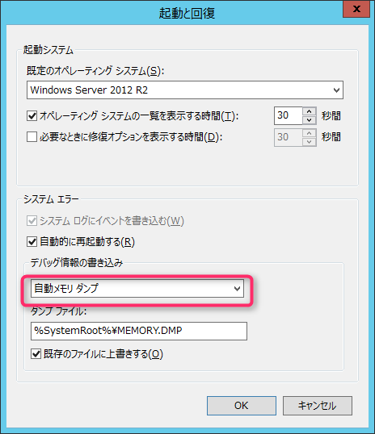
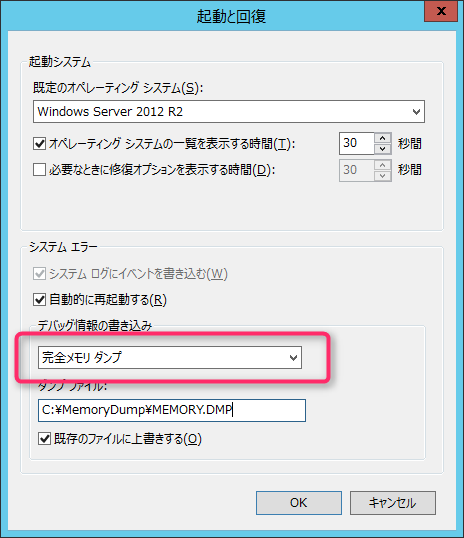
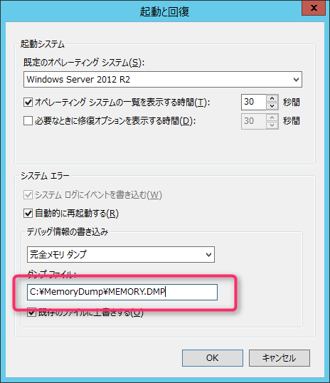
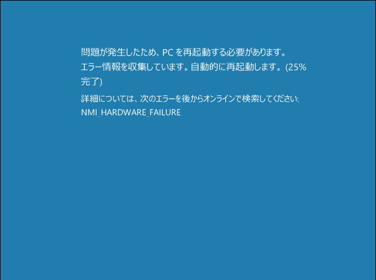
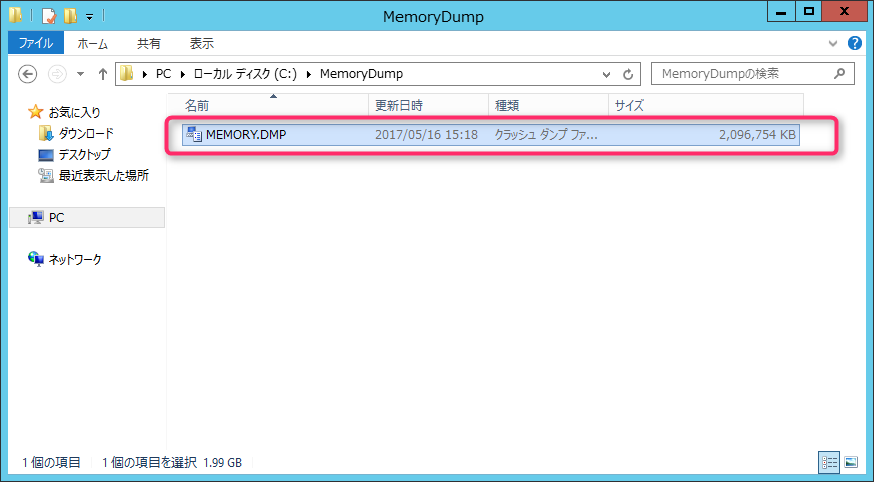

こんにちは、じんないです。

今回はVMware ESXiホスト上で稼動している仮想マシンの[メモリダンプ](http://e-words.jp/w/%E3%83%A1%E3%83%A2%E3%83%AA%E3%83%80%E3%83%B3%E3%83%97.html)を取得する方法を紹介します。

メモリダンプとは、ある瞬間のメモリ内容を記録したファイルです。クラッシュダンプなんて言われるときもあります。

コンピュータがおかしくなってしまったときに自動的に出力されるものですが、プログラムの挙動がおかしかったり、OSの調子がわるかったりと原因調査のために手動で出力したい場合もあるかと思います。

物理サーバの場合は[NMI](https://ja.wikipedia.org/wiki/%E5%89%B2%E3%82%8A%E8%BE%BC%E3%81%BF_(%E3%82%B3%E3%83%B3%E3%83%94%E3%83%A5%E3%83%BC%E3%82%BF))ダンプスイッチが設けられていることも多く、ポチッと押せばメモリダンプが取得されます。

仮想マシンの場合は、このようなボタンがないためひと手間かけないといけません。


今回評価に用いる環境は以下のとおりです。

* 仮想化環境：　VMware vSphere 5.5
* メモリダンプ試験サーバ：　Windows Server 2012 R2

また、本記事では以下のように用語定義しています。

* VMware vSphere：　VMware vCenter Server、VMware ESXiを含む仮想化環境
* ESXiホスト：　VMware ESXiをインストールした仮想化基盤サーバ
* ESXiシェル：　ESXi(OS)が使用するシェルのデーモン名

## 事前設定

### シェルとSSHの有効化

メモリダンプを取得するためには、ESXiホストへSSH接続しコマンド実行しなければなりません。

デフォルトではESXiシェルとSSHが無効になっているため、有効化していきます。

設定の変更はVMware vSphere Web Client(vCenter)から行います。


対象の仮想マシンが稼動するホストを選択します。


[管理] > [設定] > [セキュリティ プロファイル] よりサービスの[編集]をクリック


**ESXiシェル** と**SSH**のデーモンを起動させます。


ホストのサマリを見るとESXiシェルとSSHが有効になっている旨の警告表示が出ていますが、このままでOKです。


作業終了時に元に戻すことを覚えておきましょう。


### ダンプ設定の変更

次は、メモリダンプの設定をしていきます。

[システムのプロパティ] > [詳細設定] > 起動と回復より[設定]をクリック。


Windows Server 2012 R2のデフォルトは**自動メモリダンプ**になっています。


通常使用する場合ではこのままで問題ないと思いますが、不具合の調査や原因の追求を行う場合は、より多くのダンプを出力する**完全メモリダンプ**にしておくことをおすすめします。


詳細は以下をご覧ください。
[Technet：完全メモリ ダンプ採取のための設定手順について](https://blogs.technet.microsoft.com/askcorejp/2016/11/17/complete-memory-dump/)

また、ダンプファイルの出力先も変更することができます。

今回は**C:\MemoryDump\MEMORY.DMP**としました。



変更を反映するために再起動します。


## メモリダンプを取得してみる


TeraTermなどのターミナルソフトを使って、ESXiホストにSSH接続します。

``` 
$ ssh root@<ESXiホストのIPアドレス>
```

仮想マシンのプロセスリストを取得します。

```
＃ esxcli vm process list
```

ここで表示される、対象の仮想マシンの**World ID**をメモしておいてください。

```
DumpTest
   World ID: 3199732
   Process ID: 0
   VMX Cartel ID: 3199731
   UUID: 42 30 f9 ee a2 2a 3c e0-02 33 07 ac af f8 d2 5c
   Display Name: DumpTest
   Config File: /vmfs/volumes/643475f9-d1354340/DumpTest/DumpTest.vmx
```

このWorld IDを指定し、メモリダンプを取得します。

```
＃ /sbin/vmdumper 3199732 nmi
Sending NMI to guest...
```

すると、今頃はブルースクリーンが表示されて大騒ぎとなっていることでしょう。


メモリダンプの取得が完了すると自動的に再起動が行われます。

再起動後、指定したパスにダンプファイルが出力されています。
**完全メモリダンプ**を指定したので、物理メモリと同等のファイルサイズとなってます。


## おわりに

今回はWindows Serverを対象としましたが、Linuxでも同様の手順で取得可能です。

メモリダンプはOS不具合の際に、サポート窓口へ問い合わせをおこなうと取得を依頼されることもあります。

インフラエンジニアの方は覚えておいてはいかがでしょうか。

ではまた。
