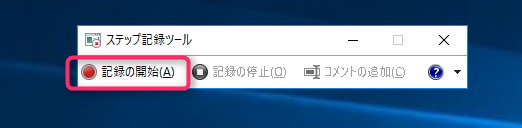

こんにちは、じんないです。

今回は画面キャプチャ取得ツールについて触れてみたいと思います。

システム構築において切っても切り離せないのが構築中の画面キャプチャ(エビデンスにも使われる)です。

どのような手順で実施したのか。どのような設定をしたのか。

ユーザーにとってもですが、我々SEにとっても非常に重要な情報です。

そして、それをいかに残すのかが課題でもあります。

キャプチャツールとしてのメジャーどころは[Print Screenキー] + MSペイントでしょうか。

皆さんも一度は使ったことがあるのではと思います。

Windows標準という点ではマルですが、「撮って」「貼っつけて」「保存して」と、なんと言っても手間がかかります。

今回紹介する**[ステップ記録ツール(psr.exe)](https://technet.microsoft.com/ja-jp/windows/dd941885.aspx)**はWindows標準でありながら、クリックするだけでキャプチャが取得できるツールです。

本来はWindowsで発生している問題をMicrosoftが状況を正確に把握するために作られたツールのようです。

サーバOSではWindows Server 2008 R2以降、クライアントOSではWindows 7以降で標準インストールされています。

まずはどのようなものなのか、触ってみましょう。

## 実際に使ってみる

評価する環境はWindows Server 2016です。

スタートメニューから**ステップ記録ツール(psr.exe)**を起動します。

こんな画面が表示されます。

右側の▼印から設定画面を出します。

デフォルトでは画像取り込み枚数の上限が25枚になっています。

クリックするたびにキャプチャが取得されるので25枚なんてあっという間です。
取りこぼしの無いように最大数の999枚に設定しておきましょう。
※Windows7は99枚が最大です。

「記録の開始」をクリックするとキャプチャの取得を開始します。

この間にOSの設定やソフトウェアのインストールを実施します。

クリックすると赤いポインタが表示されます。これがキャプチャの取得のサインです。

「記録の停止」をクリックすると終了します。

ウィンドウが起動し、取得したキャプチャの一覧が表示されます。
「保存」からMHTML形式で保存することができ、以後はブラウザで閲覧が可能です。

## イケてるところ

* **キャプチャの取得を意識しなくていい**
一番のおすすめポイントはこれです。
キャプチャ取得の手間がかからないので、構築スピードも格段に上昇します。

* **Windows標準ツールである**
こちらも非常にポイントが高いです。
サードパーティ製の優れたキャプチャツールもたくさんありますが、サーバに不要なソフトをインストールするのはご法度です。
インストール不要なツールもありますが、導入後の保守作業などを鑑みるとやはりWindows標準ツールがおすすめですね。
 
* **マウスカーソルも取得できる**
場合によっては必要となることもあるかと思います。
通常のPrint Screenではマウスカーソルは取得されません。
ちなみに、Windows標準ツールの拡大鏡 + Print Screenでもマウスカーソルの取得が可能です。

## イケてないところ

* **ときどきコマ落ちする**
イケてないとことろNo.1はこれです。
原因は不明ですが、まれに取れていないときがあります。
これではエビデンスとしての意味が・・・

* **対象ウィンドウだけの取得はできない**
Print Screen + MSペイントを使っている方は対象のウィンドウだけのキャプチャを取得するのに[Alt] + [Print Screen]を使われることも多いかと思います。
残念ながらそのような機能がなく常に全画面キャプチャとなります。

* **途中のデータは保存されていない**
実行中はメモリ上に記録されるため、途中でPCの電源が落ちたりするとデータはすべて失われます。
インストールでありがちな「次へ」「次へ」「インストール」「再起動」・・♪
なんてリズミカルにやっているとすべてが水の泡となるので注意が必要です。

* **画質が粗い**
仕様なので仕方ない部分ですが、Print Screen + MSペイントより画質が劣ります。
手順書など納品資料などには不向きですので、その際はキャプチャを取り直しましょう。

## まとめ

Windows標準で使い勝手のよいツールですが、メインで使うには少々頼りない部分があるので、あくまで作業記録として補助的に使うのが良いかと思います。

クリックすると自動的に取り込んでくれるため、「作業前の設定を取っていなかった！」なんて時にも力を発揮するでしょう。

筆者も何度か救われた経験があります。

それほど手間ではありませんので、皆さんも一度試されてはどうでしょうか。
