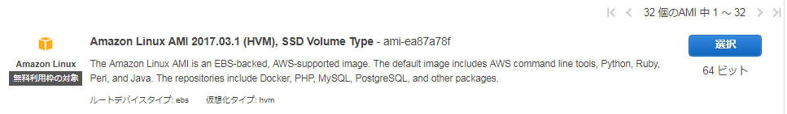
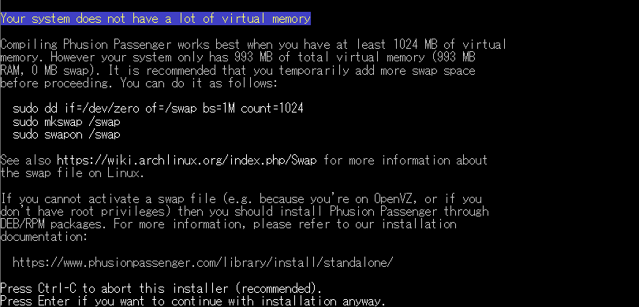
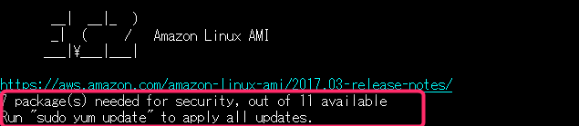

こんにちは、じんないです。

**AWS(Amazon Web Services) EC2上に作成されたAmazon LinuxにAnsibleを使って[Redmine](http://redmine.jp/)を構築する方法**を紹介します。

Redmineはオープンソースのプロジェクト管理ソフトウェアです。

弊社のカスタマーサポート窓口もRedmineを使用しています。

Amazon LinuxでRedmineを構築できるように、[CentOS用のプレイブック](https://github.com/farend/redmine-centos-ansible)をAmazon Linux用へモディファイしました。

GitHubでも公開しています。
[redmine-amazon-linux-ansible](https://github.com/mseninc/redmine-amazon-linux-ansible)


## 想定環境

AWSのEC2 (t2.micro/1 core/1GB RAM) に作成されたAmazon Linuxを対象とし、すでにインスタンスの作成が完了していることを前提としています。

EC2にインスタンスを作成したあと、セキュリティグループの設定で インバウンド HTTP(80) を許可しておいてください。



## インストール手順

[EC2インスタンスにSSHで接続](http://docs.aws.amazon.com/ja_jp/AWSEC2/latest/UserGuide/AccessingInstancesLinux.html)します。

rootユーザーに昇格し、以下の手順を実行します。

### スワップ設定

t2.microでインスタンスを作成した場合は、メモリが1GBと多くありません。

インストール中にPassengerのインストールで止まってしまう (後述) ので、スワップを設定します。

t2.small (2GB RAM) の環境では不要だと思いますので、お使いの環境にあわせて実施してください。

```
dd if=/dev/zero of=/swap bs=1M count=1024
chmod 600 /swap
mkswap /swap
swapon /swap
```

### pipとAnsibleのインストール

pipでAnsibleをインストールしておきます。

```
easy_install pip
pip install ansible
```

### EPELとGitのインストール

GitHubのリポジトリをクローンするため、Gitをインストールします。

```
yum -y install epel-release git
```

### playbookのダウンロード

弊社GitHubリポジトリから [redmine-amazon-linux-ansible](https://github.com/mseninc/redmine-amazon-linux-ansible) をクローンします。

```
git clone https://github.com/mseninc/redmine-amazon-linux-ansible.git
```

これでカレントディレクトリに `redmine-amazon-linux-ansible` ディレクトリができていればOKです。

### PostgreSQLに設定するパスワードの変更

PostgreSQL の接続パスワードを設定するため、ダウンロードしたplaybookから `group_vars/redmine-servers` を開き、**db_passwd_redmine** を適当なパスワードに変更します。

```
cd redmine-amazon-linux-ansible
vi group_vars/redmine-servers
```

### playbookの実行

ここまでの準備ができたら、playbookを実行します。

```
ansible-playbook -i hosts site.yml
```

インストールが完了したら、Webブラウザで` http://< IPアドレス >/redmine ` にアクセスします。

このときのIPアドレスはAWSコンソールのインスタンス一覧から確認できる **IPv4 パブリック IP** を使用してください。

あとは、必要に応じて**iptables**でファイアウォールの設定を行ってください。

接続できない場合は、下記の項目を確認してください。

- iptables が適切に設定されているか (80番ポートが開いているか)
- AWS EC2 に紐付いているセキュリティグループ設定で 80 が許可されているか

## オリジナルからの変更点

Amazon Linuxに対応するため、オリジナルから下記の点を変更しています。

- yum アップデートの追加
- SELinux 関連設定の削除 (Amazon Linux には初期状態で SELinux が導入されていないため)
- Firewalld 関連設定の削除（Firewalldがないため）
- iptables 設定を追記
- 日本語フォントの変更（該当するフォントが無いため）
- PostgreSQLのinitコマンドの変更
- pg_hba.confのパスを変更
- pythonのドライバを変更（バージョンの変更）
- redmine.confのアクセス制限変更（500エラー回避）

## ハマったところ

今回の手順で実行してもらえれば特に問題はないのですが、苦労したとこを書いておきます。

### passengerのインストールが失敗する

playbookがひととおり完了して、さぁredmineに接続しようと思うもエラー画面。

`/var/log/httpd/error_log` を見ると以下のエラーが出ています。

```bash
[error] *** Passenger could not be initialized because of this error: Unable to start Phusion Passenger: Support binary PassengerAgent not found (tried: /usr/local/lib/ruby/gems/2.4.0/gems/passenger-5.1.7/buildout/support-binaries/PassengerAgent and /root/.passenger/support-binaries/5.1.7/PassengerAgent). There may be different causes for this:\n\n - Your 'PassengerRoot' setting is set to the wrong value. Please see https://www.phusionpassenger.com/library/config/apache/reference/#passengerroot to learn how to fix the value.\n - The PassengerAgent binary is not compiled. Please run this command to compile it: /usr/local/lib/ruby/gems/2.4.0/gems/passenger-5.1.7/bin/passenger-config compile-agent\n - Your Passenger installation is broken or incomplete. Please reinstall Passenger.
```

passengerの初期化し失敗しましたよ的なエラーメッセージが表示されています。

後半に以下のコマンドを実行してくれと書いてあるので、言われるがままに実行してみます。

```bash
/usr/local/lib/ruby/gems/2.4.0/gems/passenger-5.1.7/bin/passenger-config compile-agent
```



> `Your system does not have a lot of virtual memory`

メモリが足りませんと言われてしまいます。

**Enter**を押下するとさらにエラーになるか、固まってしまうので注意です。

#### 原因1：スワップを設定していない

エラー画面のままですが、メモリが足りてないのでスワップを設定してくれと出ています。

以下のコマンドでスワップを設定し、再度実行することでエラー解消しました。

```bash
dd if=/dev/zero of=/swap bs=1M count=1024
chmod 600 /swap
mkswap /swap
swapon /swap
```

エラーメッセージにもあるように、1024MB以上ないとだめなようです。

t2.microのメモリは1GBですが、993MBになるようでちょっと足りないんですね。

```bash
Compiling Phusion Passenger works best when you have at least 1024MB of virtual memory.However your system only has 993MB of total virtual memory (993 MB RAM, 0 MB swap). It is recommended that you temporarily add more swap space pefore proceeding.
```

#### 原因2：yum updateをしていない

エラー画面とは関係ないのですが、仮想マシンをデプロイしたあと `yum update` をしていないと同様のエラーとなるようです。

この場合も `yum update` を実行するとエラーは解消しました。

playbookの冒頭で `yum update` を組み込んでいるのでご安心ください。

余談ではありますが、Amazon LinuxのマシンにSSH接続をするとyum updateをしてくれと書いてあるんですよね。



「EC2の文字が浮かびあがっててスゲー」と気を取られて、スルーしてました。

まぁ人間なんてこんなもんです。

## 謝辞

最後にCentOS用のプレイブックを作ってくださった、[ファーエンドテクノロジー株式会社](http://www.farend.co.jp/)さんに感謝いたします。