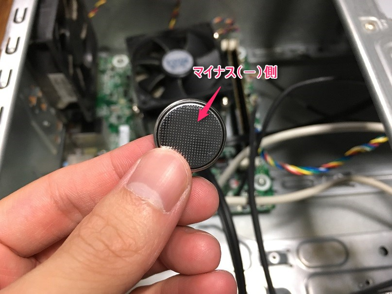

こんにちは、じんないです。

自宅で使っているPCを起動すると、毎回時計がずれているのでマザーボードのボタン電池を交換することにしました。

PCのマザーボードには、電源を切っても時計やBIOSの設定を保持するためにボタン電池が取り付けられています。

電池なので当然ながらどんどん消耗し、その寿命は大体5年前後と言われています。

筆者のPCは2011年に購入したので、6年ほどもってくれました。

※実際にはだましだまし使っていたので5.5年くらい。

ノートPCでは二次電池(充電できるやつ)のタイプもあるようなので、一概に時計がずれても「電池を交換しましょう」とは言えないようです。

今回は、「電池変えてみたいけどどうやってやるの！？」って方のために、交換手順を紹介します。

では、さっそく交換していきましょう。

## 作業前の注意点

* **PCのコンセントを抜き、十分な時間が経ってから作業を開始する！**

コンデンサに貯まった電気が放電される前に作業すると、感電の恐れがあります。

* **自分にたまった静電気に気をつける！**

PCに使われている電子部品は非常に繊細です。数kV以上にもなる静電気で壊れてしまうことがあります。

アース線や水道管など接地されているもに触れて静電気を逃しておきましょう。

くれぐれも、フリースを着て作業しないように（笑）

## ボタン電池の交換手順

分解といってもたいそうなことはありません。

背面にあるねじを一本ゆるめ、側面のパネルをスライドさせて開きます。

開け方が分からない場合は取扱説明書を参照してください。

はい。ガラガラです。

学生時代にコミコミ3万で買ったHPのミニタワーなんですが、なんの拡張もできない割りに超ゆとりがあります。

このデッドスペースにいっそのことNASをビルドインしてやろうかと思うくらいです。

余談はこれくらいにして、**赤枠で囲った部分がマザーボード**と呼ばれる部分です。

CPUやメモリなどが載っている、**PCの中枢部分**です。

拡大してみると、ボタン電池を発見しました。

金属のレバーで押さえられているので、指で軽く引っ張ってボタン電池を引き抜きます。

使われている電池はCR2032でした。ちなみに、今写っている面がプラス側です。

こっちがマイナス側になります。

ためしに、どこのご家庭にもあるテスターで電圧を測ってみると・・・**0.9V！**

CR2032の公称電圧は3Vなので、だいぶ消耗していました。

安物テスターですが、乾電池を測ると1.5Vを示していたのできっと真値なんでしょう。

家電量販店やコンビニでCR2032を調達してきます。

今回はパナソニック製のものを採用しました。

なぜパナ製にしたのかご興味がある方は以下のサイトをご覧ください。
CR2032について、熱く語られています。筆者はこういう記事が大好きです。
[CR2032ってどんな電池？主要メーカ７社の比較まとめ](http://rbs.ta36.com/?p=20398)

こちらも、どこのご家庭にもあるテスターで電圧を測ってみました。
さすが新品、**3.23V**。

あとは電池をセットし、元通りくみ上げていきます。

この時、CPUク−ラーやファンにこびりついたホコリを取り除いておくと、なおいいです。

なかなか開ける機会がないので、きれいにしておきましょう♪

PCの電源をオンにし、インターネット時刻をOFF→ONすると時計があうと思います。

また、以下のコマンドでもNTPサーバに再同期をかけることができます。

` w32tm /resync `

このとき、「サービスを開始できません」と表示された場合は、Windows Time サービスを「開始」してください。

※NTPの設定方法は以下で紹介しています。
[コマンドでWindows ServerのNTPサーバーを設定する](https://mseeeen.msen.jp/set-ntp-server-with-command-in-windows-server/)

## あとがき

100円程度で修理でき、難易度も低いため素人の方でもチャレンジしやすいのではないでしょうか。

自分で修理することを推奨しているかのような記事になってしまいましたが、先に書いた注意点を意識しくれぐれも自己責任でお願いいたします。

自信の無い方は無理せずメーカーに修理を依頼しましょう。

余談ですが、任天堂ゲームボーイでセーブできなくなったときも、カセット内のボタン電池を交換することで直ります。

興味のある方は試してみてはどうでしょうか。

ではまた。
