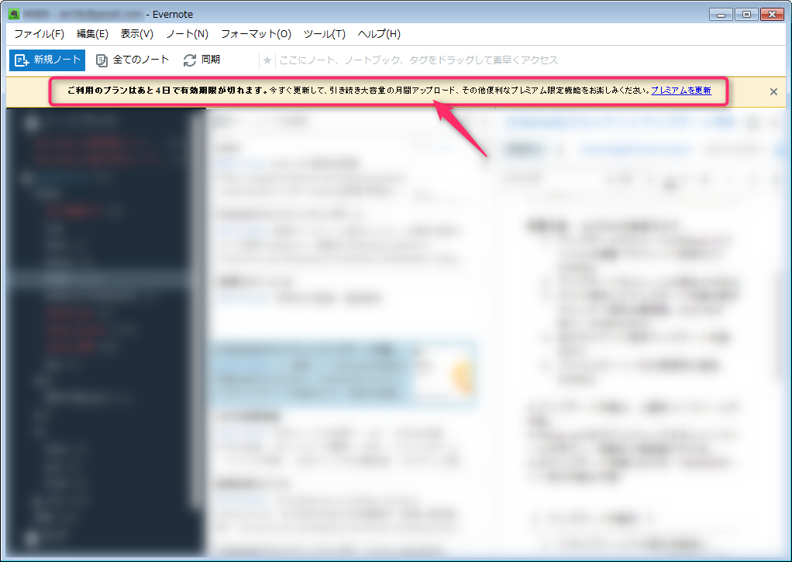
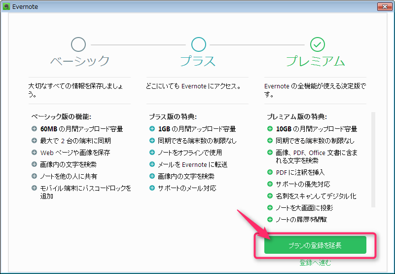
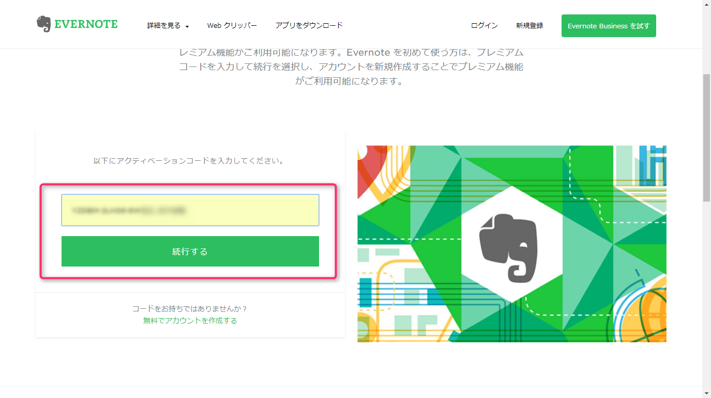
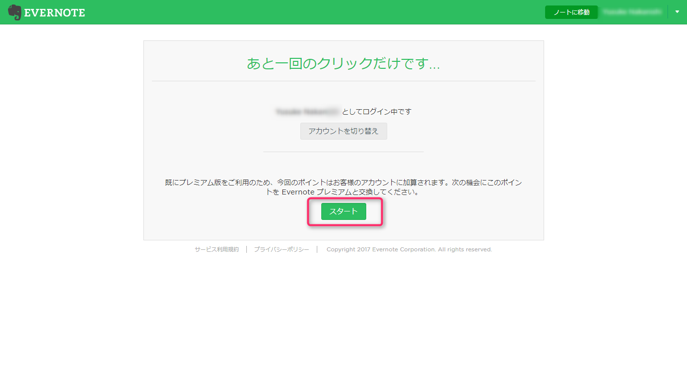
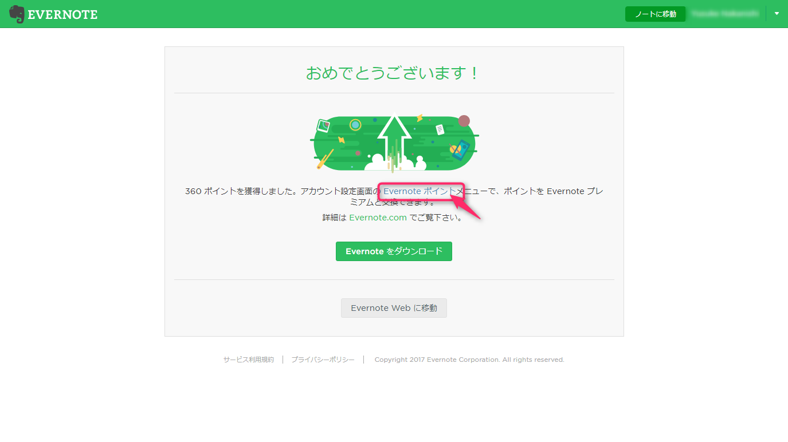
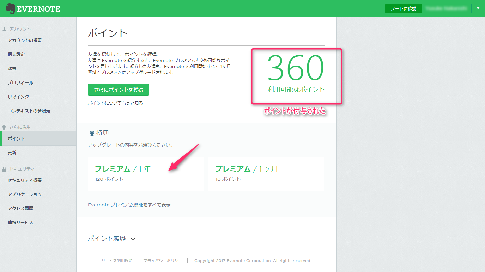
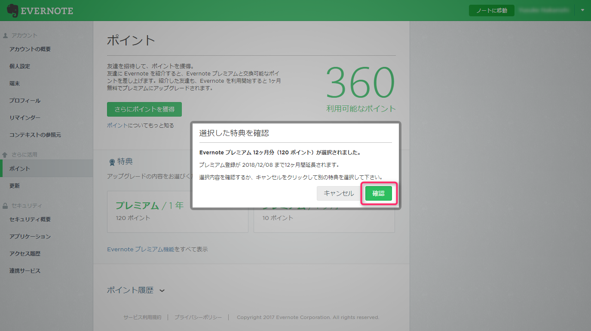
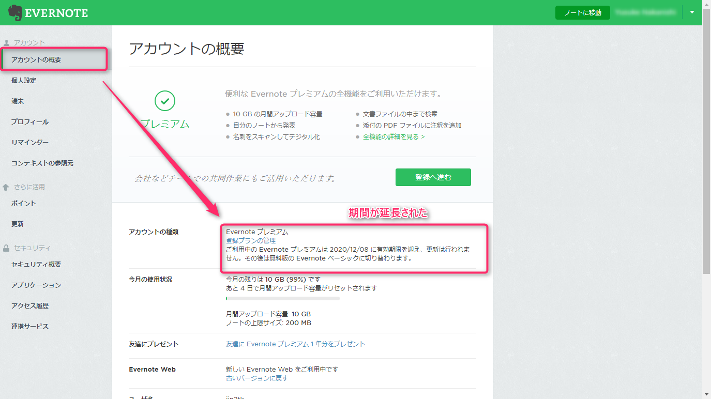

**すべてを記憶する** のキャッチフレーズでおなじみの[Evernote](https://evernote.com/intl/jp)。

皆さんもお使いでしょうか。

日常のちょっとしたメモからアイデアの整理、ビジネスシーンにおいては名刺管理や仕事のノートまで用途は多岐にわたります。

非常に便利で筆者も公私問わず使用しています。

さて、そんなEvernoteですが数年前に申し込んだプレミアム版の有効期限が切れてしまったので、更新することにしました。

[各プランの比較はこちら](https://evernote.com/intl/jp/get-started)

## まずはプレミアムパックの購入

有効期限が近づくとEvernoteに以下のテロップがでるようになります。

クリックして進めるとここからプレミアムパックを購入できるようになっています。

## すでにアクティベーションコードを持っている場合

### アクティベーション

既にプレミアムパックを購入していたり、会社でコードだけ渡された場合は以下の手順でアクティベートする必要があります。

アクティベーションコードを用意し、[プレミアムコードを有効化](https://evernote.com/intl/jp/partner/retail) にアクセスします。

アクティベーションコードを入力し、 **続行する** をクリックします。

アカウントを確認して問題なければ、 **スタート** をクリックします。

### Evernoteポイントをプレミアムに交換する

「おめでとうございます！」と表示されますが安堵してはいけません。

あくまで **Evernoteポイントをゲットしたにすぎない** のです。

**Evernoteポイント** をクリックします。

3年分を購入したので、360ポイント付与されました。

このポイントを使ってプレミアムパックの購入を行います。

ここからは任意で構いませんが、**プレミアム / 1年** をクリックします。

**確認**をクリックします。

あとは気が済むまでポイントを使っていきます。

**アカウントの概要** から有効期限が延長されていることを確認します。

## あとがき

さまざまな端末から、いつでもどこでも使いたいときに使えるというのはEvernoteに限らず魅力的なサービスです。

無料トライアルも可能ですので、まだ使ったことがない方はこの機会に是非どうでしょうか。
