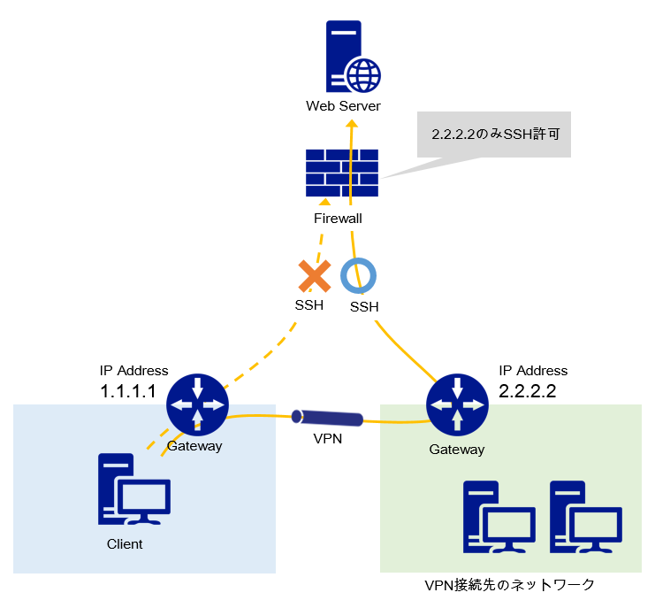
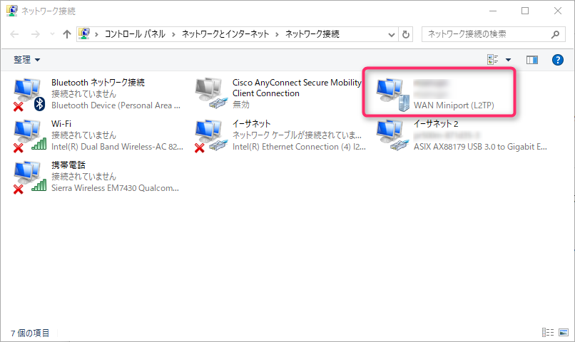
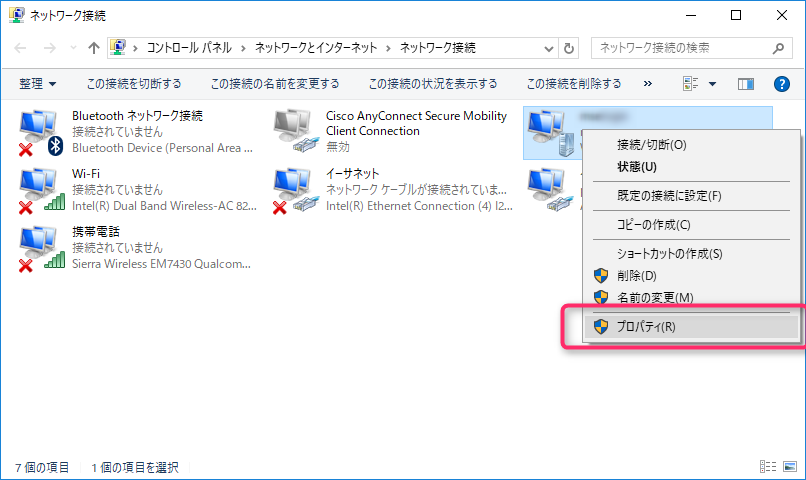
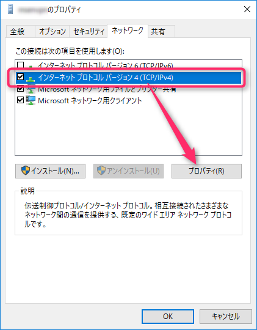
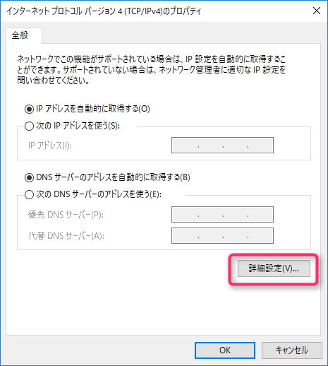
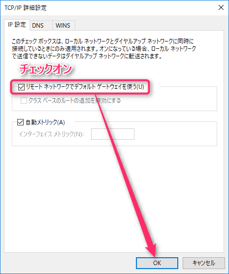
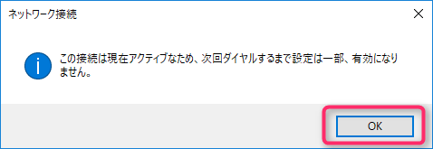

こんにちは、じんないです。

VPN接続している先のネットワークを経由して特定のサーバーやネットワークにアクセスできればなーと思うことはありませんか。

接続元のIPアドレスを制限している環境などに接続したいときは、許可されたIPアドレスをもつ環境から接続しなければいけません。

上図のような環境があるとして、Web Serverが**IPアドレス 2.2.2.2**からのSSH接続のみを許可している場合、Client(**IPアドレス 1.1.1.1**)からダイレクトにSSH接続することはできません。

このような場合は、一旦IPアドレス 2.2.2.2の環境にVPN接続し、接続先のデフォルトゲートウェイを使用することでClientからダイレクト（見かけ上）にSSH接続できるようになります。

## リモートネットワークのゲートウェイを使用する

**コントロールパネル > ネットワークとインターネット > ネットワーク接続** を開きVPNアダプタを見つけます。

**右クリック > プロパティ** をクリックします。

**ネットワークタブ > インターネットプロトコルバージョン4(TCP/IP)** を選択し、**プロパティ** をクリックします。

**詳細設定** をクリックします。

IP設定タブより**リモートネットワークでデフォルトゲートウェイを使う**にチェックを入れます。

VPN接続中に変更した場合は以下のメッセージが表示されます。
OKをクリックして、VPNを一旦切って再接続してください。

あとはVPN接続元の端末から、接続元のIPアドレスを制限しているサーバーやネットワークにアクセスしてみてください。

ダイレクトにつながるようになっていると思います。

## 特定のホストに対して有効なルートを設定する

上述の方法だとVPN接続をしている間、外向きへの通信はすべてリモートネットワークのゲートウェイを経由してしまいます。

これでは余計なトラフィックが増えるばかりでなくセキュリティ的にもよろしくありません。

そこで`route add`コマンドを使用してWindowsのルーティングテーブルを変更し、**特定のホストへの接続だけこのルートを通りますよ**と指定してあげます。

Web Serverへのアクセスのみ2.2.2.2のゲートウェイを経由する例です。

`route add <Web ServerのIPアドレス> mask <ネットマスク> 2.2.2.2`

コマンドが成功すると`OK!`となんだかチャラいレスポンスが返ってきます。

ルーティングテーブルを確認する場合は、`route print` コマンドを使用します。

これでWeb Serverへのアクセスのみ、2.2.2.2のゲートウェイを経由することができました。

ではまた。
