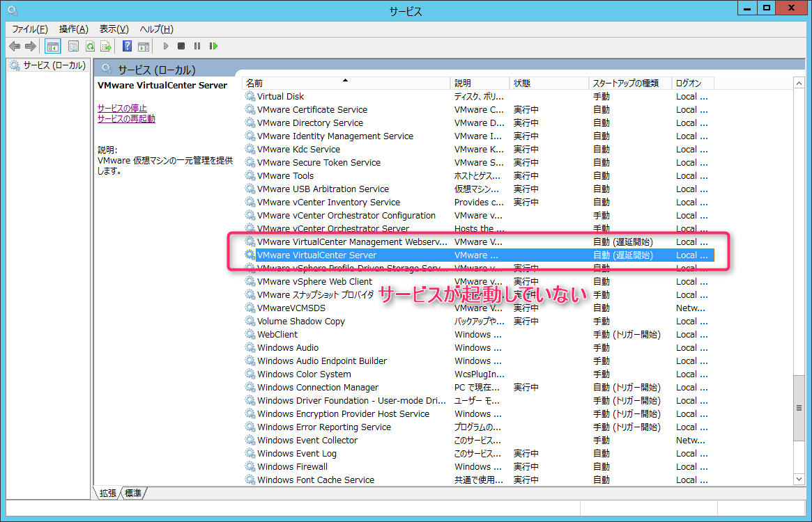
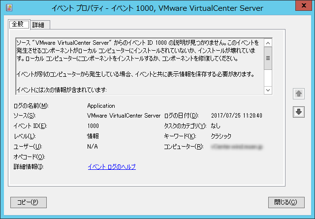
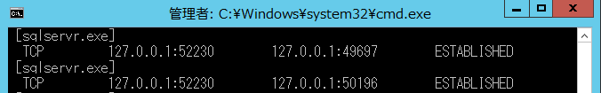
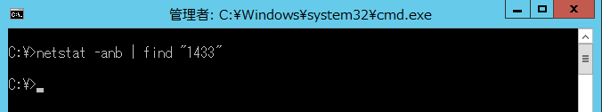
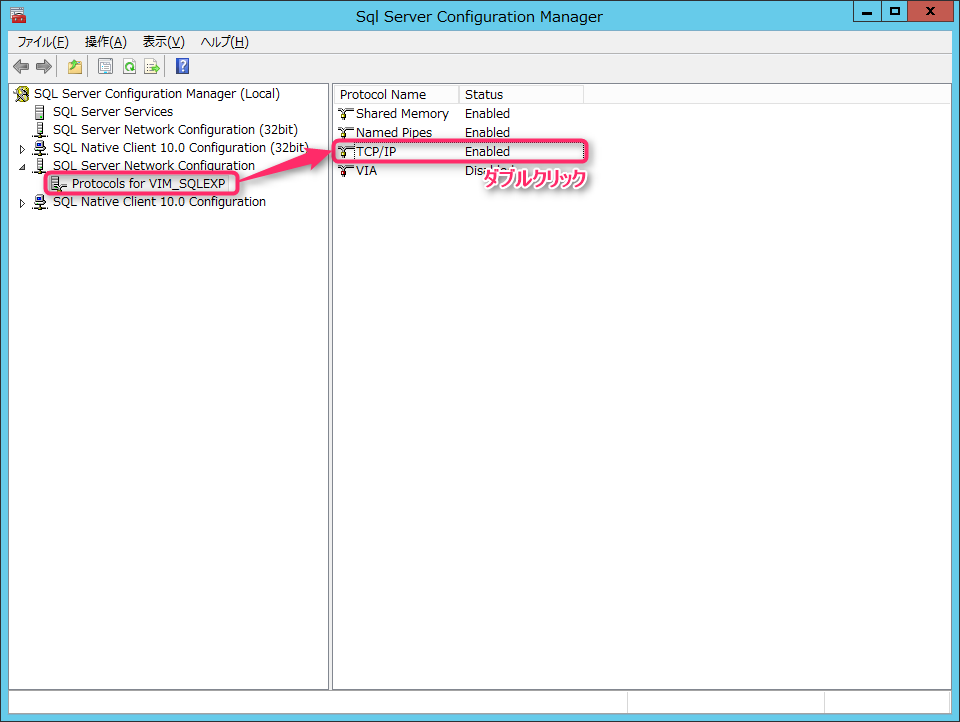
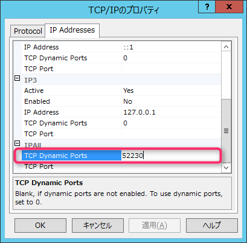
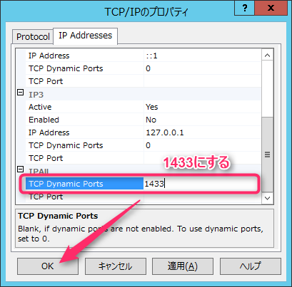
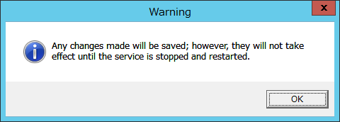
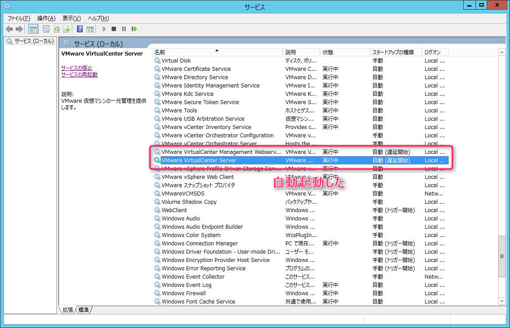

こんにちは、じんないです。

社内の評価環境を整備しようとしたのですが、vCenter Serverに接続できませんでした。

サービスを確認するとvCenterのサービスである **VMware VirtualCenter Server** が実行されていません。

自動起動に設定しているのですが、前回サーバーを再起動したときにサービスが起動しなかったようです。

VMwareのKnowledge Baseによると、vCenterが使っているSQL Serverよりも先にvCenterのサービスが起動しているのが悪いのだとか。

[再起動後に VMware vCenter Server サービスが自動的に開始されない (2076922)](https://kb.vmware.com/selfservice/microsites/search.do?language=en_US&cmd=displayKC&externalId=2076922)

レジストリから依存関係の設定をするようですが、実はこれ、既に設定済みでした。

色々調べてるとどうもSQL Serverで使っているポートが1433以外になっているとダメなようです

[VMware VirtualCenter Server サービスが次のエラーで起動に失敗する: vpxd logs show ODBC error: (08001) - [Microsoft][SQL Native Client]TCP Provider: Timeout error [258] (2092677)](https://kb.vmware.com/selfservice/microsites/search.do?language=en_US&cmd=displayKC&externalId=2092677)

イベントログに記録されていた以下のイベントが解決への手がかりとなりました。

> ソース "VMware VirtualCenter Server" からのイベント ID 1000 の説明が見つかりません。このイベントを発生させるコンポーネントがローカル コンピューターにインストールされていないか、インストールが壊れています。ローカル コンピューターにコンポーネントをインストールするか、コンポーネントを修復してください。

ではさっそく、SQL Serverが使用するポートを変更していきましょう。

### 対象環境

* ホストOS：　Windwos Server 2012 R2
* vCenter：　VMware vCenter Server 5.5
* DB：　Microsoft SQL Server 2008 Express

## SQL Serverが使用するポートの確認

以下のコマンドを実行して **sqlservr.exe** が使用するポートを確認します。

` C:\> netstat -anb ` 

面倒な人は、そもそも1433を使ってるかどうかを確認しても良いでしょう。

` C:\> netstat -anb | find "1433" ` 

1433以外になっていた場合は、以下の手順で変更してきます。

## SQL Serverのポート変更

スタートメニューより **SQL Server Configuration Manager** を起動します。

**SQL Server Network Configuration** を展開して **Protocols for VIM_SQLEXP** を選択し **TCP/IP** をダブルクリックします。
※VIM_SQLEXPの部分はお使いの環境により異なる場合があります。

**IP Address** タブより **TCP Dynamic Ports** の番号を確認します。
今回は52230となっていました。

これを1433に変更します。

　　　　　　　　　
OKをクリック。

SQL Serverのサービス **SQL Server (VIM_SQLEXP)** とvCenterのサービス **VMware VirtualCenter Server**を再起動します。

あとはサーバーを再起動し、サービスを確認します。

遅延起動にしているので少し遅いですが、ちゃんと起動していました。

めでたし、めでたし。

## あとがき

vCenter 6.0の構築も幾度とやってきましたが、起動に失敗したことはありませんでした。

データベースもSQL ServerからvPostgresに変更されており、起動周りも改善されているのかもしれませんね。

ではまた。