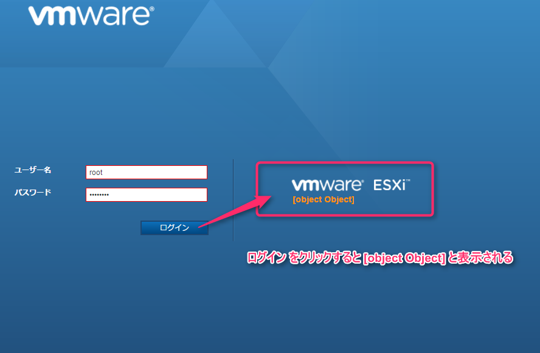
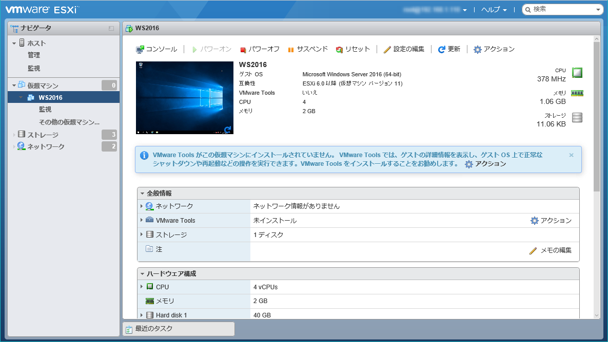

こんにちは、じんないです。

VMware Host Clientからポートフォワーディングで接続したESXiにログインしようとすると、**object Object** と表示されてログインできない現象が発生しました。

原因の究明はできてませんが、回避方法を紹介します。

ポートフォワーディングを使ってESXiに接続する方法は以下の記事を参照してください。

[vSphere Client 6.0 からポートフォワードでESXiに接続する](https://mseeeen.msen.jp/connect-to-esxi-with-port-forwarding/)

## 想定環境

* 仮想化環境： VMware ESXi(Hypervisor) 6.5
* ポートフォワーディングでESXiに接続
* 現象発生確認ブラウザ： Internet Explorer 11、Chrome

## 回避方法

通常、VMware Host ClientでESXiに接続するには以下のURLを入力します。

`https://<ホスト名 or IPアドレス>/ui`

ポートフォワーディングを行っている場合、ローカル端末のポートをたたくので以下のようになります。

`https://localhost:<任意のポート>/ui`

今回の現象が発生するのは、**ローカル端末を指定するのにlocalhostを使用している**ためです。

これを**ループバックアドレスに変更**します。

`https://127.0.0.1:<任意のポート>/ui`

これで正常にログインできるようになったはずです。

原因をご存知のかたはコメントいただけると幸いです。

ではまた。