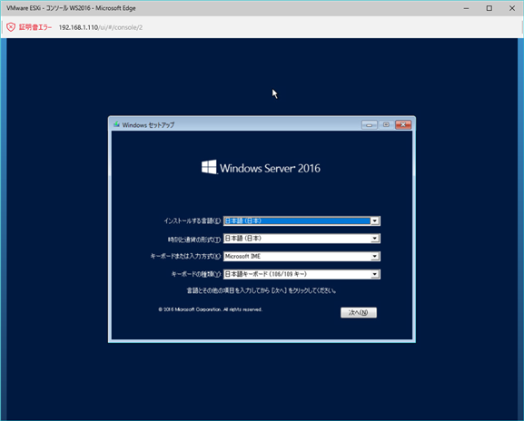
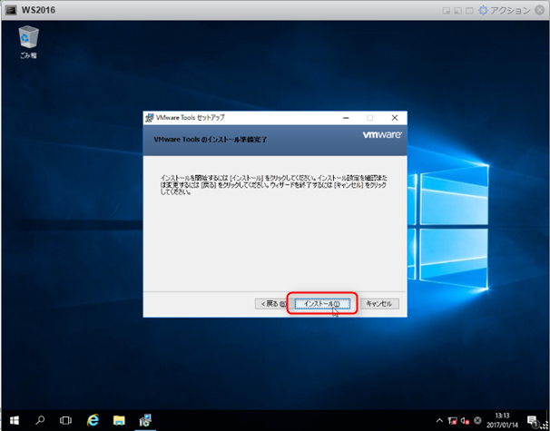

こんにちは、じんないです。

[導入編の執筆](/vmware-vsphere-hypervisor-6-esxi-intro/)からずいぶんと経ってしまいましたが、続編としてvSphere Hypervisor 6.0上に仮想マシンを作成する方法を紹介します。

## 前提

OSのイメージはデータストアに配置したisoファイルを使用します。

また、ESXiホストへの接続や仮想マシンの作成にはVMware Host Clientを使います。

## 仮想マシンの作成

ブラウザよりESXiホストに接続し、ログインします。
https://<ESXiのIP>/ui

左ペインの「仮想マシン」より「仮想マシンの作成/登録」をクリック。

「新規仮想マシンの作成」を選択し、「次へ」をクリック。

仮想マシンの名前、ゲストOSファミリ、ゲストOSのバージョンを設定し、「次へ」をクリック。
ここで指定する名前は、VMware上での名前でありコンピューター名（ホスト名）ではないので注意しましょう。

仮想マシンイメージやファイルを格納するデータストアを選択し、「次へ」をクリック。
NASなど共有ディスクとしてマウントしているデータストアがあれば、そこに格納することをおすすめします。
ほかのESXiからも参照できるデータストアに仮想マシンを保存することで、[vMotionやHA](https://blogs.vmware.com/jp-cim/2014/09/vsphere_kiso03.html)などの機能が使用でき可用性を高めることができます。
※利用可能なライセンスは[こちら](http://www.vmware.com/jp/products/vsphere.html#compare)を参照してください。

ハードウェアを設定していきます。自作のPCを作っていくような感覚ですね。
基本的な設定を紹介していますので、用途や仕様に応じて変更してください。
まずは、CPUを設定します。

例として、4コア/1CPUを設定する場合です。
ソケットあたりのコア数を指定することで、ソケット数を決定しています。
今回は4コア/１CPUなので、ソケットあたりのコア数は4です。
また、「CPUホットアドの有効化」をチェックするとOSが起動中でもCPUのコア数を増やすことができます。

メモリは2GBとしました。
こちらもCPUと同じく、メモリホットプラグの「有効」にチェックを入れるとOSが起動中でもメモリを増やすことができます。

ハードディスクは40GBでシンプロビジョニングを選択しています。
シンプロビジョニングは実際に使った分だけしかディスクを確保しないので効率的です。
DB領域に使いたいなど、パフォーマンスを重視される場合はシックプロビジョニング(Eager Zeroed）を選択されるとよいでしょう。
※Eager Zeroed：仮想ディスク作成時にゼロ埋めするため容量に応じて初期化に時間がかかる。
そのほかのディスクタイプについては[こちら](https://kb.vmware.com/selfservice/microsites/search.do?language=en_US&cmd=displayKC&externalId=2101080)を参照してください。

そしてOSイメージをどこからマウントするかというと、CD/DVDドライブからおこいます。
今回はデータストアに配置のisoファイルを使うので、「データストアISOファイル」を選択します。

目的のisoファイルを選択し、「選択」をクリック。

上部にもどり、「仮想マシンオプション」をクリック。
※ハードディスクやNICを追加したい場合は、「ハードディスクの追加」「ネットワークアダプタの追加」からおこなってください。
また、ハードウェアの設定は仮想マシン作成後も変更することができますので、ご安心ください。

起動オプション > 強制的にBIOSセットアップ の「次回仮想マシン起動時に、強制的にBIOSセットアップ画面に入る」にチェックをいれ、「次へ」をクリック。

設定内容を確認し、「完了」をクリック。

仮想マシンが作成されたことを確認し、クリック。

「パワーオン」をクリック。

「コンソール」をクリックし、好きなコンソールを開きます。

BIOSが表示されるので、Bootメニューより「CD-ROM Drive」の起動順位を上げておきます。

isoが読み込まれ、Windowsのインストールが始まります。

あとは、OSのインストールを実施するだけです。

## VMware Toolsのインストール

仮想マシンの作成が完了すると「[VMware Tools](https://kb.vmware.com/selfservice/microsites/search.do?language=en_US&cmd=displayKC&externalId=2051284)がインストールされてないよ」的なメッセージが出ていたかと思います。
[VMware Tools](https://kb.vmware.com/selfservice/microsites/search.do?language=en_US&cmd=displayKC&externalId=2051284)をインストールすると、コンソールを開いたときにマウスがとられる（開放は右Ctrl+Alt）ことがなくなったり、VMware Host ClientからOSをシャットダウンできたりします。
非常に便利なツールなので、ぜひインストールしておきましょう。

「アクション」をクリック。

ゲストOS > 「VMware Toolsのインストール」の順にクリック。

仮想マシンにVMware Toolsがマウントされるので実行します。

「次へ」をクリック。

「標準」が選択されていることを確認し、「次へ」をクリック。

「インストール」をクリック。

「完了」をクリックし、終了します。

OSを再起動します。

以上で、仮想マシンの作成は完了です。
あとは必要に応じて設定してください。

## あどがき

今回はWindowsの仮想マシンを作成しましたが、Linuxの場合でも同じ手順で仮想マシンを作成することができます。

次回は、ちょっと変わった仮想マシンをESXi上に構築してみたいと思います。

ではまた。