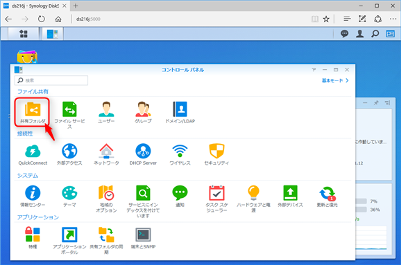
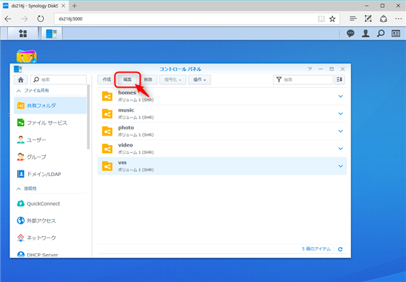
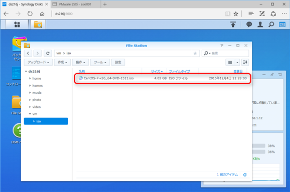

こんにちは、じんないです。

今回は[Synology DiskStation DS216j](https://www.synology.com/ja-jp/products/DS216j)(以下、DS216j)をvSphere ESXiにデータストア(NFS)としてマウントする方法を紹介します。

NASをデータストアにマウントすることで、仮想マシンイメージやisoなどを格納することができます。

また、複数のESXiホストが存在する場合、それぞれに共有ストレージとしてマウントしておくことで、[vMotionやHA](http://blogs.vmware.com/jp-cim/2014/09/vsphere_kiso03.html)、[DRS](http://blogs.vmware.com/jp-cim/2014/02/vspheredrs.html)などを利用することができます。
※利用可能なライセンスは[こちら](http://www.vmware.com/jp/products/vsphere.html#compare)を参照してください。

環境は前回つくったものを使用するので、以下を参考にしてみてください。
[無償の仮想化基盤 VMware vSphere Hypervisor 6.0 (vSphere ESXi) を使ってみる。【 導入編 】](https://mseeeen.msen.jp/vmware-vsphere-hypervisor-6-esxi-intro/)

クライアントインターフェースはVMware Host Clientを使用してESXiに接続します。

ではさっそくはじめていきましょう。

## DS216jの設定
まずはNAS側の設定をしていきます。

### 共有フォルダの作成

ブラウザからDS216jの管理コンソールに接続し、「コントロールパネル」を起動。

「共有フォルダ」をクリック。

「作成」をクリック。

フォルダの名前を入力して「OK」をクリック。

### NFSの設定

コントロールパネルより、「ファイルサービス」をクリック。

Win/Mac/NFSタブ > NFSサービス　の「NFSを有効にする」をチェックして「適用」をクリック。

左ペインの「共有フォルダ」より、前項で作成したフォルダを選択して「編集」をクリック。

NFS権限タブの「作成」をクリック。

ホスト名またはIP欄に接続するESXiホストのIPアドレスを入力。
※複数のESXiホストにマウントする場合は、ネットワークアドレスなどを指定してください。
「マウントしたサブフォルダへのアクセスを許可する」をチェックして「OK」をクリック。

作成されたことを確認して、「OK」をクリック。

### サブフォルダの作成

コンソールトップより、「File Station」を起動。

左ペインから作成したフォルダを選択 > 作成 > フォルダの作成の順にクリック。

サブフォルダ名を入力し、「OK」をクリック。
今回は、isoを入れておくためのフォルダを作成するので「iso」と名付けました。

フォルダが作成されたことを確認。

あとは、エクスプローラーから共有フォルダにアクセスし、ファイルなどをアップロードします。
画像はCentOS7のisoをアップロード後の状態

## ESXiにマウント
作成した共有フォルダをESXiにマウントします。

ブラウザより「https://<ESXiのIPアドレス/ui>」にアクセスし、ログインします。

左ペインのストレージをクリック。

「新しいデータストア」をクリック。

「NFSデータストアのマウント」を選択し、「次へ」をクリック。

マウントするフォルダの名前、DS216jのIPアドレス、NFSシェアを入力し、「次へ」をクリック。
NFSシェアはマウントするDS216jのディレクトリです。ここではサブフォルダのisoを指定しています。
またパスは、**/<ボリューム名>/<フォルダ名>/<サブフォルダ名>** のように、**ボリューム名から指定**する必要があります。

内容を確認して「完了」をクリック。

データストアが追加されたことを確認します。

データストアブラウザを起動してみると、先ほどアップロードしたCentOS7のisoがちゃんと入っています。

複数のESXiホストへマウントしたい場合は、同様の手順を繰り返してください。

## あとがき

isoのみならず、パッチファイルやインストーラなどをデータストアへ入れておくことで、仮想マシンにマウントして使用することができます。
次回は、データストア上のOSイメージ(iso)から仮想マシンを作成する方法を紹介予定です。

ではまた。