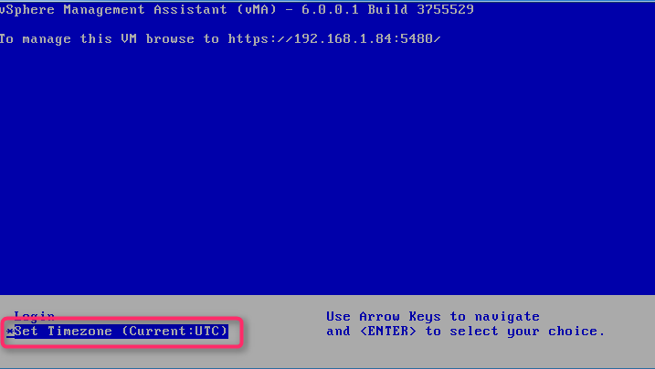
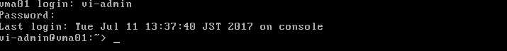

こんにちは、じんないです。

とあるUPSの電源管理をしているときに、vSphere Management Assistant(以下、vMA)を使う機会がありました。

vMAとはVMwareが無償で提供しているLinuxベースの仮想アプライアンス(CUI)です。

仮想化基盤サーバー(ESXi)を管理(スクリプト実行など)するのが主な用途だそうな。

確かに使い方を調べていると、PowerChuteによる電源制御の使用例が多くありました。

筆者もvMAに電源管理ソフトウェアをインストールし、UPSや仮想化基盤サーバー(ESXi)の電源制御を行いました。

vMAはOVFテンプレートからデプロイするのですが、初期設定が普通の仮想マシンとは少し異なるのでメモしておきます。

## 想定環境

仮想化環境はVMwareのvSphere 6.0系を想定しています。

* 仮想化基盤： VMware vSphere ESXi 6.0
* 仮想アプライアンス： vSphere Management Assistant 6.0
* 使用インターフェース： VMware Host Client

## vMAの入手

vMAはVMwareのwebページから無償でダウンロードが可能です。

[VMware vSphere Management Assistant 6.0.0.1 (vMA)](https://my.vmware.com/jp/web/vmware/details?downloadGroup=VMA6001&productId=577)

ダウンロードにはVMwareアカウントが必要になるので、お持ちでない方は作成しておきましょう。

zip形式のファイルをダウンロードします。

## OVFテンプレートからデプロイ

新規仮想マシン作成から「OVFファイルまたはOVAファイルから仮想マシンをデプロイ」を選択し、「次へ」をクリックします。

仮想マシンを名前を入力します。今回は「vMA01」としました。

ダウンロードしたファイルの中から「ovfファイル」と「vmdkファイル」を水色のエリアにドラッグ&ドロップし、「次へ」をクリックします。

対象のデータストアを選択し、「次へ」をクリックします。

使用許諾契約書に同意し、「次へ」をクリックします。

デプロイオプションを選択して「次へ」をクリックします。

Networking Propertiesは指定するとうまくいかなかったため、ここでは指定せずに「次へ」をクリックします。

設定を確認し問題なければ「完了」をクリックします。

デプロイが完了したらパワーオンします。

以下のようなダイアログが出てきますが、ネスト環境を使用するわけでもないので「はい」を選択し回答します。

すると、ブートが始まります...

## 初期設定

### ネットワーク設定

初回起動時はネットワークの設定画面が登場します。

2) Default Gateway
3) Hostname
4) DNS
5) Proxy Server
6) IP Address Allocaiton fot eth0

を設定して、最後に **1) Exit this program**　を選択して完了します。

ただし、UPSはクローズドな管理系ネットワークにつながっていることが多いと思いますので、その場合は **3) Hostname**  、 **6) IP Address Allocaiton fot eth0** だけ設定しておきましょう。

まずはデフォルトゲートウェイを設定するので「2」を入力します。

対象のネットワークインターフェースを選択して、デフォルトゲートウェイのIPアドレスを入力します。
IPv6は使用しないのでブランクのままにします。

3を入力してホスト名を設定します。

今回は「vma01」としました。

4を入力してDNSを設定します。

DNSサーバーのIPアドレスを入力します。セカンダリが無い場合はそのままブランクでいきましょう。

6を入力してIPアドレスを設定します。

IPv6は使わないのでnを。IPv4を設定するのでyを入力します。
DHCPによる動的割り当てを使いたい場合はyを、固定IPを使いたい場合はnを入力します。
今回は固定IPを使うので、nです。

IPアドレスとサブネットマスクを入力します。

設定内容が正しければyを入力します。

一通り設定が終われば1を入力して終了します。

### パスワード設定

ネットワークの設定が終わると、パスワードの設定画面になります。

ユーザー名 **vi-admin** に対するパスワードを設定します。

Old Passwordはコンソールに表示されているとおり、 **vmware** です。
New PasswordとRetype new passwordを設定します。

### タイムゾーンの設定

パスワードの設定が終わると青い画面になります。

タイムゾーンを設定する場合は「Set Timezone」を実行します。

以下はタイムゾーンを日本とする例です。
4) Asia を選択するので、4を入力します。

国は 19) Japan を選択するので、19を入力します。

問題なければ1を入力して完了します。

## ログインしてみる

青の画面で「Login」を実行します。

ユーザー名に「vi-admin」、先ほど設定したパスワードを入力してログインします。

## キーボードを日本語化する

デフォルトのキー配列は英字となっています。

パスワードに記号などを混ぜている場合は、何かの拍子にログインできなくなってしまいかねないので、日本語のキー配列に変更しておきます。

` sudo vi /etc/sysconfig/keyboard `

KEYTABLEを変更します。

` KEYTABLE="us.map.gz" ` →　` KEYTABLE="jp106.map.gz" `

YAST_KEYBOARDを変更します。

` YAST_KEYBOARD="english-us,pc104" ` → ` YAST_KEYBOARD="japanese,pc104" `

### viエディタで保存するときの注意

通常、RedHat系のOSではviエディタで保存するときは「ESC」+「:」＋「w」+「q」のキーを順番に押していくかと思いますが、このvMAではコロン「:」が入力できません。

コロンを入力するには「Shift + q」を使用します。

なので、viエディタで保存するときは「ESC」+「Shift + q」＋「w」+「q」を使いましょう。

## SSHは標準で有効

vMAの5系までは ` /etc/hosts.allow ` に ` sshd : ALL : ALLOW ` の追記が必要だったようですが、6系では標準で追記されています。

特に設定は必要ないので、ターミナルソフトでSSH接続してみましょう。

このあとは電源管理ソフトウェアをインストールするなりして、仮想化基盤サーバー(ESXi)の管理に役立ててください。

ではまた。