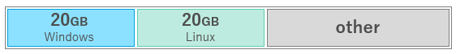

こんにちは、じんないです。

partedコマンドを使って、WindowsとLinuxのパーティションを自動的に切る方法を紹介します。

WindowsとLinuxのデュアルブートが可能な環境で、ページファイルやログの吐き出し先にそれぞれのローカルドライブが欲しいなぁと思うときがあるかもしれません。

Windowsの標準機能ではLinuxのファイルシステム(ext4)をフォーマットできませんが、LinuxからはWindowsのファイルシステム(ntfs)をフォーマットすることができます。

パーティション操作ではfdiskコマンドがメジャーですが、対話形式のため台数が多い場合は面倒です。

今回は、**非対話形式でパーティション操作が可能なpartedコマンド**を使っていきます。

partedコマンドも本来は対話形式ですが、`-s`オプションを追加することで非対話形式での操作が可能となります。


## 注意事項

パーティション操作を誤ると、最悪の場合OSの起動ができなくなる恐れがあります。

仮想マシンなどでシミュレーションの上、実施することをおススメします。

## 想定環境とシナリオ

1本のローカルディスクからWindowsとLinuxのパーティションを切り出します。



パーティションサイズはそれぞれ20GB。

OSはWindows 10とCentOS 7.4を想定しています。

1つずつコマンドを確認し、最後に自動化するシェルスクリプトを紹介します。

## まずはディスクを確認する

`lsblk` コマンドで、ディスク情報を確認します。

``` bash
[root@jinna-i ~]# lsblk
NAME   MAJ:MIN RM   SIZE RO TYPE MOUNTPOINT
sda      8:0    0 238.5G  0 disk
sr0     11:0    1  1024M  0 rom
pdisk0 222:0    0 488.3G  0 disk /

```

240GBのディスクが `sda` で認識されています。これが対象のディスクです。実パスは`/dev/sda`になります。

デバイス名はお使いの環境に合わせて読み替えてください。

## パーティションを切ってみる

ディスクの確認ができたところで、早速パーティションを切っていきます。

### Windows用のパーティションを切る

まずは、Windows用に20GBのパーティションを切ります。

コマンド例は以下のとおり。

`parted -s -a optimal /dev/sda -- mkpart primary ntfs 1MiB 20481MiB`

**-a optimal** でアライメントの最適化をしてくれる（らしい）

パーティションを切るときは`mkpart`コマンドをつなげます。

`-- mkpart [part-type] [fs-type] [start] [end]`

**[part-type]**は新規でつくる場合は**primary**でいいです。拡張の場合は**extended**を指定します。

**[fs-type]**はWindowsで使うので**ntfs**。ここで指定してもntfsでフォーマットしてくれる訳ではないので注意です。

**[start][end]**は開始と終了位置です。デフォルトは**MB(10進接頭辞)**です。ここでは**MiB(2進接頭辞)**を使いました。

OMiBとかで指定すると警告が出るので、セクタサイズの倍数をオフセットしておきましょう。

セクタサイズは`parted -l`とかで確認できます。

### Linux用のパーティションを切る

次はLinux用に20GBのパーティションを切ります。

コマンド例は以下のとおり。

`parted -s -a optimal /dev/sda -- mkpart primary ext4 20482MiB 40962MiB`

**[fs-type]**はLinux用に**ext4**を指定します。

当たり前ですが**[start][end]**は先に作ったパーティションと被らないようにします。

無事に切り終わったらもう一度`lsblk`を実行して確認します。

``` bash
[root@jinna-i ~]# lsblk
NAME   MAJ:MIN RM   SIZE RO TYPE MOUNTPOINT
sda      8:0    0 238.5G  0 disk
├sda1   8:1    0    20G  0 part　★Windows用のパーティション
└sda2   8:2    0    20G  0 part　★Linux用のパーティション
sr0     11:0    1  1024M  0 rom
pdisk0 222:0    0 488.3G  0 disk /
```
## フォーマットする

ファイルシステムとして使うにはフォーマットしないといけません。

ntfsフォーマットを実行するには**ntfsprogs**というパッケージが必要なのでインストールします。

`yum -y install ntfsprogs`

* **ntfsフォーマット**

`mkfs.ntfs -Q -L Volume /dev/sda1`

`-Q`でクイックフォーマット、`-L`でラベルの付与ができます。

* **ext4フォーマット**

`mkfs.ext4 /dev/sda2`

フォーマットができたら、Windows、Linuxそれぞれで認識ができているか確認しましょう。


## 自動化するスクリプトを作成する

ここまでの流れを自動化するシェルスクリプトを作成します。

台数が多いと以下の感じで進められると大変助かります。

1. 自動ログイン
2. パーティション作成
3. フォーマット
4. 自動シャットダウン

自動ログインの設定は、`/etc/gdm/custom.conf`の`daemon`セクションで設定します。

※root権限で実行されるのでパスワードの指定は不要です。

``` bash
[root@jinna-i ~]# vi /etc/gdm/custom.conf
	：
[daemon]
TimedLoginEnable=true
TimedLogin=user1　★自動ログインするユーザーを指定　
TimedLoginDelay=0
	：
```

パーティション作成 / フォーマット用スクリプトの作成

スクリプトの例を紹介しておきます。適宜変更してみてください。

ここでは`/usr/local/sbin/kitting.sh`として作成します。

``` bash
#!/bin/bash

## create partition
sudo parted -s -a optimal /dev/sda -- mkpart primary ntfs 1MiB 20481MiB
sudo parted -s -a optimal /dev/sda -- mkpart primary ext4 20482MiB 40962MiB

## install ntfs format package
sudo yum -y install ntfsprogs

## format partition
sudo mkfs.ntfs -Q -L Volume /dev/sda1
sudo mkfs.ext4 /dev/sda2

sudo shutdown -h now
```

**user1**は一般ユーザーなので、sudoをノンパスで使えるようにしてあげる必要があります。

下記は`/etc/sudoers.d/`の設定例です。

```
user1     ALL=(ALL)       NOPASSWD: ALL
```
ご覧のとおりALLで許可しています。

セキュリティ的に好ましくないので、実際では特定のコマンドのみsudoを使えるように絞っておきましょう。

あとは、**user1**がログインしたときに`/usr/local/sbin/kitting.sh`を実行してやればOKです。

ログオンスクリプトのキック方法は以下の記事で紹介していますので、参考にしてください。

[\[CentOS 7.4\] GNOME環境にログインした時だけ実行されるスタートアップスクリプトを書く](https://mseeeen.msen.jp/centos74-gnome-startup-script/)

ではまた。

## 参考
[第13章 パーティション - Red Hat Customer Portal](https://access.redhat.com/documentation/ja-jp/red_hat_enterprise_linux/6/html/storage_administration_guide/ch-partitions)
[GNU partedの罠 | Everyday Deadlock](https://hayamiz.com/technology/2013/01/30/gnu-parted/)