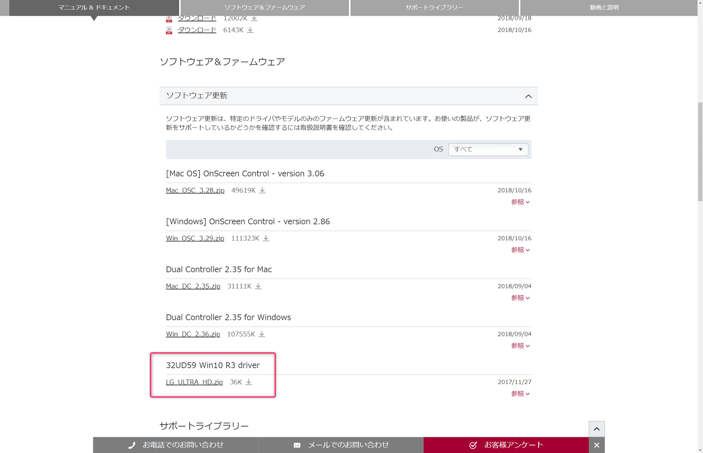
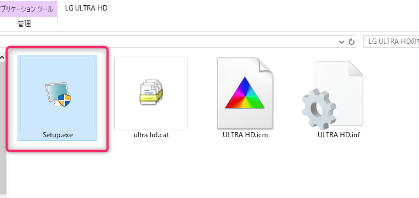

こんにちは、じんないです。

作業用に[LGのモニター（32UD59-B）](https://www.lg.com/jp/monitor/lg-32UD59-B)を使用しています。

このモニターは4K 60Hzの表示に対応しているのですが、私が使用しているThinkpad X1 Carbonから4K 60Hzの利用ができませんでした。

筆者が使用しているThinkpad X1 Carbon 5thはUSB-C出力であれば4K 60Hzをサポートしています。また、グラフィックスは[intel HD Graphics 620](https://www.intel.co.jp/content/www/jp/ja/support/products/96551/graphics-drivers/graphics-for-7th-generation-intel-processors/intel-hd-graphics-620.html)ですが、こちらも4K 60Hzをサポートしています。

30Hzしか出ないと、カーソルやウィンドウを移動させた際にどうしてももたつきや、ちらつきが生じてしまいます。条件を満たしているのでなんとしても出したいですね。
※感じ方には個人差があります。

今回の場合はモニターのドライバーを最新とすることで4K 60Hzの出力ができるようになったのでその方法を紹介します。

## 環境
- PC：Lenovo Thinkpad X1 Carbon 5th
- グラフィックス：Intel HD Graphics 620
- モニター：LG 32UD59-B
- ケーブル：USB-C to HDMI(4K対応)

## モニターのドライバーを更新する

[LG 32UD59-Bのサポートページ](https://www.lg.com/jp/support/support-product/lg-32UD59-B)にアクセスし、ページ中腹の「ソフトウェア&ファームウェア」から**32UD59 Win10 R3 Driver**をダウンロードします。

解凍したファイルの中から「setup.exe」を実行します。

お使いの環境のディスプレイアダプターを選択し、「OK」をクリックしインストールします。

筆者は念のためここで再起動しました。
※不要かもしれません

再度、モニターのプロパティを確認すると**60ヘルツ**を選択できるようになりました！

## それでもダメな場合

以下のページからグラフィックスドライバーの更新がないかチェックしてみてください。
[intel ドライバーおよびソフトウェア](https://downloadcenter.intel.com/ja)

