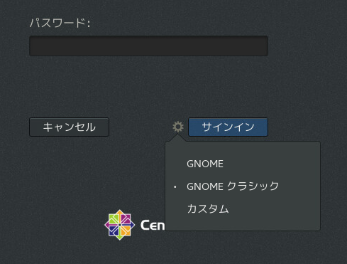
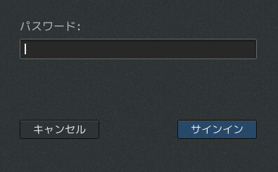
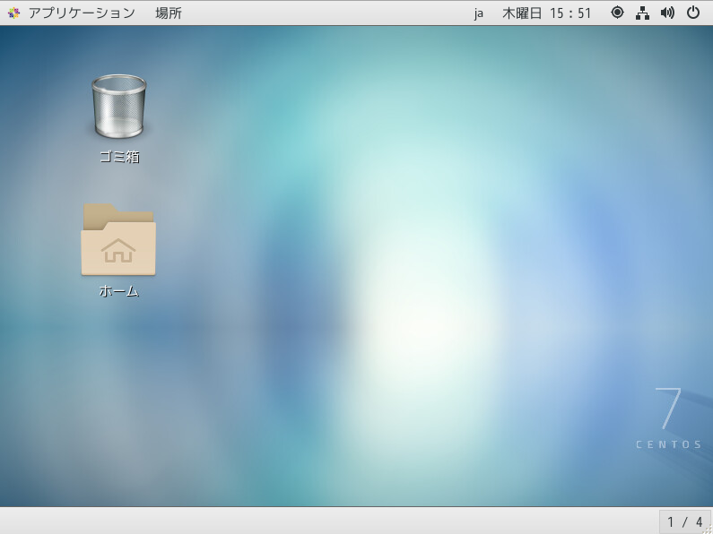

こんにちは、じんないです。

CentOS7系ではGNOMEデスクトップをインストールしている場合、サインインの際にデスクトップの種類を変更することができます。
<a href="images/centos7-how-to-fix-gnome-desktop-type-1.png"></a>

上から「GNOME」「GNOMEクラシック」「カスタム」があり、**デフォルトはGNOMEクラシック**となっています。

クライアント系などで環境を統一したい場合はデスクトップの種類を固定する必要があります。

今回はその方法を紹介します。

## 想定環境
- CentOS 7.5
- GNOMEデスクトップ環境

## 設定はどこで持っているのか
**`/usr/share/xsessions/`配下に3つのデスクトップファイル**が用意されています。

- gnome-classic.desktop
- gnome-custom-session.desktop
- gnome.desktop

`gdm.service`がこれらのデスクトップファイルを読み込んで、サインインの際に表示しているという感じです。

## デスクトップの種類を固定するには

デスクトップの種類を固定するには**`gdm.service`にデスクトップファイルを読み込ませないようにすればOK**です。

読み込ませたくないデスクトップファイルの**中身を**消してしまいましょう。

コマンド例は以下のとおり。

```
[root@jinchan ~]# cd /usr/share/xsessions/
[root@jinchan xsessions]# ls
gnome-classic.desktop  gnome-custom-session.desktop  gnome.desktop

[root@jinchan xsessions]# cp /dev/null gnome-custom-session.desktop
[root@jinchan xsessions]# cp /dev/null gnome.desktop
```

`cp /dev/null <filename>`とすることで、ファイルの中身を空にしています。

最後にサービスを再起動します。

```
[root@jinchan xsessions]# systemctl restart gdm.service
```

再度サインインをしてみると。
<a href="images/centos7-how-to-fix-gnome-desktop-type-2.png"></a>

設定ボタンが消えてデスクトップが選べないようになっています。

そのままサインインするとGNOMEクラシックのデスクトップが表示されました。

<a href="images/centos7-how-to-fix-gnome-desktop-type-3.png"></a>

### yum update時の注意

`yum update`で**gnome系のパッケージを更新するとデスクトップファイルの中身も更新されてしまう（元に戻る）**ようです。

`yum update`を実施した際は、再度デスクトップファイルのクリアが必要です。

恒久的な対策が見つかればまた紹介します。

ではまた。