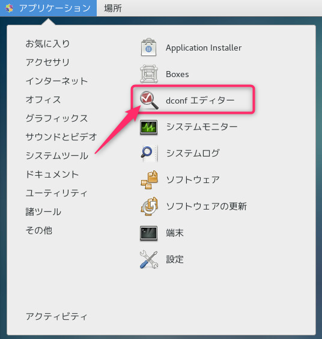
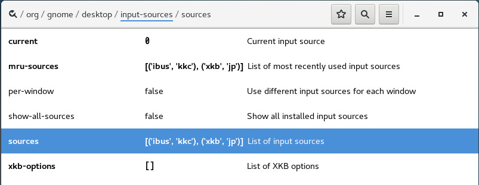
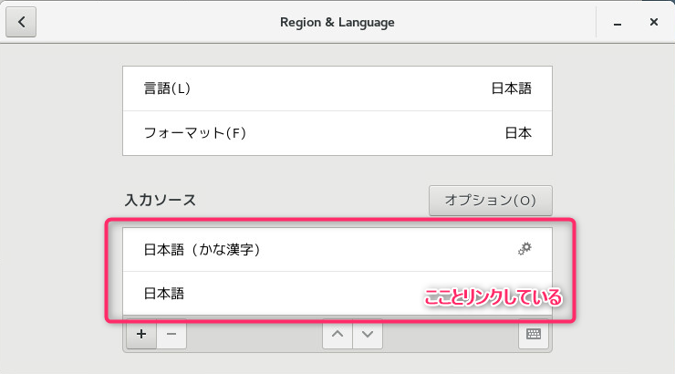
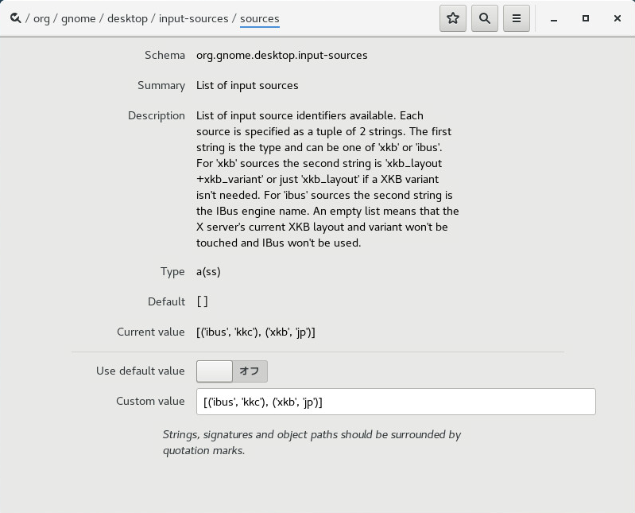

こんにちは、じんないです。

今回は、CentOS 7 で入力ソースを共通化する方法を紹介します。

複数のユーザーが同一のクライアント端末を利用する場面などで、入力ソースの設定を共通化しておきたい場面に役立つでしょう。

## 想定環境

* CentOS 7.4
* GNOMEデスクトップ環境

## ユーザープロファイルの設定はdconfが持っている

各ユーザーのプロファイル設定は`~/.config/dconf/user`に格納されています。

キーと値から構成されていて、Windowsでいうところのレジストリのような構造をしています。

この中に、入力ソースの設定も保持されているわけです。

基本的にはこのファイルを触っていくことになりますが、このファイル、cat等で見てもらうとわかりますがバイナリファイルとなっていて直接編集することができません。

## dconf エディターをインストールする

さて、バイナリファイルを見て幻滅するのはまだ早いです。

CentOSには**dconf エディター**なるものが用意されています。

**dconfの設定をGUIから行えるツール**です。

yumで入るのでインストールしてみます。

`yum install dconf-editor`

アプリケーション > システムツール > dconf エディター から起動し、さっそくスキーマを確認します。



入力ソースの設定は、`/org/gnome/desktop/input-sources/sources`にあります。



ここの値は言語設定のところとリンクしていて、実際に**入力ソース**の値を変更するとリアルタイムに反映されるのがわかります。



**日本語(かな漢字)**と**日本語**であれば、値は`('ibus', 'kkc'),('xkb', 'jp')`です。



最初に書いたほうがログイン時のデフォルト値になります。

上の例だと**日本語(かな漢字)**がデフォルトですね。

ようは、この設定をユーザー共通としてあげればいいってわけです。

## gsettingsコマンドでdconfを設定する

設定を共通化する方法はいくらかあると思いますが、今回は[gsettings](https://access.redhat.com/documentation/ja-jp/red_hat_enterprise_linux/7/html/desktop_migration_and_administration_guide/gsettings-dconf)コマンドを使ったログインスクリプトでおこないます。

ログインスクリプトの作成方法は以下の記事を参考にしてみてください。

[\[CentOS 7.4\] GNOME環境にログインした時だけ実行されるスタートアップスクリプトを書く](https://mseeeen.msen.jp/?p=6746)

必要なコマンドはこんな感じです。

`gsettings set org.gnome.desktop.input-sources sources "[('ibus', 'kkc'), ('xkb', 'jp')]"`

ただし、このままだとなりふりかまわず日本語設定になってしまいます。

海外のスタッフがいるような場面だとよろしくないので、実際にはロケールを見てから実行するようにしましょう。

``` bash
#!/usr/bin/bash

# set input sources
LANGJP="ja_JP.UTF-8"

if [ $LANG = $LANGJP ]; then
	gsettings set org.gnome.desktop.input-sources sources "[('ibus', 'kkc'), ('xkb', 'jp')]"
else
	:
fi
```

これで、ユーザーがログインしたときに入力ソースを共通化することができます。

このほかにも、さまざまな設定変更が可能です。

dconf エディターとともに色々いじくって、唯一無二のGNOMEデスクトップ環境を手に入れてください笑

ではまた。