こんにちは、じんないです。

今回はグループポリシーを使って、特定のOUに所属しているユーザーアカウントでログオンしたときにWindowsで使用する言語を変更する方法を紹介します。

海外のスタッフやメンバーが共用のPCを利用したり、リモートデスクトップをする場合などに便利です。

## 想定環境

今回は、**ALL Users**配下の**EnglishというOUを対象**とし、このOUに所属しているユーザーでログオンした場合にWindowsが使用する言語（今回は英語）を変更します。
テストユーザーとして、EngUser1を作成しています。
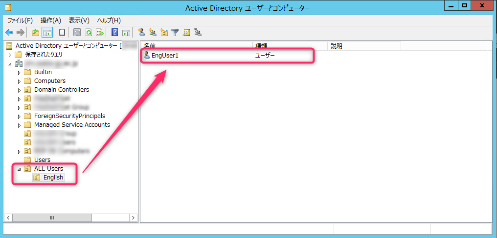

言語を変更する対象のOSはWindows Server 2012R2 または、Windows Server 2016です。

## 事前準備
### 言語の追加

まず、前提としてOSに対象の言語がインストールされていないといけません。

[コントロールパネル] > [時計、言語、および地域] > [言語]を参照します。

[言語の追加]をクリックします。
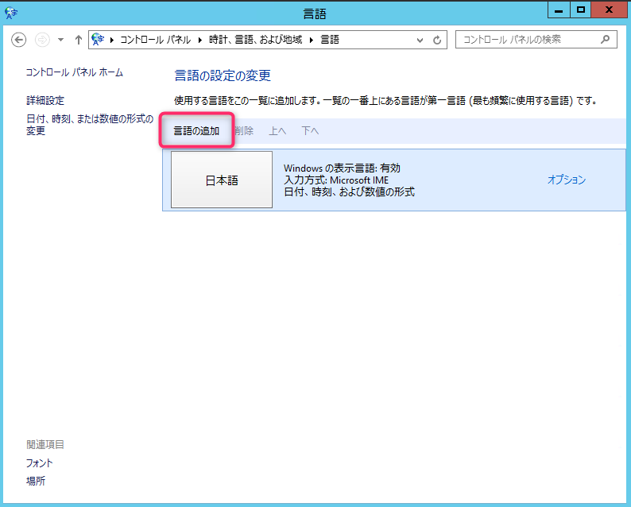

今回は例として**英語**を追加します。
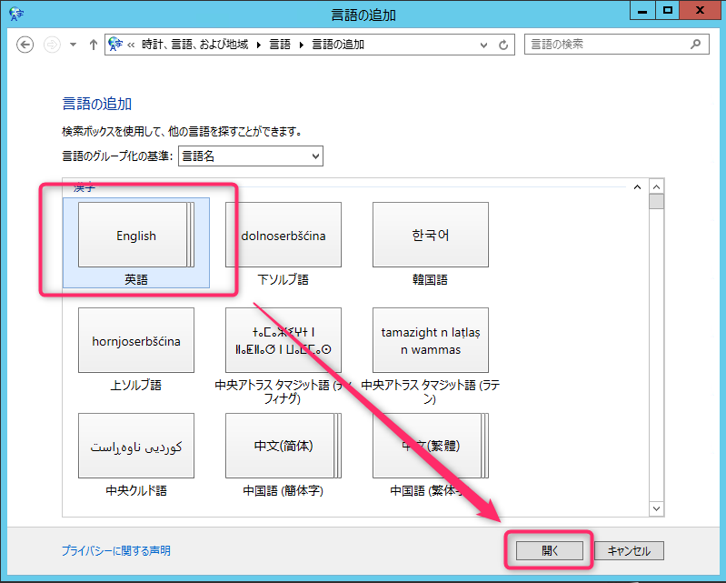

英語の中でもたくさんあるので、**英語(米国)**を選択します。
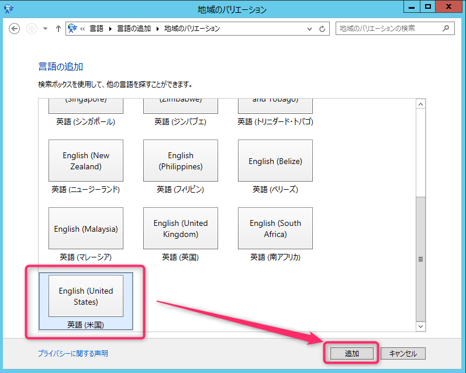

この状態だとまだ追加されていないので、[オプション]をクリック。
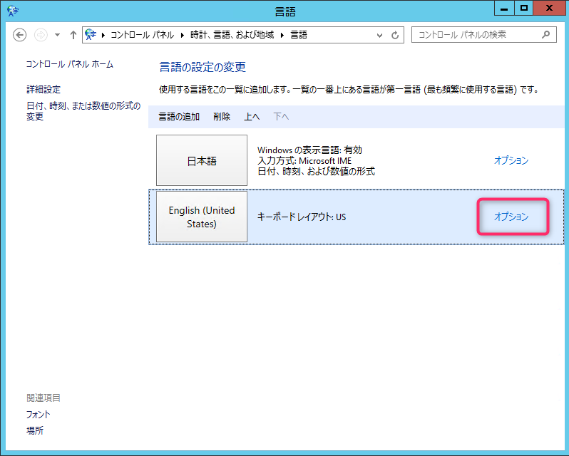

[言語パックをダウンロードしてインストールします]をクリック。
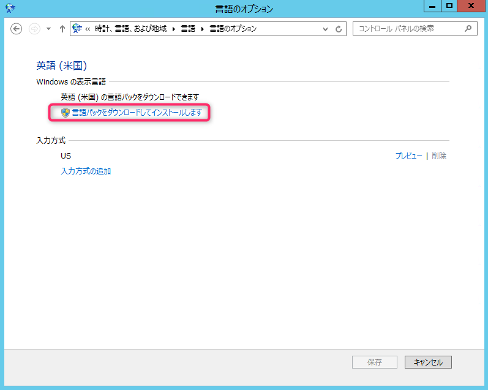

インストールが完了すると、**利用可能**という表示に変わります。これで準備は完了です。
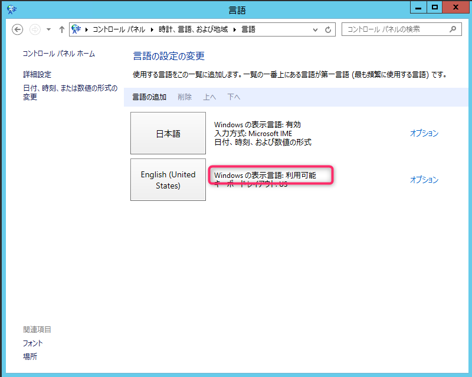

## グループポリシーの作成

[グループポリシーの管理]を開き、グループポリシーオブジェクト（GPO：Group Policy Object）を作成します。

今回は**ChangeLanguage**と名付けました。
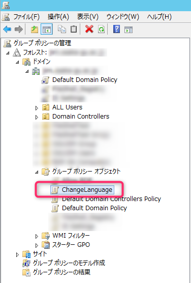

ChangeLanguageを右クリックし、グループポリシー管理エディターを開いて[ユーザーの構成] > [ポリシー] > [管理テンプレート] > [コントロールパネル] > [地域と言語のオプション]を参照します。 

**選択されたユーザーに対してWindowsが使用するUI言語を制限する**をクリック。
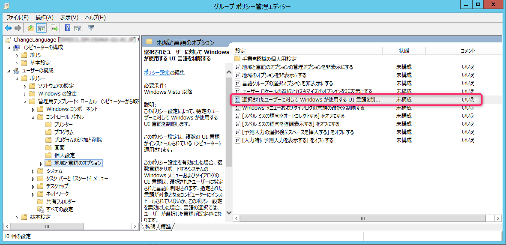

**有効**に変更し、[ユーザーを次の言語に制限する]で**英語**を選択します。
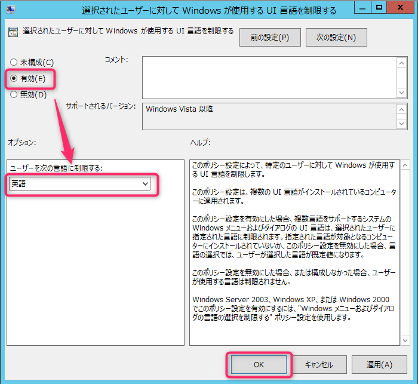

編集したGPO(ChangeLanguage)を対象のOU(English)にリンクします。
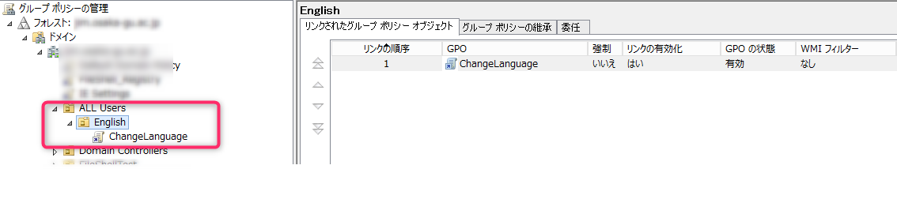

設定は以上です。

## 対象ユーザーでログオン

対象のOU(English)に所属するユーザー(EngUser1)でサーバーにログオンしてみます。

スタートメニューが**英語**表記に変わりました。
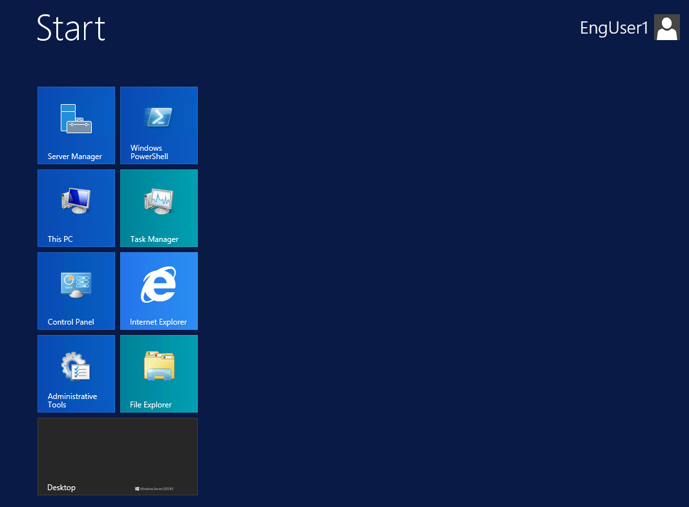

コントロールパネルも英語になっています。こっちのほうがスタイリッシュでいいですね。笑
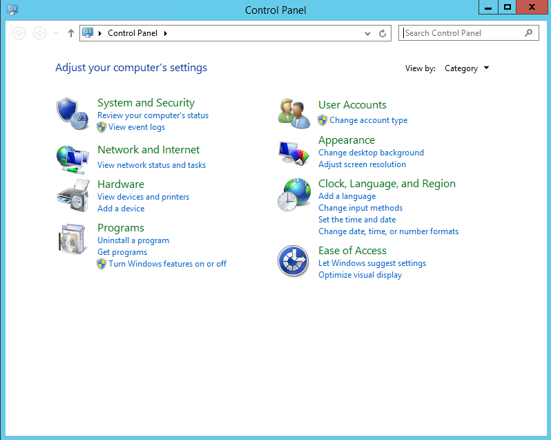

補足として、Microsoft OfficeなどはOSの言語を追加しただけでは変更されません。

Microsoft Officeの言語を変更したい場合は、別途言語パックのインストールが必要です。

参考：[Office 2016 用言語アクセサリ パックのインストール](https://support.microsoft.com/ja-jp/help/4026353/office-install-the-language-accessory-packs-for-office-2016)

ではまた。