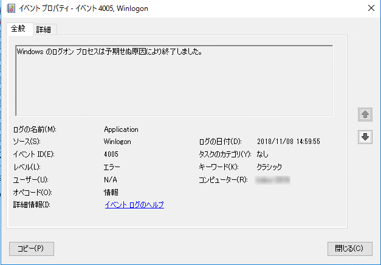
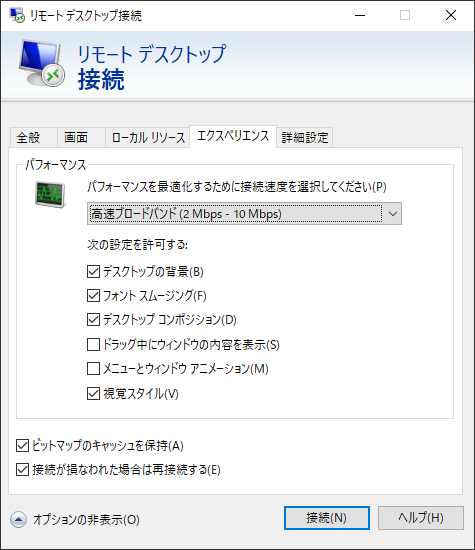
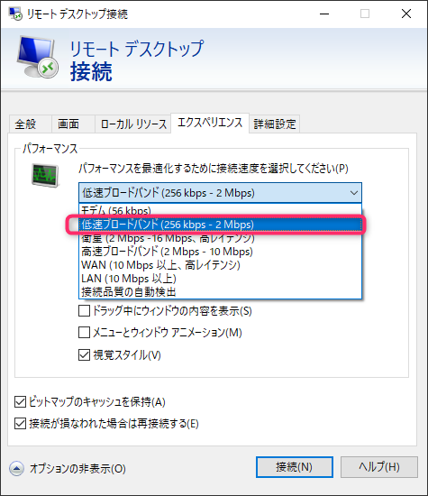

こんにちは、じんないです。

先日、外出先からVPN経由でリモートデスクトップをしていると「内部エラーが発生しました。」となって接続が完了しませんでした。

認証までは通っているのでネットワークは疎通しているようです。

当該マシンのイベントログを確認してみるとアプリケーションログに以下のエラーイベントが記録されておりました。

> Windows のログオン プロセスは予期せぬ原因により終了しました。
> ログの名前： Application
> ソース：Winlogon
> イベントID：4005

このイベントだけでは全く手掛かりがつかめないので、同様の事象でハマらないようメモを残しておきます。

## 想定環境
リモート元：Windows 10 Pro (1803)
リモート先：Windows Server 2016

## 接続速度を確認する

普段はあまり意識していませんが、リモートデスクトップの接続画面ではいろいろと設定ができます。

「エクスペリエンス」タブではパフォーマンスに関する設定ができ、接続速度を選択することが可能です。

今回はこの接続速度が**高速ブロードバンド(2M-10Mbps)になっていることが原因**でした。

これを**低速ブロードバンド(256kbps-2Mbps)に変更することでリモートデスクトップができるようになりました。**

LAN上にあるサーバーに接続する場合は問題ありませんが、VPN等でインターネットから接続する場合は必ずしもこれらの速度を担保することはできません。

高速設定にしておくと文字がキレイになったりデスクトップ背景が表示されるなどユーザーエクスペリエンスが向上するのでいいことがあるのですが、固定にしてしまうとその速度が担保できない場合にこのようなエラーになってしまうようです。

接続環境がころころ変わるよという方は**接続品質の自動検出**を選んでおくことをおすすめします。

しかしながら自動の場合は大概低く検出されるので低速ブロードバンドと変わらないかもしれません。まぁ品質よりも繋がらないことのほうがダメなので当たり前ですが。

もし固定していて繋がらない！となったときはこの記事を思い出していただければ幸いです。

ではまた。