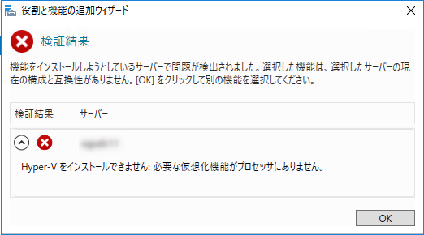
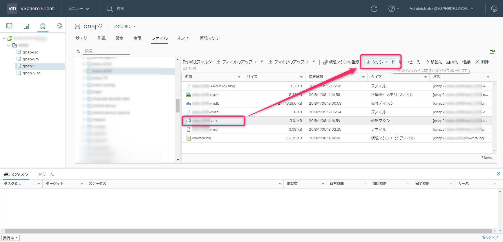
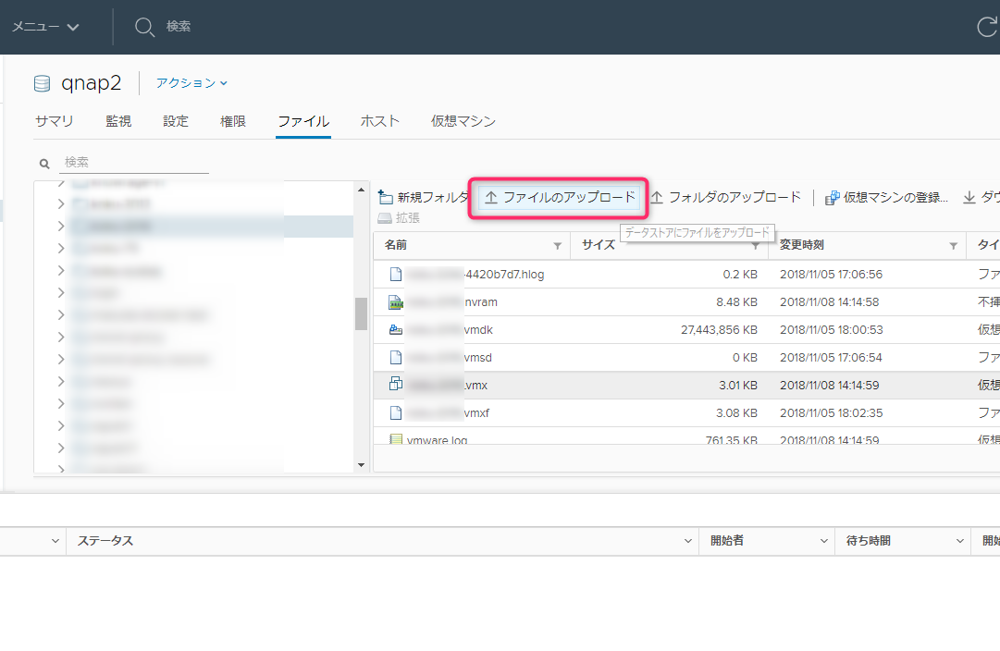
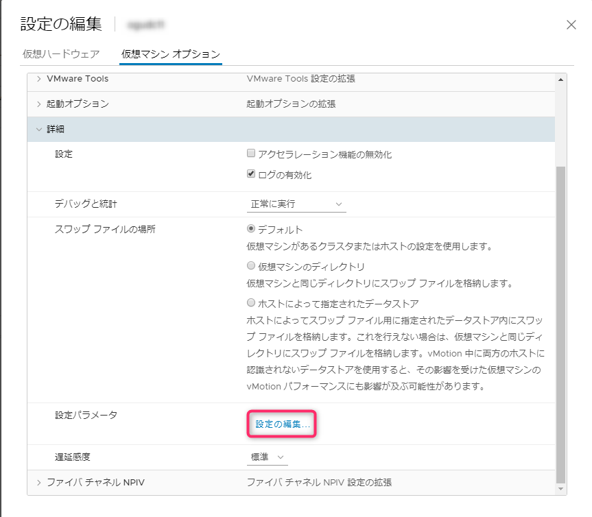
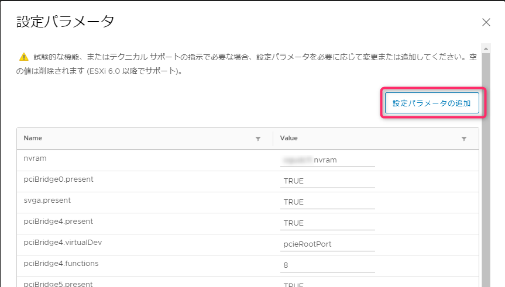

こんにちは、じんないです。

今回はVMware ESXi上のWindows Server 2016でHyper-Vを有効にする方法を紹介します。

仮想マシンのWindows Server 2016で役割と機能の追加からHyper-Vをインストールしようとすると、以下のメッセージが表示されてインストールできません。

> Hyper-Vをインストールできません:必要な仮想化機能がプロセッサにありません。

これを回避するには仮想マシンの構成ファイルを編集し、仮想化支援機能を有効にする必要があります。

尚、本番環境の仮想環境の入れ子についてVMwareは公式サポートしていないようですので、その点ご認識をお願いします。

## 想定環境
仮想化基盤：VMware ESXi 6.5
仮想化管理：vCenter Server 6.7
OS: Windows Server 2016 (1607)

インタフェースはvSphere Client(HTML)を利用します。

## 仮想化支援機能を有効化する

vSphere Clientから仮想マシンファイルが格納されているデータストアを参照し、仮想マシンをファイルをダウンロードします。

ダウンロードした仮想マシンファイルをテキストエディターで開き、以下を追記します。

`vhv.enable = "TRUE"`

「ファイルのアップロード」から編集した仮想マシンファイルをアップロードします。

警告が出た場合は「はい」をクリックします。

これで準備はOKです。仮想マシンをパワーオンしてHyper-Vをインストールしてみてください。

### GUIからは変更できない

仮想マシンの設定を開き **設定パラメータ ＞ 設定の編集** で仮想マシンファイル(vmxファイル)の編集ができます。

「設定パラメータの追加」から先ほどの `vhv.enable = "TRUE"` を追加すればいいのですが、**何回やっても設定が無効になってしまいます**。

いくつか他の設定を入れてみましたが、問題なく保存されるのでこのパラメータ特有の問題かもしれません。

仮想化支援機能を有効にする場合はテキストエディターから行うことをおすすめします。

ではまた。