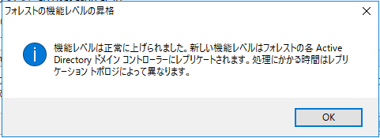

こんにちは、じんないです。

Windows Server 2016 で構成している Active Directory ドメインコントローラーでフォレストの機能レベルを上げているときに以下のエラーになりました。

> ディレクトリ パーティションが少なくとも1つのレプリケーション パートナーで正常にレプリケートされていないため、FSMO の役割の所有者を検証できませんでした。

## 環境
- OS： Windows Server 2016
- ドメインの機能レベル： Windows Server 2016

フォレストの機能レベルを Windows Server 2003 から Windows Server 2016 へ上げているときに発生しました。

## ドメインコントローラーの同期状況を確認

> レプリケーション パートナーで正常にレプリケートされていないため

とあるようにドメインコントローラーの同期がうまくいっていないと推測されます。

`repadmin`コマンドでドメインコントローラーの同期状況を確認します。

`repadmin /showrepl`

コマンドの実行結果のすべての項目が`最後の試行は成功しました`となっていればドメインコントローラーの同期ができています。

おそらくこのうちのどれかがエラーや失敗になっているのではないでしょうか。

筆者の場合、`DNS参照エラーのため、DSA操作を継続できません。`というエラーがでていました。

### ドメインコントローラーの同期

ドメインコントローラーの同期は`repadmin`コマンドから手動で実施できます。

`repadmin /replicate <同期先DC> <同期元DC> DC=msen,DC=jp`

「<同期元DC> から <同期先DC> への同期が完了しました。」と表示されればOKです。

`repadmin /showrepl`で再度同期状況を確認しましょう。

すべてのドメインコントローラーで同期状況を確認することをおすすめします。

### それでもだめなら

ドメインコントローラーを再起動してください。

再起動するときはドメインコントローラーが必ず一台存在するように順番に実施します。

### フォレストの機能レベルを変更するときの注意点

フォレストの機能レベルを変更する際は **Enterprise Admins** のセキュリティグループに所属しているユーザーで実施してください。

シングルフォレスト・シングルドメインで Administrator を使用している場合は問題ないですが、別ユーザーでドメインを管理している場合は注意が必要です。

## 再度フォレストの機能レベルを変更

「Active Directory管理センター」から「フォレストの機能レベルの昇格」をクリックし、機能レベルを変更します。

今度は無事に機能レベルの引き上げができました。

すべてのドメインコントローラーでフォレストの機能レベルの変更が反映されていることを確認しておきましょう。

ではまた。