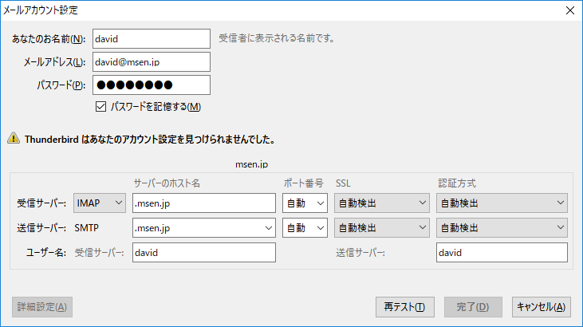
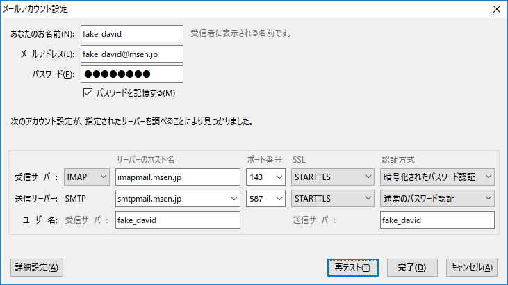
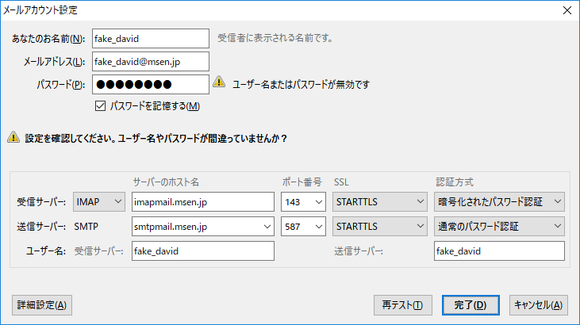

先日Thunderbirdを使う機会があり、メールアカウント設定の際にうまくいかなかったのでログの取り方をメモしておきます。

ログを見てなんとかできるぐらいの方を読者対象としています。

## 想定環境
* Windows 10
* Thunderbird 52.6.0

## ログの取り方
Thunderbirdでログをとるには環境変数で目的の動作を指定します。

環境変数をセットするコマンド例は以下のとおり。IMAP,POP,DNSのログを取得します。

``` bash
set NSPR_LOG_MODULES=timestamp,append,IMAP:2,POP3:2,nsHostResolver:4
set NSPR_LOG_FILE=C:\thunderbird.log
```
**NSPR_LOG_MODULES** に取りたい**ログの種類**や**オプション**を指定します。

* timestamp 
UTCでタイムスタンプを付与。

* append　
ログの追記。指定しない場合はThunderbirdを起動するたびに初期化される。

**NSPR_LOG_FILE**に**ログを出力先**を指定します。

続けてThunderbirdを起動します。

``` bash
cd "C:\Program Files (x86)\Mozilla Thunderbird"
thunderbird.exe
```

### ログレベルの話

> 0 = PR_LOG_NONE: log を取りません
> 1 = PR_LOG_ALWAYS: 重要。全ての log を取ることを意図しています。
> 2 = PR_LOG_ERROR: errors
> 3 = PR_LOG_WARNING: warnings
> 4 = PR_LOG_DEBUG: デバッグメッセージ、注意
> 5: 全部取ります！
>
> [NSPR LOG MODULES - Mozilla | MDN](https://developer.mozilla.org/ja/docs/Mozilla/Projects/NSPR/Reference/NSPR_LOG_MODULES)

ログレベルは0から5まであります。

5にすると一番多くログが出力されますが、かなりカオスになるので徐々にあげていくことをおすすめします。

エラーを取りたいときは2、デバッグログを取りたいときは4ぐらいを目安にするといいです。

### 環境変数の話

setコマンドで設定される環境変数は一時的なものです。

別ウィンドウでコマンドプロンプトを起動して`set`を実行すると環境変数がないのがわかります。

環境変数を設定したコマンドウィンドウからThunderbirdを起動する場合は良いですが、スタートメニューから起動する場合は注意しましょう。

恒久的に設定したい場合は、setxコマンドを使います。

``` bash
setx NSPR_LOG_MODULES timestamp,append,IMAP:2,POP3:2,nsHostResolver:4
setx NSPR_LOG_FILE C:\thunderbird.log
```


## どこで失敗しているのか調べる

### メールサーバーの設定が間違っている場合

メールサーバーの設定が間違っている場合はここでコケます。



> Thunderbird はあなたのアカウント設定を見つけられませんでした。

アカウントが見つからないと警告が出ますが、実際には**メールサーバーの名前解決ができなかった場合**に出るようです。

この時のログはnsHostResolverが出力します。

``` bash
D/nsHostResolver DNS lookup thread - lookup completed for host [imap.msen.jp]: failure: unknown host.
	：
D/nsHostResolver DNS lookup thread - lookup completed for host [mail.msen.jp]: failure: unknown host.
	：
D/nsHostResolver DNS lookup thread - lookup completed for host [pop.msen.jp]: failure: unknown host.
	：
D/nsHostResolver DNS lookup thread - lookup completed for host [smtp.msen.jp]: failure: unknown host.
```

また、メールサーバーのホスト名を変更して、再テストをしてもなんの画面遷移もない場合も同様です。

WireShark等でパケットをのぞいてみるとよくわかりますが、実際には裏で入力されたホスト名をDNSに聞きにいってます。

名前解決ができた場合だけ次のステップに進めるようです。

せめて、なんかやってます感は出してもらいたいですね。

ここから進まない方は、**メールサーバーのホスト名を確認**してみてください。


### メールアカウントの設定が間違っている場合

メールアカウントが間違っていても、メールサーバーの設定があっている場合はここまでいけます。



> 次のアカウント設定が、指定されたサーバーを調べることにより見つかりました。

なんでだよ。って感じですが、このまま[完了]をクリックしてみます。



> 設定を確認してください。ユーザー名やパスワードが間違っていませんか？

メールアカウントの設定が間違っている場合はここでコケます。

この時のログはIMAPまたはPOP3が出力されます。

* IMAPの場合

``` bash
IMAP: ask user what to do (after login failed): new passwort, retry, cancel
login failed entirely
```

* POP3の場合

``` bash
POP: no auth methods remaining, setting password failure
```
ここで詰まっている場合は、**メールアドレスやパスワードに間違いがないか確認**してみてください。

### 目的のログがどこで出るか正確に捕捉する

**「何時何分にどういう動作をした」**というのはログを見る上で**非常に重要**です。

○○時○○分にどこどこをクリックして・・・を控えて後からログを追うというもアリなんですが、リアルタイムに分かるほうがよりシューティング精度が高まります。

PowerShellのGet-Contentコマンドを使って目的の文字列を含むログが出力されたときだけ表示するようにしましょう。

` Get-Content C:\thunderbird.log -wait | Select-String "fail" `

Linuxだと`tail -f ./thunderbird.log | grep -i "fail"`で流している感じですね。

## all:5だとなぜかDNSのログが記録されない・・・

余談ですが、Mozillaのホームページではすべてのログを取りたい場合は**all:5**を指定しろと書いています。

確かにいっぱいログが出るのですがnsHostResolverのログがなく、名前解決に失敗しているのかがわかりません。

原因はわかりませんが、調査の際にはモジュールを個別に指定することをおすすめします。

モジュールの一覧は下記の参考ページを参照してください。


## 参考
[NSPR LOG MODULES - Mozilla | MDN](https://developer.mozilla.org/ja/docs/Mozilla/Projects/NSPR/Reference/NSPR_LOG_MODULES)
[Xoatlicue: Investigating NSPR Logging](http://xoatlicue.blogspot.com/2007/02/investigating-nspr-logging.html)
